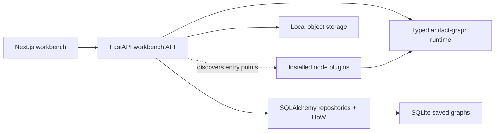

# Notarius Workbench

Notarius is a node-first workbench for building and running typed artifact
graphs. Nodes declare typed ports, edges may select declared fields from
compound artifacts, and the runtime materializes those values only when a
downstream node executes.

Each edge declares how its value is transported. `direct` passes a compatible
value with its collection shape unchanged; `map` connects a sequence to one
item input, invokes the target once per item, broadcasts its other inputs, and
returns ordered output sequences. The runtime derives invocation from those
edges, so mapping is explicit workflow structure rather than hidden node state.

That field-projection model is the important compatibility primitive. An
`arithmetic.result@1` artifact can expose `addition` and `subtraction` as
`scalar.integer@1`, so either nested value can connect directly to an integer
input without a visible adapter node.

## Architecture



- `apps/web` owns the canvas, node rendering, schema-driven controls, and edge
  projection/mapping editor.
- `apps/api` owns plugin discovery, runtime composition, and the HTTP adapters
  for execution and saved-graph CRUD under `/v1`.
- `libs/core/src/notarius_core` owns artifacts, nodes, ports, projections,
  runtime execution, saved-graph aggregates and use cases, the plugin contract,
  and built-in operators.
- `libs/persistence` owns the async SQLAlchemy repository and unit-of-work
  adapters for saved graphs. Alembic is the only schema authority.
- `libs/storage` owns the local file object store.
- `plugins/ocr` is an independently packaged example plugin. It owns OCR nodes,
  OCR persistence/resolution, the server-side Mistral adapter, and its Mistral
  SDK dependency.
- `CONTEXT.md` defines the product vocabulary and active scope.
- `docs/workbench-interaction-plan.md` records the current interaction decisions,
  their rationale, acceptance criteria, and deliberately deferred work.

There is intentionally no legacy extraction pipeline, Dagster deployment,
message broker, worker service, or platform API in this workspace.

## Register a plugin

Plugins are ordinary Python distributions that export one
`notarius_core.plugins.Plugin` declaration through the `notarius.plugins`
entry-point group:

```toml
[project.entry-points."notarius.plugins"]
my_plugin = "my_package.plugin:PLUGIN"
```

Install the distribution in the API environment and restart the API. FastAPI's
lifespan discovers installed entries, validates collisions, freezes the catalog,
and exposes the contributed nodes and artifact types through `/v1/nodes`.
Plugins depend on core contracts and ports; they do not import the API host or a
concrete storage implementation. The OCR package follows this boundary, while
the API package has no OCR or Mistral dependency. Installing a plugin also
installs the third-party dependencies declared by that plugin.

## Run locally

Requirements:

- Python 3.12.9
- [uv](https://docs.astral.sh/uv/)
- Node.js 20+ and npm

Install both workspaces:

```bash
make install
```

The default installation contains the API, core, persistence, storage, and web
application; it does not install OCR or Mistral. Enable the optional OCR plugin
with:

```bash
make install-ocr
```

Start the API and web app in separate terminals:

```bash
make api
make web
```

`make api` applies pending Alembic migrations before starting FastAPI. Saved
graphs are stored in SQLite at
`.notarius-artifacts/workbench/notarius.sqlite3` by default. Override
`NOTARIUS_DATABASE_URL` when another SQLite location is required. Useful
migration commands are `make db-current`, `make db-history`, and
`make db-revision message="describe change"`.

After a default installation, `make api-ocr` installs the OCR extra and starts
the API in one command. Use `make api-ocr` whenever that plugin should be
available; `make api` keeps the API environment on its minimal package graph.

Open <http://localhost:3000>. The API is available at
<http://localhost:8000>; its health endpoint is `/health`.

The workbench defaults to local artifact storage and a local API URL. Copy
`.env.example` only when you need to override them. `MISTRAL_API_KEY` is
required only for the Mistral OCR node and must remain server-side.

## Verify

Run the full retained contract:

```bash
make check
```

The check runs backend tests, Python and TypeScript lint/type checks, verifies
that the generated OpenAPI client is current, and builds the production web
bundle. It enables the OCR extra while running Python tests and type checks so
the external example plugin remains covered without becoming a default runtime
dependency.

To exercise the runtime without the browser:

```bash
make smoke
```

## Containers

The API Dockerfile's default `api` target contains no OCR or Mistral dependency.
The Compose stack explicitly selects its `api-ocr` target so the example plugin
is available in that deployment. A one-shot migration service must complete
before the API starts. SQLite, uploads, and artifact objects share the durable
`notarius-data` volume.

```bash
make docker-up
make docker-down
```
