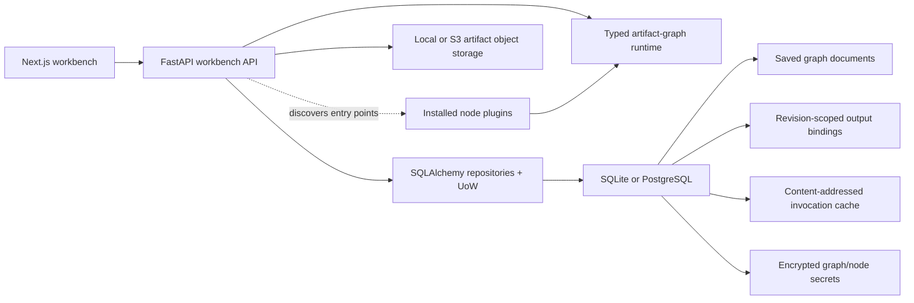
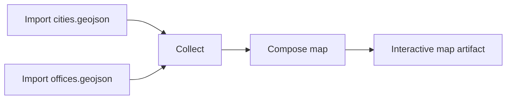
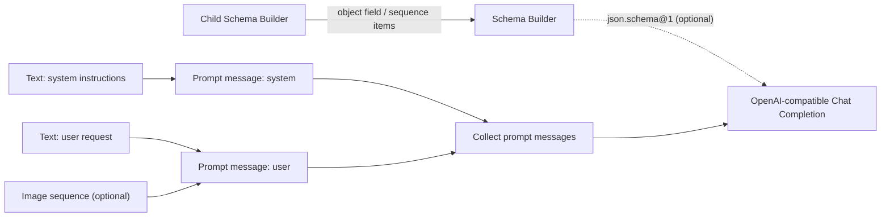

# Notarius Workbench

Notarius is a node-first workbench for building and running typed artifact
graphs. Nodes declare typed ports, while edges may select schema-derived or
explicit fields from compound artifacts or apply an ordered path of declared,
versioned artifact conversions before a downstream node executes.

Each edge declares how its value is transported. `direct` passes a compatible
value with its collection shape unchanged; `map` connects a sequence to one
item input, invokes the target once per item, broadcasts its other inputs, and
returns ordered output sequences. The runtime derives invocation from those
edges, so mapping is explicit workflow structure rather than hidden node state.

Field projection and artifact conversion are distinct compatibility primitives.
Nested JSON Schema `string` and `integer` leaves are automatically exposed as
the installed canonical scalar artifact types. Structural projection remains a
runtime capability for compound artifact types supplied by plugins; its
behavioral coverage uses a test/plugin compound type rather than a production
tutorial node. A declared conversion can then materialize a projected integer
as `scalar.text@1`. If the registry declares `X -> Y` and `Y -> Z`, the
workbench can persist and execute the exact `X -> Y -> Z` path on one edge.
These choices remain visible without adding boilerplate adapter nodes.
Configurable or domain-significant transformations remain nodes.

## Architecture



- `apps/web` owns the canvas, node rendering, schema-driven controls, and edge
  projection/conversion/mapping editor.
- `apps/api` owns plugin discovery, runtime composition, and the HTTP adapters
  for execution and saved-graph CRUD under `/v1`.
- `libs/core/src/notarius_core` owns artifacts, nodes, ports, projections,
  conversions, runtime execution, saved-graph aggregates and use cases, the
  plugin contract, and the generic Image, Sequence, Arithmetic, Text, Schema,
  and Prompt built-in operator families.
- `libs/persistence` owns the async SQLAlchemy repository and unit-of-work
  adapters for saved graphs and graph materialization bindings. Alembic is the
  only schema authority.
- `libs/storage` owns the local and S3-compatible object stores.
- `plugins/ocr` is an independently packaged example plugin. It owns OCR and
  table-extraction nodes, their artifacts and persistence/resolution, the
  server-side Mistral adapter, and its Mistral SDK dependency.
- `plugins/gis` owns WGS84 GeoJSON import, spatial artifact persistence, and
  ordered map composition. Its map documents are rendered interactively by the
  web workbench with MapLibre.
- `plugins/llm` owns provider-backed generation. Its generic OpenAI-compatible
  Chat Completions node wraps the official OpenAI Python SDK, consumes built-in
  prompt messages and an optional runtime JSON Schema, and keeps credentials
  outside core.
  The older Mistral-specific structured node remains available for existing
  graphs.
- `CONTEXT.md` defines the product vocabulary and active scope.
- `docs/workbench-interaction-plan.md` records the current interaction decisions,
  their rationale, acceptance criteria, and deliberately deferred work.

There is intentionally no legacy extraction pipeline, Dagster deployment,
message broker, worker service, or platform API in this workspace.

Saved graph documents contain workflow structure and canvas layout, not run
state. Successful outputs are recorded separately as durable materialization
bindings. A "latest" output is therefore exact: it is the binding for one graph
id, graph revision, node id, and output port, and it is reusable only while all
referenced artifacts are accessible to the active runtime. A default selected
run reuses those bindings without executing unselected sources. If a required
binding is missing, the workbench blocks the run and offers running the upstream
node or **Run with dependencies**; that separate action executes the selection's
full upstream closure.

Execution reuse is a separate concern from those revision-scoped bindings.
Nodes default to `never` caching; deterministic built-ins opt into the `exact`
policy explicitly. An exact invocation key covers the operator version,
validated configuration (including defaults), stable node/module identity,
invocation mode and mapped item index, resolved artifact-type bindings, exact
ordered input refs and SHA-256 values, and opaque secret revisions. Mapped nodes
cache each item independently, so a failed or newly added item does not force
already completed items to execute again. Provider, OCR, upload, and graph-module
wrapper nodes remain uncached unless their own declaration can supply every
required stable identity. Cache entries store only the final digest and artifact
refs; stale or inaccessible refs are evicted lazily.

## Register a plugin

Plugins are ordinary Python distributions that export one
`notarius_core.plugins.Plugin` declaration through the `notarius.plugins`
entry-point group:

```toml
[project.entry-points."notarius.plugins"]
my_plugin = "my_package.plugin:PLUGIN"
```

Install the distribution in the API environment and restart the API. FastAPI's
lifespan discovers installed entries, validates collisions, freezes the catalog,
and exposes the contributed nodes, artifact types, and active conversions
through `/v1/nodes`. The host marks explicitly installed Image, Sequence,
Arithmetic, Text, Schema, and Prompt families as `builtin`, and marks entry-point
plugins as `external`; plugins cannot self-assign that origin. The node catalog
exposes and visually separates those origins. Sequence provides generic Collect,
Count, Slice, and Pick item operations; Arithmetic works directly with canonical
integer scalars. Tables are not a built-in family because the current table
artifacts and extraction semantics are OCR-specific. Schema provides one
recursive, interactive JSON Schema Builder; Prompt provides the deterministic
message constructor used by provider plugins. The OCR and LLM packages
contribute optional external nodes, while the API package has no OCR, LLM, or
Mistral dependency. Installing a plugin also installs the third-party
dependencies declared by that plugin.

## Run locally

Requirements:

- Python 3.12.9
- [uv](https://docs.astral.sh/uv/)
- Node.js 20+ and npm

Install both workspaces:

```bash
make install
```

The default installation contains the API, core, persistence, storage, and web
application; it does not install OCR or Mistral. Enable the optional OCR plugin
with:

```bash
make install-ocr
```

Enable the optional LLM plugin with:

```bash
make install-llm
```

Enable the optional GIS plugin with:

```bash
make install-gis
```

Install every optional plugin together with the default workspaces using:

```bash
make install-all
```

Start the API and web app in separate terminals:

```bash
make api
make web
```

`make api` applies pending Alembic migrations before starting FastAPI. Saved
graphs, artifact metadata, and materialization bindings are stored in SQLite at
`.notarius-artifacts/workbench/notarius.sqlite3` by default, together with exact
invocation-cache entries. Override
`NOTARIUS_DATABASE_URL` with another SQLite URL or a
`postgresql+asyncpg://...` URL for PostgreSQL. Useful
migration commands are `make db-current`, `make db-history`, and
`make db-revision message="describe change"`.

After a default installation, `make api-ocr` installs the OCR extra and starts
the API in one command. Use `make api-ocr` whenever that plugin should be
available; `make api` keeps the API environment on its minimal package graph.
Use `make api-llm` for the OpenAI-compatible and Mistral LLM nodes.
Use `make api-gis` to discover the GeoJSON import and map composition nodes.

### Compose GeoJSON layers

With the GIS plugin enabled, import one WGS84 GeoJSON `FeatureCollection` per
Import GeoJSON node. Connect those outputs to the generic Collect node in the
desired layer order, bind its `T` artifact type to `geo.feature_collection@1`,
and connect the resulting sequence to Compose map:



Compose map preserves collection order, assigns deterministic layer colors,
fits the preview to the combined bounds, and exposes visibility toggles and
click-to-inspect feature properties. Coordinates outside WGS84 longitude and
latitude ranges are rejected; reprojection is not implicit.

Open <http://localhost:3000>. The API is available at
<http://localhost:8000>; its health endpoint is `/health`.

The workbench defaults to local artifact storage and a local API URL. Set
`NOTARIUS_STORAGE_BACKEND=s3` plus the S3 settings shown in `.env.example` for
AWS S3 or an S3-compatible service such as MinIO. `MISTRAL_API_KEY` is required
by Mistral OCR and structured-output nodes and must remain server-side.

The OpenAI-compatible node uses a write-only key configured on a saved node,
not an environment-specific provider variable. Generate one stable encryption
key for the Notarius server and put it in `.env` before configuring node keys:

```bash
openssl rand -base64 32
```

Assign the result to `NOTARIUS_CREDENTIAL_ENCRYPTION_KEY`. Keep that value
stable and backed up: replacing or losing it makes existing encrypted node
keys unusable. Graph documents, run requests, artifact payloads, and read APIs
never contain provider keys. Stored ciphertext is bound to graph id, node id,
operator version, secret name, and the normalized `base_url`; changing the URL
deletes the old binding and requires explicitly applying a key for the new
endpoint. Removing a node likewise deletes its encrypted node secrets, so
reusing the node id cannot reactivate an old credential.

### Try OpenAI-compatible generation

Build one provider-neutral prompt graph, then connect it to the generic external
LLM node:



Add the system message to Collect before the user message. Keep the Collect to
LLM edge in `direct` mode so the LLM receives the ordered conversation once;
`map` would invoke it independently for every message. Configure the node's
base URL, model, generation limits, and write-only API key after saving the
graph. The default endpoint is OpenAI, while the same node can target an
OpenAI-compatible LiteLLM or OpenRouter base URL. Remote endpoints must use
HTTPS; plain HTTP is accepted only for localhost and loopback development.

Connect Schema Builder only when structured output is needed. It emits Draft
2020-12 JSON text with an object root. Add primitive fields inside the node;
choose Schema, or Sequence with Schema items, to expose a field-owned input
socket for another builder. The request uses Chat Completions `json_schema`
response format and Notarius validates the returned object locally. For
example:

```json
{
  "type": "object",
  "required": ["title"],
  "properties": {
    "title": { "type": "string" }
  },
  "additionalProperties": false
}
```

The OpenAI-compatible and Mistral adapters accept PNG, JPEG, GIF, and WebP image
artifacts on user messages. They bound one request to eight images, 20,000,000
bytes per image, and 50,000,000 image bytes in aggregate before base64 encoding.

Node secrets currently use trusted-collaboration semantics. Any visitor who can
access a graph can run it without retrieving the configured key. Because this
repository does not yet have authentication or graph roles, those visitors can
also replace or remove the key through the API. Put the Notarius API behind
HTTPS and an access-controlled boundary before exposing it to untrusted users.

## Verify

Run the full retained contract:

```bash
make check
```

The check runs backend tests, Python and TypeScript lint/type checks, verifies
that the generated OpenAPI client is current, and builds the production web
bundle. It enables the OCR and LLM extras while running Python tests and type
checks so the external plugins remain covered without becoming default runtime
dependencies.

To exercise the runtime without the browser:

```bash
make smoke
```

## Containers

The API Dockerfile's default `api` target contains no OCR, LLM, or Mistral
dependency. The Compose stack explicitly selects its `api-plugins` target so the
optional OCR and structured-output nodes are available in that deployment. A
one-shot migration service must complete before the API starts. SQLite, uploads,
and artifact objects share the durable `notarius-data` volume.

```bash
make docker-up
make docker-down
```
