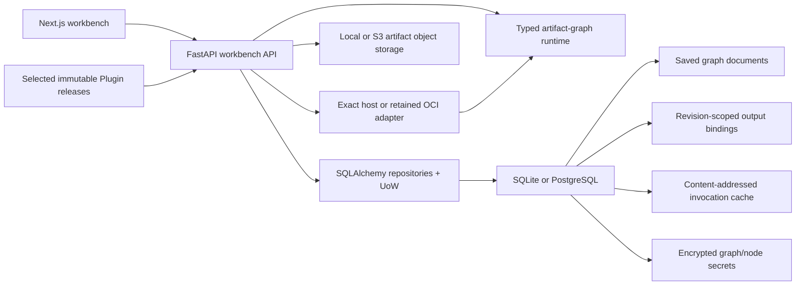
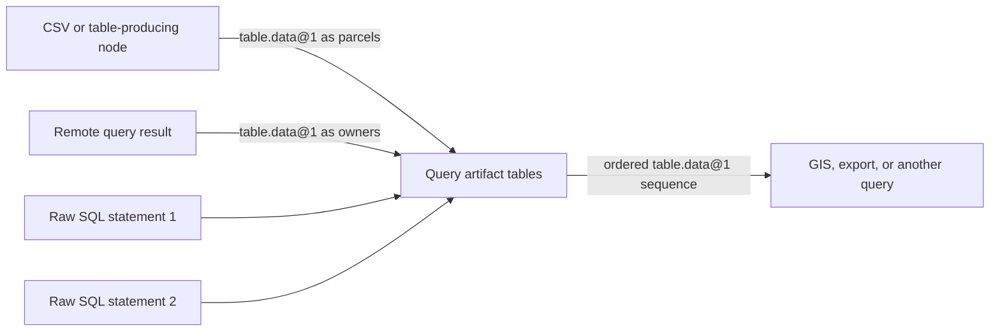
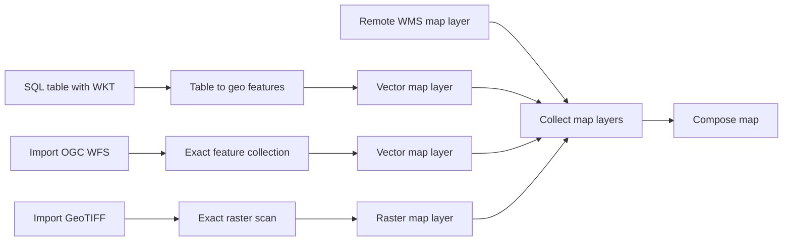
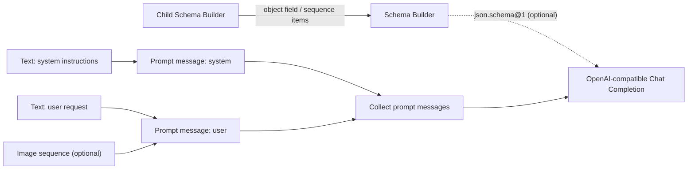

# Grafy Workbench

Grafy is a node-first workbench for building and running typed artifact
graphs. Nodes declare typed ports, while edges may select schema-derived or
explicit fields from compound artifacts or apply an ordered path of declared,
versioned artifact conversions before a downstream node executes.

Each edge declares how its value is transported. `direct` passes a compatible
value with its collection shape unchanged; `map` connects a sequence to one
item input, invokes the target once per item, broadcasts its other inputs, and
returns ordered output sequences. The runtime derives invocation from those
edges, so mapping is explicit workflow structure rather than hidden node state.

Field projection and artifact conversion are distinct compatibility primitives.
Nested JSON Schema `string` and `integer` leaves are automatically exposed as
the installed canonical scalar artifact types. Structural projection remains a
runtime capability for compound artifact types supplied by plugins; its
behavioral coverage uses a test/plugin compound type rather than a production
tutorial node. A declared conversion can then materialize a projected integer
as `scalar.text@1`. If the registry declares `X -> Y` and `Y -> Z`, the
workbench can persist and execute the exact `X -> Y -> Z` path on one edge.
These choices remain visible without adding boilerplate adapter nodes.
Configurable or domain-significant transformations remain nodes.

## Architecture



- `apps/web` owns the canvas, node rendering, schema-driven controls, and edge
  projection/conversion/mapping editor.
- `apps/api` owns exact release admission, runtime composition, and the HTTP
  adapters for execution and saved-graph CRUD under `/v1`.
- `libs/core/src/grafy_core` owns artifacts, nodes, ports, projections,
  conversions, runtime execution, saved-graph aggregates and use cases, the
  Plugin contract, producer-neutral artifact contracts, portable runtime
  primitives, and graph-Module boundaries.
- `libs/persistence` owns the async SQLAlchemy repository and unit-of-work
  adapters for saved graphs and graph materialization bindings. Alembic is the
  only schema authority.
- `libs/storage` owns the local and S3-compatible object stores.
- `plugins/arithmetic`, `plugins/image`, `plugins/prompt`, `plugins/schema`,
  `plugins/sequence`, `plugins/table`, and `plugins/text` own the first-party
  bundled System Plugin implementations and their release declarations.
- `plugins/ocr` is an independently packaged System Plugin. It owns the OCR
  page node, its artifacts and persistence/resolution, and the Tesseract OCR
  adapter.
- `plugins/gis` owns exact WGS84 vector sources, georeferenced raster scans,
  OGC WFS/WMS integration, lightweight map-layer recipes, and ordered map
  composition. MapLibre renders derived PMTiles and XYZ projections without
  downloading complete source artifacts into the browser.
- `plugins/llm` owns provider-backed generation. Its generic OpenAI-compatible
  Chat Completions node wraps the official OpenAI Python SDK, consumes exact
  prompt messages and an optional runtime JSON Schema, and keeps credentials
  outside core.
- `plugins/sql` owns engine-neutral parameterized statement artifacts, the
  existing atomic PostgreSQL batch executor, and an isolated DuckDB executor
  for joining materialized `table.data@1` artifacts. PostgreSQL connection
  identity is node configuration, while its password remains in encrypted
  node-secret storage.
- `CONTEXT.md` defines the product vocabulary and active scope.
- `docs/workbench-interaction-plan.md` records the current interaction decisions,
  their rationale, acceptance criteria, and deliberately deferred work.

There is intentionally no legacy extraction pipeline, Dagster deployment,
message broker, worker service, or platform API in this workspace.

Saved graph documents contain workflow structure and canvas layout, not run
state. Successful outputs are recorded separately as durable materialization
bindings. A "latest" output is therefore exact: it is the binding for one graph
id, graph revision, node id, and output port, and it is reusable only while all
referenced artifacts are accessible to the active runtime. A default selected
run reuses those bindings without executing unselected sources. If a required
binding is missing, the workbench blocks the run and offers running the upstream
node or **Run with dependencies**; that separate action executes the selection's
full upstream closure.

Execution reuse is a separate concern from those revision-scoped bindings.
Nodes default to `never` caching; deterministic System nodes opt into the
`exact` policy explicitly. An exact invocation key covers the operator version,
validated configuration (including defaults), stable node/module identity,
invocation mode and mapped item index, resolved artifact-type bindings, exact
ordered input refs and SHA-256 values, and opaque secret revisions. Mapped nodes
cache each item independently, so a failed or newly added item does not force
already completed items to execute again. Provider, OCR, upload, and graph-module
wrapper nodes remain uncached unless their own declaration can supply every
required stable identity. Cache entries store only the final digest and artifact
refs; stale or inaccessible refs are evicted lazily.

## Register a plugin

Each Plugin project exports one `grafy_core.plugins.Plugin` declaration from a
stable loader target. Workspace projects are published as immutable,
workspace-scoped releases and execute through the retained isolated runtime;
the API never imports their working copies.

System packages are enumerated by the platform-owned inventory. A deployment
may bind an exact current System release to installed host code by supplying
`GRAFY_SYSTEM_PLUGIN_DEPLOYMENT_MANIFEST`. Startup verifies the installed
distribution bytes and exact release contract before importing only the named
loader targets. Merely installing a package does nothing, and an API with no
manifest starts with host-owned Module boundaries only. See
[Plugin development](docs/design/plugin-development.md) for project shape and
publication workflows.

### Query artifact tables

The SQL plugin keeps statement authoring separate from execution. Connect one
or more **Raw SQL statement** nodes and one or more named table-artifact inputs
to **Query artifact tables**. Relation names are stable node configuration, so
renaming or reordering a relation does not discard its graph connection.



Every statement artifact must contain exactly one read-only query. All queries
see the same immutable relation snapshot and produce one ordered table output;
the node returns no outputs when any query fails. Canonical `:name` parameters
remain reusable by both executors—the DuckDB adapter translates them to native
bindings without interpolating values into SQL.

DuckDB runs in a fresh subprocess with bounded input/output, rows, wall time,
CPU, file descriptors, and spill space, plus a DuckDB engine memory limit.
External files, replacement scans, extension installation/loading, and
configuration changes are disabled.
DuckDB configuration is defense in depth rather than a complete operating-
system sandbox; production deployments should additionally run the job worker
in a networkless, least-privileged container or VM with no application data or
credential mounts.

### Report live node progress

Nodes may publish short, user-visible progress messages through their execution
context. The managed execution API streams those messages from
`GET /v1/executions/{execution_id}/events`, and the workbench displays them on
the node that emitted them. Messages from a graph module's child nodes are
grouped under that module instance.

```python
async def run(
    self,
    context: NodeExecutionContext,
    config: ImportConfig,
    inputs: ImportInput,
) -> ImportOutput:
    await context.progress("Preparing the payload")
    await context.progress("Uploading records", current=40, total=100)
    ...
```

Function nodes may opt into the same context by declaring
`(context, config, inputs)` instead of `(config, inputs)`. Progress is ephemeral
and bounded: it is not saved in execution history or graph documents, and a
missing subscriber never blocks or fails node execution. Messages must remain
short status text; do not include credentials, secrets, full inputs, payloads,
or one-time URLs. The JSON execution endpoint remains the source of truth for
the terminal result.

## Run locally

Requirements:

- Python 3.14
- [uv](https://docs.astral.sh/uv/)
- [just](https://github.com/casey/just)
- Node.js 20+ and npm
- For local GIS project tests: GDAL 3.8+ with writable PMTiles, COG, and PNG
  drivers, plus `gdal2tiles.py`. Isolated Plugin runtime images own their native
  tools; the API image does not.

Install both workspaces:

```bash
just install
```

The default installation contains the API, core, persistence, storage, and web
application. Install every System project into the root integration-test
environment using:

```bash
just install-all
```

Installation does not activate a System Plugin. The API loads host code only
when an exact `GRAFY_SYSTEM_PLUGIN_DEPLOYMENT_MANIFEST` binds an installed
distribution to a selected immutable release; isolated execution uses that
release's retained OCI artifact.

Start the API and web app in separate terminals:

```bash
just api
just web
```

For a VPS deployment behind an existing Nginx instance, use the production
[Docker Compose guide](infra/docker/README.md). The Compose services publish
only loopback-bound ports, run migrations before the API, and keep the database
and local artifact objects in one durable volume.

On a configured production host, deploy the checked-out branch and wait for
healthy services with:

```bash
just deploy
```

Use `just status`, `just logs`, and `just minio-status` for routine operations.
The production recipes read `/etc/grafy/grafy.env` and merge
`/etc/grafy/storage.override.yaml`; override those paths with
`GRAFY_ENV_FILE` and `GRAFY_COMPOSE_OVERRIDE` when required.

`just api` applies pending Alembic migrations before starting FastAPI. Saved
graphs, artifact metadata, and materialization bindings are stored in SQLite at
`.grafy-artifacts/workbench/grafy.sqlite3` by default, together with exact
invocation-cache entries. Override
`GRAFY_DATABASE_URL` with another SQLite URL or a
`postgresql+asyncpg://...` URL for PostgreSQL. Useful
migration commands are `just db-current`, `just db-history`, and
`just db-revision "describe change"`.

`just api` never discovers installed Plugin packages ambiently. Configure an
exact System deployment manifest and selected release when exercising a System
host binding; use the retained OCI runtime for isolated-only families such as
GIS, LLM, OCR, and SQL.

### Compose vector and raster maps

The GIS workflow separates exact data from rendering instructions:



`geo.feature_collection@1` is the exact WGS84 vector source. Its stored JSON
chunks remain authoritative; a PMTiles archive is generated only as a browser
projection. `geo.raster_scan@1` is a canonical Cloud Optimized GeoTIFF, with a
derived XYZ pyramid for browser rendering. `geo.map_layer@1` references one
source and owns its style, visibility, opacity, attribution, and zoom range.
`geo.map_document@1` contains only an ordered list of layer references, a
basemap choice, and optional initial bounds.

For database WKT, configure **Table to geo features** with the geometry column
and its actual source CRS; the node reprojects supported point, line, polygon,
multi-geometry, and geometry-collection values to exact EPSG:4326 features.
Create a **Vector map layer** for each vector source and a **Raster map layer**
for each GeoTIFF. Collect the `geo.map_layer@1` outputs in drawing order, then
connect the ordered sequence to **Compose map**. The preview loads only after an
explicit click and exposes local order, visibility, opacity, zoom, vector style,
label, and raster image controls.

External GeoServer-compatible services follow the same model. **Import OGC
WFS features** takes a bounded snapshot into an exact feature artifact. **Remote
WMS map layer** keeps the remote raster live and proxies only requested image
tiles. For Atlas Fontium, use
`https://data.atlasfontium.pl/geoserver/ows`; example layer names include
`geonode:powiaty`, `geonode:miejscowosci`, and historical raster layers exposed
by its capabilities document. Service URLs must be public and credential-free,
and WMS layers require explicit bounds and attribution.

This is a clean-break development contract: rerun old GIS nodes to create the
new source projections and reference-only map artifacts. The API intentionally
does not reconstruct or page legacy embedded map documents.

Open <http://localhost:3000>. The API is available at
<http://localhost:8000>; its health endpoint is `/health`.

The workbench defaults to local artifact storage and a local API URL. Set
`GRAFY_STORAGE_BACKEND=s3` plus the S3 settings shown in `.env.example` for
AWS S3 or an S3-compatible service such as MinIO.

The OpenAI-compatible node uses a write-only key configured on a saved node,
not an environment-specific provider variable. Generate one stable encryption
key for the Grafy server and put it in `.env` before configuring node keys:

```bash
openssl rand -base64 32
```

Assign the result to `GRAFY_CREDENTIAL_ENCRYPTION_KEY`. Keep that value
stable and backed up: replacing or losing it makes existing encrypted node
keys unusable. Graph documents, run requests, artifact payloads, and read APIs
never contain provider keys. Stored ciphertext is bound to graph id, node id,
operator version, secret name, and the normalized `base_url`; changing the URL
deletes the old binding and requires explicitly applying a key for the new
endpoint. Removing a node likewise deletes its encrypted node secrets, so
reusing the node id cannot reactivate an old credential.

### Try OpenAI-compatible generation

Build one provider-neutral prompt graph, then connect it to the generic external
LLM node:



Add the system message to Collect before the user message. Keep the Collect to
LLM edge in `direct` mode so the LLM receives the ordered conversation once;
`map` would invoke it independently for every message. Configure the node's
base URL, model, generation limits, and write-only API key after saving the
graph. The default endpoint is OpenAI, while the same node can target an
OpenAI-compatible LiteLLM or OpenRouter base URL. Remote endpoints must use
HTTPS; plain HTTP is accepted only for localhost and loopback development.

Connect Schema Builder only when structured output is needed. It emits Draft
2020-12 JSON text with an object root. Add primitive fields inside the node;
choose Schema, or Sequence with Schema items, to expose a field-owned input
socket for another builder. The request uses Chat Completions `json_schema`
response format and Grafy validates the returned object locally. For
example:

```json
{
  "type": "object",
  "required": ["title"],
  "properties": {
    "title": { "type": "string" }
  },
  "additionalProperties": false
}
```

The OpenAI-compatible adapter accepts PNG, JPEG, GIF, and WebP image
artifacts on user messages. It bounds one request to eight images, 20,000,000
bytes per image, and 50,000,000 image bytes in aggregate before base64 encoding.

Node secrets currently use trusted-collaboration semantics. Any visitor who can
access a graph can run it without retrieving the configured key. Because this
repository does not yet have authentication or graph roles, those visitors can
also replace or remove the key through the API. Put the Grafy API behind
HTTPS and an access-controlled boundary before exposing it to untrusted users.

## Verify

Run the full retained contract:

```bash
just check
```

The check runs backend tests, Python and TypeScript lint/type checks, verifies
that the generated OpenAPI client is current, and builds the production web
bundle. Python verification enables every declared development extra so all
System Plugin families remain covered without making them ambient runtime
discoveries.

To exercise the runtime without the browser:

```bash
just smoke
```

## Containers

The API Dockerfile's `api-plugins` target adds the Docker CLI used by the
opt-in retained OCI runtime and System publisher, but installs only
`grafy-api` and its bundled dependencies. GIS, LLM, OCR, SQL, and their native
tools belong in retained Plugin images, not the online API image. A one-shot
migration service must complete before the API starts. SQLite, uploads, and
artifact objects share the durable `grafy-data` volume.

```bash
just docker-up
just docker-down
```
