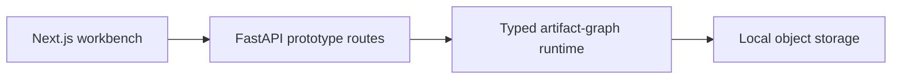

# Notarius Workbench

Notarius is a node-first workbench for building and running typed artifact
graphs. The current codebase is the working prototype: nodes declare typed
ports, edges may select declared fields from compound artifacts, and the
runtime materializes those values only when a downstream node executes.

That field-projection model is the important compatibility primitive. An
`arithmetic.result@1` artifact can expose `addition` and `subtraction` as
`scalar.integer@1`, so either nested value can connect directly to an integer
input without a visible adapter node.

## Architecture



- `apps/web` owns the canvas, node rendering, schema-driven controls, and field
  projection picker.
- `apps/api` exposes the five `/v1/prototype/*` routes and server-side Mistral
  OCR adapter.
- `libs/core/src/notarius_core/prototype` owns artifacts, nodes, ports,
  projections, materialization, execution, and persistence.
- `libs/storage` owns the local file object store.
- `CONTEXT.md` defines the product vocabulary and active scope.

There is intentionally no legacy extraction pipeline, Dagster deployment,
message broker, worker service, or platform API in this workspace.

## Run locally

Requirements:

- Python 3.12.9
- [uv](https://docs.astral.sh/uv/)
- Node.js 20+ and npm

Install both workspaces:

```bash
make install
```

Start the API and web app in separate terminals:

```bash
make api
make web
```

Open <http://localhost:3000>. The API is available at
<http://localhost:8000>; its health endpoint is `/health`.

The workbench defaults to local artifact storage and a local API URL. Copy
`.env.example` only when you need to override them. `MISTRAL_API_KEY` is
required only for the Mistral OCR node and must remain server-side.

## Verify

Run the full retained contract:

```bash
make check
```

The check runs backend tests, Python and TypeScript lint/type checks, verifies
that the generated OpenAPI client is current, and builds the production web
bundle.

To exercise the runtime without the browser:

```bash
make smoke
```

## Containers

The Compose stack contains only the API and web app. Prototype artifacts are
stored in the `prototype-data` volume.

```bash
make docker-up
make docker-down
```
