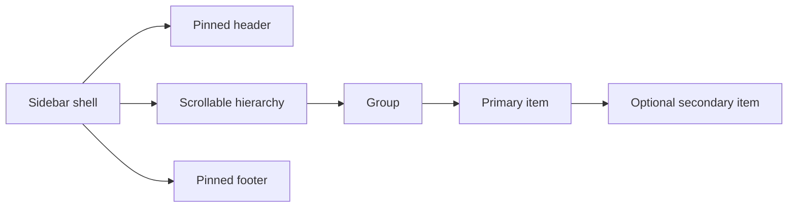

# BB Sidebar Specification

Status: implementation handoff
Audience: coding agent implementing the BB web application
Reference inspected: Superconductor (`super.engineering`) desktop app, 26 August 2026
Document type: reference specification

## 1. Goal

Replace BB's current left navigation with a compact, hierarchical sidebar inspired by Superconductor. Match the reference's density, hierarchy, restrained styling, selection treatment, and progressive disclosure while keeping BB's own terminology, data model, routes, icons, and branding.

The finished sidebar should feel like a persistent outline of the user's work, not a dashboard menu or a stack of cards.

## 2. Scope and assumptions

This specification covers:

- desktop and web-responsive sidebar layout;
- hierarchy, row anatomy, spacing, typography, and visual states;
- expand/collapse, selection, hover actions, scrolling, keyboard behavior, and persistence;
- loading, empty, error, long-label, and large-list states;
- accessibility semantics;
- a suggested component and data contract;
- integration notes for the current `apps/web` implementation;
- verification and acceptance criteria.

This specification does not cover:

- the main content area, its toolbar, chat, canvas, or bottom status bar;
- copying Superconductor's proprietary branding or exact icons;
- adopting git-specific concepts when BB does not have the same domain object;
- redesigning BB's backend or route model solely to support the sidebar;
- drag-and-drop reordering in the first implementation.

Assumption: "BB app" refers to the web app in `apps/web`. If BB is a different codebase, keep the UI and behavioral contract below and replace the integration-file references.

## 3. Reference observations

The following are directly observed in the live Superconductor app and supplied screenshot:

- The sidebar occupies the full window height below/behind the native top bar.
- At a 1268 px-wide window, the sidebar/main divider sits at approximately 321-322 px.
- The sidebar surface is a very pale cool gray, visually distinct from the near-white content surface.
- Content is left aligned and intentionally dense; there are no standalone navigation cards.
- A small context label appears above a `Projects` section label.
- Each top-level project has a compact identity row: avatar/icon, name, disclosure affordance, and a trailing add action.
- Clicking a project header toggles its expanded/collapsed state.
- Expanded projects reveal indented primary rows and, where present, further-indented child rows.
- Primary rows show a branch/worktree icon, title, optional favorite marker, relative age, and a right-aligned green change count.
- Child rows show a small task icon and a single-line title.
- The selected row uses a subtle cool-gray fill and thin border with a small radius. It does not use a bright accent stripe.
- Hovering a project header replaces passive trailing space with an overflow action and keeps the add action visible.
- Hovering a primary row reveals several compact contextual actions at the trailing edge.
- Inactive metadata is muted; positive numeric status is green; exceptional negative status is red.
- The sidebar scrolls independently from the main content.
- Persistent utility actions sit at the bottom edge, separated from the scrollable project hierarchy.

The following are recommended web adaptations rather than observed native-app behavior:

- a 44 px minimum hit area on touch layouts;
- an overlay drawer on narrow mobile screens;
- keyboard tree navigation and explicit ARIA tree semantics;
- local persistence of group expansion and desktop width;
- tooltips for icon-only actions and truncated labels.

## 4. Design principles

1. **Hierarchy before decoration.** Indentation, typography, and metadata communicate structure. Avoid nested cards, heavy shadows, and colored blocks.
2. **Dense but calm.** The user should scan many objects without the rail feeling cramped or noisy.
3. **Actions appear in context.** Rare actions stay hidden until hover, focus-within, selection, or a menu is opened.
4. **Selection is quiet and unmistakable.** Use one neutral filled row with a thin border. Do not combine multiple selected indicators.
5. **Domain nouns belong to BB.** Copy the interaction grammar, not Superconductor's git vocabulary.
6. **One scroll region.** The hierarchy scrolls; the top utility strip and bottom utility strip remain anchored.
7. **Stable geometry.** Revealing actions must not shift row text or change row height.

## 5. Information architecture

Use these role names in implementation. Product copy may use BB-specific labels.

| Sidebar role | Superconductor example | BB mapping |
| --- | --- | --- |
| Context label | `Default` | Active account, environment, or location label; omit if redundant |
| Section label | `Projects` | BB's top-level collection label |
| Group | Repository/project (`grafY`) | Workspace/team/project container |
| Primary item | Branch/worktree (`main`) | Graph/document/board or other main work object |
| Secondary item | Task/thread (`App Dev Environment Setup`) | Session/run/thread associated with the primary item |
| Primary status | `+13284`, `-3`, age | BB's most useful compact status and relative activity time |
| Group action | Plus button | Create/import an object inside that group |
| Bottom utilities | Settings/add controls | Existing BB settings, account, and creation affordances |

Do not invent a secondary level if BB has no meaningful child object. In that case, render groups and primary items only.



## 6. Desktop anatomy and geometry

### 6.1 Shell

| Property | Target |
| --- | --- |
| Default width | 320 px |
| Minimum resizable width | 240 px |
| Maximum resizable width | 420 px |
| Height | `100dvh` |
| Position | Fixed to the left edge |
| Layer | Above page content; below modal/dialog portals |
| Right divider | 1 px neutral border |
| Background | Cool neutral surface, slightly darker than the main canvas |
| Horizontal padding | 8 px |
| Top content padding | 8 px after the application/native toolbar |
| Bottom padding | 8 px plus safe-area inset |

Keep `--grafy-rail-width` as the single source of truth for the rail and adjacent content offset. The current application already relies on this variable.

### 6.2 Vertical regions

1. **Pinned header:** context label and optional global sidebar controls.
2. **Scrollable hierarchy:** section label, groups, primary rows, and optional secondary rows.
3. **Pinned footer:** account/settings and any existing global create affordance.

Only region 2 receives `overflow-y: auto`. Use `min-height: 0` on the flex child so it can actually shrink.

### 6.3 Indentation

Use a regular 16 px indentation step:

- group header content starts at 2 px inside the row;
- primary item content starts 16 px deeper than the group header;
- secondary item content starts 32 px deeper than the group header.

Icons occupy a fixed 16 px column. Text begins at a stable x-coordinate for every row at the same level.

### 6.4 Row heights

| Element | Desktop height | Notes |
| --- | ---: | --- |
| Context label | 24 px | 11-12 px text |
| Section label | 22 px | Includes spacing below |
| Group header | 30 px | Identity plus trailing actions |
| Primary item with metadata | 42 px | Two-line layout |
| Primary item without metadata | 30 px | One-line layout allowed |
| Secondary item | 30 px | Single-line layout |
| Footer action | 32 px | Increase on touch layouts |

Rows use a 5-6 px radius. Maintain 2 px vertical space between independently selectable rows. Do not add vertical gaps between a primary item and its own secondary children beyond the indentation rhythm.

## 7. Visual tokens

Use the existing BB/Grafy design tokens where possible. The values below describe the required contrast relationship, not a new parallel token system.

| Role | Light target | Existing token direction |
| --- | --- | --- |
| Sidebar surface | cool gray near `#f4f5f7` | Add/use a rail-specific surface derived from `colorSurface` |
| Main divider | neutral gray near `#dfe1e5` | `colorBorder` / `colorDivider` |
| Primary text | near black | `colorText` |
| Secondary text | medium gray | `colorMuted` |
| Tertiary metadata | lighter gray | `colorSubtle` |
| Hover fill | 4-6% ink | `colorHover` |
| Selected fill | cool neutral, stronger than hover | `colorSurfaceRaised` or a dedicated selected token |
| Selected border | 1 px neutral | `colorBorder` |
| Positive status | muted green | `colorSuccess` |
| Negative/destructive status | muted red | `colorDanger` |

Dark mode must preserve the relationships: rail distinguishable from canvas, selected stronger than hover, border visible without glowing, and status colors readable. Use `light-dark()` in the shared shell stylesheet; do not introduce raw one-theme component colors.

Do not use shadows inside the hierarchy. Menus/popovers may use the existing overlay shadow.

## 8. Typography

- Use the existing Geist Sans family.
- Context label: 12 px, 600 weight, primary text.
- Section label: 11 px, 500 weight, muted text. Keep the visible label in normal/title case unless BB's existing language requires uppercase.
- Group name: 12 px, 600 weight.
- Primary item title: 12 px, 500 weight when selected; 400-500 otherwise.
- Secondary item title: 11-12 px, 400 weight.
- Relative time and counters: 10 px, 400-500 weight.
- Line height: approximately 1.25-1.35.
- All row labels are single line with ellipsis. Never wrap a row and increase its height.

The complete label must remain available through `title`, tooltip, or an accessible description.

## 9. Component contract

Suggested public shape:

```ts
type SidebarSecondaryItem = {
  id: string;
  label: string;
  href: string;
  icon?: React.ReactNode;
  status?: "idle" | "running" | "succeeded" | "failed";
};

type SidebarPrimaryItem = {
  id: string;
  label: string;
  href: string;
  icon: React.ReactNode;
  favorite?: boolean;
  updatedAt?: string;
  positiveCount?: number;
  negativeCount?: number;
  children?: readonly SidebarSecondaryItem[];
};

type SidebarGroup = {
  id: string;
  label: string;
  icon: React.ReactNode;
  items: readonly SidebarPrimaryItem[];
  canCreate?: boolean;
};
```

Use typed domain objects directly if BB's existing `Workspace` and `SavedGraphSummary` models already express the needed fields. Do not introduce this projection merely to rename fields. A projection is justified only if several BB domains feed the same sidebar.

Recommended component ownership:

- `WorkspaceRail`: shell, responsive mode, width persistence, active-route resolution, and data orchestration;
- `SidebarGroup`: group disclosure and group-level actions;
- `SidebarPrimaryRow`: selectable work object, metadata, hover actions, and optional child disclosure;
- `SidebarSecondaryRow`: child link/status;
- existing menu components: rename/delete/share or equivalent contextual operations.

Keep row components in the workspace/sidebar feature unless they are reused elsewhere. Avoid a generic global `Tree` abstraction for this single product navigation use case.

## 10. Interaction specification

### 10.1 Group disclosure

- Clicking the group row's disclosure area toggles expansion.
- Clicking the group name also toggles expansion unless that name must navigate. If navigation is required, use a dedicated disclosure button and do not overload the label.
- The trailing create button creates inside that group and must stop event propagation.
- Persist expanded group IDs in local storage per signed-in user when a stable user key is available.
- A newly created group starts expanded.
- A group containing the active route is forced visible on initial load, even if stored as collapsed.

### 10.2 Primary selection

- Clicking a primary row navigates to its object.
- Route state, not stale component state, is the source of truth for selection.
- A selected primary row stays visibly selected when its overflow menu is open.
- Selection fill spans the full available row width, including the metadata area.
- If a primary item has children, use a small independent disclosure control. Do not make navigation and disclosure ambiguous.

### 10.3 Secondary selection

- Clicking a secondary row navigates to or opens the child object.
- When a secondary row is selected, it receives the selected treatment; its parent primary row receives only a subtle active-parent text/icon emphasis, not a second selected fill.
- Selecting a secondary item expands both ancestors.

### 10.4 Hover and focus actions

- Group hover/focus-within reveals overflow and create buttons at the right edge.
- Primary-row hover/focus-within reveals only the actions valid for that item.
- Reserve trailing action width at all times so text does not jump when actions appear.
- Hide passive counters only when needed to make room for actions; restore them after hover/focus ends.
- Every icon action has an accessible name and tooltip.
- Destructive actions live inside an overflow menu, never as an always-visible row icon.

### 10.5 Width and collapse

- Desktop users may drag the divider between 240 and 420 px.
- Clicking the divider toggles between the last expanded width and a 64 px compact rail only if BB retains its existing compact mode.
- Persist the last expanded width and compact state.
- During drag: disable text selection, use a column-resize cursor, and update `--grafy-rail-width` directly for smooth canvas layout.
- In compact mode, show only top-level/global navigation icons. Do not attempt to render the multi-level hierarchy as unlabeled indented icons; expose the hierarchy in a popover or expand the rail when invoked.

### 10.6 Keyboard behavior

- `Tab` visits actionable controls in DOM order.
- Arrow Up/Down moves among visible tree items when focus is inside the hierarchy.
- Arrow Right expands a collapsed item; on an expanded item it moves to the first child.
- Arrow Left collapses an expanded item; otherwise it moves to the parent.
- Enter activates/navigates; Space toggles disclosure when focus is on a disclosure control.
- Escape closes an open menu or mobile drawer and returns focus to its trigger.
- Do not create a keyboard trap in the desktop rail.

## 11. States

### Loading

Keep the shell and labels stable. Render 3-5 neutral skeleton rows using the final row heights. Do not show a full-screen spinner.

### Empty

- No groups: show one compact sentence and a single `Create …` action in the hierarchy region.
- Empty group: keep the expanded group visible and show a one-line muted empty message at the primary indentation level.
- No child items: omit the child disclosure affordance.

### Error

Show a compact inline error beneath the affected group with a `Retry` action. Preserve other successfully loaded groups. Error text must name the failed operation when possible.

### Running or syncing

Use a 12-14 px spinner or status dot in the icon/status position without changing row geometry. Respect reduced motion by replacing rotation with a static status glyph.

### Disabled or unavailable

Keep the row readable, reduce contrast, remove pointer cursor, and explain the reason via tooltip or adjacent status. Do not silently hide objects the user expects to find.

### Long and duplicate labels

Ellipsize visually. Use stable IDs for keys and routes. Tooltips show full labels; do not rely on label uniqueness.

### Large lists

The hierarchy scrolls as one region. Start without virtualization; add it only after measuring a real performance problem. Preserve active-item reveal with `scrollIntoView({ block: "nearest" })` after route changes.

## 12. Responsive behavior

| Viewport | Behavior |
| --- | --- |
| Above 1024 px | Expanded 320 px rail by default; user-resizable |
| 621-1024 px | 240-280 px rail or the existing 64 px compact mode, based on available canvas space |
| 620 px and below | Rail becomes a modal left drawer; no persistent page offset |

Mobile drawer requirements:

- width is `min(320px, calc(100vw - 24px))`;
- opens from the existing mobile menu button;
- uses a dimmed backdrop;
- traps focus while open because it is modal;
- closes on backdrop click, Escape, and successful navigation;
- restores focus to the menu trigger;
- uses at least 44 px interactive row heights;
- allows the hierarchy region to scroll independently;
- accounts for safe-area insets.

## 13. Accessibility semantics

Prefer native controls and links. The hierarchy may use either:

1. a conventional nested navigation list (`nav > ul > li`) with explicit disclosure buttons; or
2. an ARIA tree when the full arrow-key behavior in section 10.6 is implemented and tested.

Do not declare `role="tree"` without implementing its keyboard contract.

Required details:

- sidebar label: `Primary navigation`;
- hierarchy label: BB's visible collection noun;
- disclosure buttons expose `aria-expanded` and name the group/item;
- the current navigational link uses `aria-current="page"`;
- icon-only buttons have specific labels such as `Add graph to Personal`;
- counters expose meaningful combined text rather than separate unlabeled numbers;
- focus rings meet 3:1 contrast and remain visible on the selected fill;
- text and status contrast meet WCAG AA;
- animations stop under `prefers-reduced-motion`.

## 14. Integration with the current BB/Grafy web app

The current rail is owned by `apps/web/src/features/workspaces/WorkspaceLayout.tsx`; shared rail geometry and responsive behavior live in `apps/web/src/app/globals.css`; global visual tokens live in `apps/web/src/lib/stylex/tokens.stylex.ts`.

Implementation guidance:

1. Keep `WorkspaceRail` as the orchestration boundary and keep `--grafy-rail-width` as the shell contract.
2. Replace the current flat `Workspaces`, `Graphs`, `Location`, and `Recent` presentation with the grouped hierarchy. Preserve the underlying routes and actions.
3. Map each workspace to a group. Map saved graphs to primary rows. Only add secondary rows if BB already has a meaningful session/run/thread route.
4. Preserve the existing account/settings footer behavior and mobile modal mechanics.
5. Reuse `GraphRowMenu` for graph overflow actions where its contract fits.
6. Keep shared shell/responsive CSS in `globals.css`. Keep any complex row-only styling together with the sidebar feature; do not split one row's layout among global CSS, StyleX, and inline styles.
7. Use the existing `useMediaQuery` breakpoints for behavior and keep them aligned with CSS.
8. Preserve current data hooks and typed API models. This is a presentation and navigation change, not a new API design.

Suggested BB copy mapping:

| Current BB concept | New placement |
| --- | --- |
| Workspace selector | Group headers or a compact context switcher above the hierarchy |
| All graphs | Pinned utility row above groups |
| New graph | Group-level plus action and an accessible menu command |
| Quick switch | Remove if the full hierarchy makes it redundant; otherwise keep as a keyboard command, not a duplicate permanent row |
| Save/Saved | Keep in workbench chrome; do not treat save state as navigation |
| Location | Express through the expanded group and selected row; remove duplicate static location section |
| Recent graphs | Sort or annotate group children by recency instead of maintaining a duplicate section |
| Teams & access | Pinned footer utility |
| Account/theme/logout | Existing footer popover |

## 15. Recommended implementation sequence

1. Add the sidebar surface/selection tokens and update width defaults.
2. Build static group, primary, and secondary row states in the development-only `/sandbox` host using real BB tokens.
3. Wire workspaces and graphs into the hierarchy without changing routes.
4. Add route-derived selection and ancestor expansion.
5. Add contextual menus and group create actions.
6. Add persistence for width and expansion.
7. Implement keyboard and accessibility behavior.
8. Integrate responsive drawer behavior.
9. Add state/error/empty coverage and visual regression screenshots.
10. Remove superseded flat-rail markup and styles after all call sites use the new hierarchy.

## 16. Test plan

### Unit and component tests

- active route selects exactly one row;
- a selected secondary item expands both ancestors;
- group disclosure toggles without navigation;
- group create and row menu actions do not trigger parent navigation;
- hover/focus action visibility does not change measured row geometry;
- full labels remain accessible when visually truncated;
- loading, empty, partial error, and disabled states render correctly;
- stored expansion/width values are restored and invalid values are clamped;
- compact and mobile modes expose usable labels;
- Escape closes menus/drawer and restores focus;
- reduced-motion mode removes nonessential animation.

### Integration tests

- navigate from one workspace/group to another graph and verify route, selection, and scroll position;
- create a graph from a group action and verify that group is expanded and the new graph is selected;
- rename/delete through the existing row menu and verify focus recovery;
- resize the rail while the workbench is open and verify canvas/content offset tracks the same CSS variable;
- open the mobile drawer, navigate, and verify it closes without leaving the page inert.

### Visual checkpoints

Capture at least:

- 1440 x 900 expanded, normal state;
- 1440 x 900 selected row plus hover actions;
- 1024 x 768 constrained desktop/tablet state;
- 390 x 844 mobile drawer;
- light and dark themes;
- 200% zoom with long labels;
- loading, empty group, and partial error.

## 17. Acceptance criteria

The implementation is complete when all of the following are true:

- The sidebar reads as a dense, hierarchical outline with group, primary, and optional secondary levels.
- Desktop default width is 320 px and adjacent content uses the same width variable.
- The hierarchy scrolls while header/footer utilities remain anchored.
- Group expansion, route selection, and active-ancestor visibility are deterministic and persisted where specified.
- Selected, hover, focus, running, disabled, success, and error states are visually distinct without layout shift.
- Contextual actions appear on hover and keyboard focus and have accessible labels/tooltips.
- No row label wraps; long labels remain discoverable.
- The mobile experience is a focus-managed drawer with 44 px targets.
- Existing BB navigation, create, rename, delete, settings, account, theme, and logout behaviors continue to work.
- The implementation does not add a backend endpoint merely for presentation.
- Component tests, type checking, linting, and the relevant web test suite pass.
- A real rendered pass confirms keyboard navigation, pointer interaction, resizing, mobile drawer behavior, and light/dark visual quality.

## 18. Explicit non-goals for the first pass

- drag-and-drop reordering;
- arbitrary user-defined nesting;
- virtualization without measured need;
- animated tree connectors;
- bright brand-colored selection;
- duplicating the same graph in both a hierarchy and a permanent `Recent` section;
- a generic reusable tree framework.

## 19. Open product decision

BB must decide whether a graph has a meaningful navigable child object. If runs/sessions/threads are not first-class destinations, omit secondary rows. Do not manufacture hierarchy purely to imitate the reference. The group-plus-primary structure already captures most of Superconductor's sidebar character.
