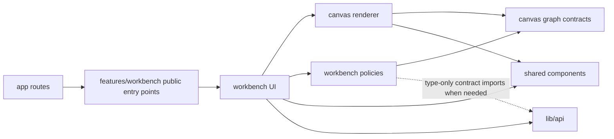

# ADR 0001: Organize the Workbench as a feature-first vertical slice

- **Status:** Accepted
- **Date:** 2026-07-17
- **Scope:** `apps/web`

## Context

The Workbench is one highly interactive editor. Canvas state, node and edge
authoring, selection, graph persistence, execution, notifications, and dialogs
coordinate within the same client lifecycle.

An islands architecture is designed for independently interactive regions within
otherwise static content. Treating Workbench regions as islands would not remove
their shared graph and execution policies. It would move that coordination into
a shared store or event bus and make cross-region invariants harder to follow.
Server components may still validate routes or preload data around the editor,
but islands are not the organizing pattern for the interactive Workbench itself.

The current frontend also spreads Workbench ownership across route files,
Workbench components, canvas components, hooks, and API modules. The refactor
needs a structure that can be adopted incrementally without introducing a full
Clean Architecture or Feature-Sliced Design taxonomy.

## Decision

Organize Workbench code as one feature-first vertical slice under
`src/features/workbench`.

```text
src/
  app/                         # Next.js routes and application composition
  features/
    workbench/
      index.ts                 # Public client feature API
      routes.ts                # Public server-safe route API
      ui/                      # Workbench composition and user-facing regions
      model/                   # Graph policies and state transitions
      canvas/                  # React Flow adapter, nodes, edges, and handles
  components/                  # Reusable, feature-agnostic UI and providers
  lib/
    api/                       # Generated contracts and concrete HTTP adapter
```

The Workbench remains one client feature. Its UI may be split into components,
and its policies may be split into model modules, without introducing independent
hydration boundaries.

### Dependency direction



Imports follow these rules:

1. `app` owns route parameters, route validation, layouts, and application-level
   providers. It imports the client Workbench through `@/features/workbench` and
   server-safe route helpers through `@/features/workbench/routes`.
2. `features/workbench/index.ts` is the public client entry point and exports
   only `Workbench`. `routes.ts` is a second, deliberately named public entry
   point so server-only route code does not evaluate the client bundle. Neither
   entry point wildcard-exports feature internals.
3. `ui` owns feature composition, browser-facing effects, view state, navigation,
   and calls to the concrete API adapter. It may import `canvas`, `model`, shared
   components, and `lib/api`.
4. `canvas` owns both the canonical React Flow-shaped graph contracts and the
   renderer. `handles.ts`, `input-plugs.ts`, and `types.ts` are the current graph
   contract; component, measurement, and style modules are renderer concerns.
   Renderer modules may import the graph contract and shared components, but no
   `canvas` module imports `model`, `ui`, or `app` while the transitional
   `model -> canvas graph contract` edge exists.
5. `model` owns deterministic Workbench policies and state transitions. During
   this migration it may import non-rendering graph contract functions and
   types from `canvas`, but it does not import canvas components or styles,
   React hooks, Next.js, StyleX, or the concrete HTTP client. Type-only imports
   from stable API contract aliases are allowed when duplicating the contract
   would be worse. Move the canonical graph contract inward only when that work
   can replace the React Flow-shaped contract rather than duplicate it.
6. Shared components and `lib/api` never import from `features/workbench`.
   Code becomes shared only after an independent consumer needs the same
   responsibility.
7. Feature-internal code imports sibling modules directly rather than importing
   its own public index, which avoids circular dependencies.

### HTTP boundary

`lib/api` remains the concrete, typed HTTP adapter. There is one production
implementation, so the feature will not add repository, gateway, port, factory,
or use-case interfaces merely to wrap those functions. Introduce an interface
only when a real caller needs multiple implementations or a stable boundary that
cannot be expressed by the existing module API.

Tests should exercise pure model behavior directly and mock at the existing
module or network boundary when an API dependency is involved. Test convenience
alone does not justify another production abstraction.

### Naming and ownership

- Name files after the capability or policy they own, such as
  `execution-plan.ts`, `connection-policy.ts`, or `SavedGraphBrowser.tsx`.
- Avoid generic ownership names such as `utils`, `helpers`, `manager`, or
  `services` inside the feature.
- Use PascalCase for component files and `use` prefixes for genuine React hooks.
- Keep one-call constructor and method wrappers inline with their owner.
- Keep feature-local types private unless another module consumes the contract;
  export public types deliberately from the module that owns them.
- Colocate behavioral tests with the model or component they protect.
- Keep styles with the component that renders them.
- Move code into shared folders only when its responsibility is feature-agnostic,
  not merely because more than one Workbench file imports it.

## Consequences

- Route code sees a small, stable feature API.
- Graph and execution policies can be tested without rendering the full editor.
- React Flow-shaped contracts remain centralized in the feature's `canvas`
  segment instead of leaking through every Workbench module. Extracting a
  framework-independent graph contract is recorded follow-up debt; until then,
  the explicit `model -> canvas graph contract` edge prevents circular imports.
- The refactor can move one responsibility at a time while preserving behavior.
- The Workbench remains one client bundle and one coordinated interaction
  boundary; this decision does not promise independent hydration.
- The previous `components/workbench` and `components/canvas` locations are no
  longer valid feature dependencies; new imports must follow the direction
  above.

## Alternatives considered

### Independent islands

Rejected as the organizing pattern because Workbench regions are not independent.
They share live graph state, execution lifecycle, persistence decisions, and
interaction invariants.

### Full Clean or hexagonal architecture

Rejected for the frontend feature. Its inward dependency principle is useful,
but ports and adapters for a single concrete HTTP client would add indirection
without an actual substitution requirement.

### Full Feature-Sliced Design taxonomy

Rejected for now. The repository has one active frontend product slice, so global
`widgets`, `entities`, `features`, and `shared` layers would cause broad movement
without clarifying Workbench ownership. This decision borrows the useful
feature-first boundary and local `ui` and `model` segments instead.
