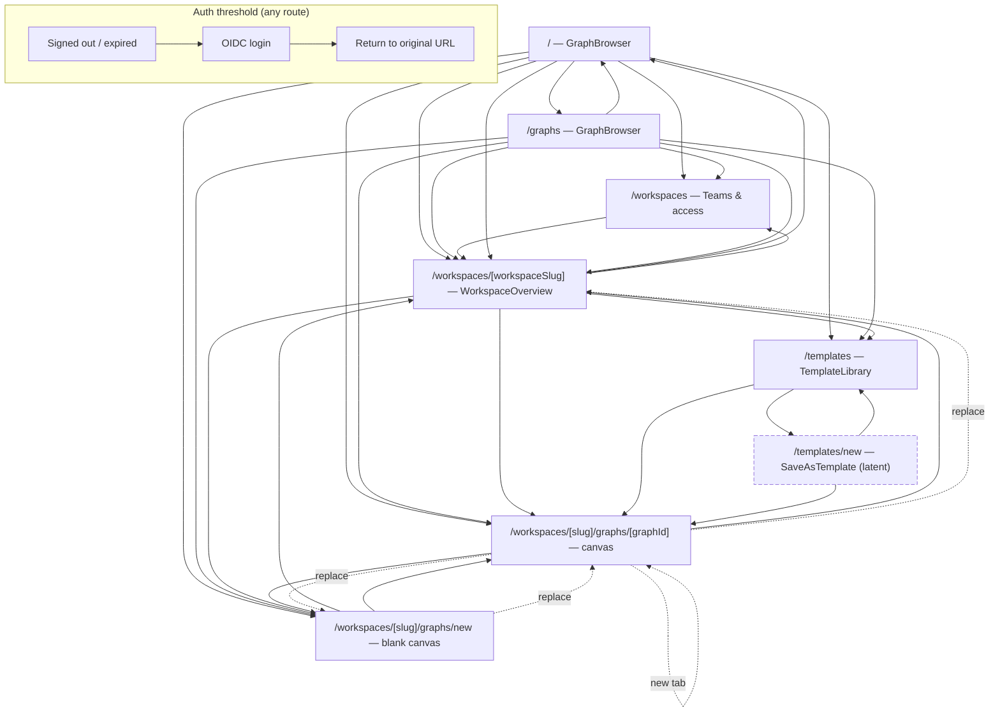

# Frontend navigation graph

- **Status:** Reference map (current implementation)
- **Date:** 2026-08-12
- **Audience:** Engineers tracing how the web frontend moves between URLs, or
  changing routing/navigation
- **App:** `apps/web` (Next.js 16 App Router)
- **Related:** [Graph browser organization](graph-browser-organization.md)

This document is a *navigation graph*: the set of URL routes the frontend can
reach, and the edges between them. It is written so a reader can trace "what
happens when I click / open X" without reading every component.

## Route inventory

The App Router derives routes from `src/app`. Each route renders a feature
component. Dynamic segments are shown as `[segment]`; the workbench graph
route accepts a real graph UUID **or** the reserved literal `new`.

| URL | Component | Purpose |
|---|---|---|
| `/` | `GraphBrowser` (`graphs/GraphBrowser`) | Graph discovery ("My graphs") |
| `/graphs` | `GraphBrowser` | Same browser, "Your work" entry |
| `/workspaces` | `WorkspacesPage` | Teams & access directory |
| `/workspaces/[workspaceSlug]` | `WorkspaceOverview` | Team / personal settings |
| `/workspaces/[workspaceSlug]/graphs/[graphId]` | `Workbench` | The canvas; `graphId` is a UUID or `new` |
| `/templates` | `TemplateLibrary` | Browse / use / archive templates |
| `/templates/new` | `SaveAsTemplate` | Save a graph revision as a template |
| `(login)` | `AuthSessionBoundary` | SSO threshold rendered over any route |

> **Note:** `saveAsTemplatePath()` (`features/templates/routes.ts`) builds the
> `/templates/new?sourceWorkspaceId=…&sourceGraphId=…&sourceRevision=…` URL, but
> no trigger currently wires it into the UI. The route exists and is renderable;
> it is marked **latent** on the graph below until a save-as-template action
> points at it.

### `/` vs `/graphs`

These are **aliases of one logical route**. `app/page.tsx` and `app/graphs/page.tsx`
both re-export the same `GraphBrowser` component (`page.test.tsx` asserts this),
and `WorkspaceLayout.tsx` treats both as the active "graph browser"
(`pathname === "/" || pathname === "/graphs"`). `/` is the post-login root;
`/graphs` is the explicit "All graphs" destination the rail pushes to. They are
interchangeable — the graph below draws an alias edge `ROOT --> GRAPHS` rather
than treating them as distinct screens.

### Templates placement (open decision)

Templates are **workspace-scoped on the backend** (`/v1/workspaces/{id}/templates`
with no `/v1/me/templates` aggregate), yet the frontend presents them top-level at
`/templates`, manually re-aggregating all workspaces via `listWorkspaceTemplates`.
`/workspaces/[slug]/templates` would mirror the graph route family and the
workspace-scoped `/templates/new` save flow. The current top-level design is a
deliberate convenience: the "Use template" flow instantiates into an explicit
save location (`destination_workspace_id`) chosen from any create-capable
workspace, which a nested route must preserve.

## Navigation mechanisms

The app uses four distinct navigation primitives. Knowing which one an edge
uses matters for back-button / history semantics.

| Mechanism | Where | History semantics |
|---|---|---|
| `<Link>` (`next/link`) | GraphBrowser rows, WorkspaceOverview, TemplateLibrary, SaveAsTemplate | Normal push; browser back returns |
| `router.push(...)` | Programmatic flows (create workspace, open graph, new graph, use template, switch workspace) | Normal push |
| `router.replace(...)` | Post-save / post-delete / room-terminal redirects | **Replaces** current history entry (back skips it) |
| `window.open(...)` | Workbench "open module source graph" | New tab |
| `window.location.assign(...)` | SSO login | Full navigation |

## Graph

*Dashed edges are `router.replace` (history-replacing), `window.open` (new tab),
or latent routes. Solid edges are normal `<Link>` / `router.push`.*

## Edge detail

Each edge below names the file that owns it, the trigger, and the mechanism.
Dotted edges replace history; plain edges push.

### From graph discovery (`/`, `/graphs`)

| Trigger | Destination | Mechanism | Owner |
|---|---|---|---|
| Click a graph row | `/workspaces/[slug]/graphs/[id]` | `<Link>` | `graphs/GraphBrowser.tsx` (`GraphRow`) |
| "New graph" (one location) | `/workspaces/[slug]/graphs/new` | `router.push` | `graphs/GraphBrowser.tsx` (`startGraph`) |
| "New graph" (choose location dialog) | `/workspaces/[slug]/graphs/new` | `router.push` | `graphs/GraphBrowser.tsx` (dialog) |
| Rail brand / "All graphs" | `/graphs` | `router.push` | `workspaces/WorkspaceLayout.tsx` (`goGraphs`) |
| Rail "Teams & access" | `/workspaces` | `router.push` | `workspaces/WorkspaceLayout.tsx` |
| Rail workspace switcher | `/workspaces/[slug]` | `router.push` | `workspaces/WorkspaceLayout.tsx` |
| Header "Templates" / "My graphs" | `/templates` / `/` | `<Link>` | `templates/TemplateLibrary.tsx`, `WorkspaceOverview.tsx` |

### From `/workspaces` (Teams & access)

| Trigger | Destination | Mechanism | Owner |
|---|---|---|---|
| Click a location row | `/workspaces/[slug]` | `<Link>` | `app/workspaces/page.tsx` (`LocationRow`) |
| Create team (submit) | `/workspaces/[slug]` | `router.push` | `app/workspaces/page.tsx` |

### From `/workspaces/[workspaceSlug]` (overview)

| Trigger | Destination | Mechanism | Owner |
|---|---|---|---|
| "Browse graphs" button | `/graphs` | `<Link>` | `workspaces/WorkspaceOverview.tsx` |
| Rail brand | `/graphs` | `router.push` | `workspaces/WorkspaceLayout.tsx` |

### In the workbench canvas

The workbench keeps one route family; graph switching happens *within* the same
route segment so the canvas can confirm unsaved changes before swapping.

| Trigger | Destination | Mechanism | Owner |
|---|---|---|---|
| Rail "New graph" | `/workspaces/[slug]/graphs/new` | `router.push` | `workspaces/WorkspaceLayout.tsx` |
| Rail recent graph row | `/workspaces/[slug]/graphs/[id]` | `router.push` | `workspaces/WorkspaceLayout.tsx` |
| Quick-switch panel row | `/workspaces/[slug]/graphs/[id]` | `router.push` | `workspaces/WorkspaceGraphPanel.tsx` |
| Save a **new** graph (first save) | `/workspaces/[slug]/graphs/[id]` | `router.replace` | `workbench/ui/useSavedGraphLifecycle.ts` |
| Delete the **active** graph | `/workspaces/[slug]/graphs/new` | `router.replace` | `workbench/ui/useSavedGraphLifecycle.ts` |
| "New graph" already on `new` route | *(no nav)* blank canvas | — | `useSavedGraphLifecycle.ts` (`requestNewGraph`) |
| Browser history nav / back | current vs route graph id, confirm then push/replace | `router.push` | `useSavedGraphLifecycle.ts` (effect) |
| Module source graph (node / library) | `/workspaces/[slug]/graphs/[id]` | `window.open` (new tab) | `workbench/ui/Workbench.tsx` (`openGraphInNewTab`) |
| Room terminal close: access revoked / graph deleted | `/workspaces/[slug]` | `router.replace` | `workbench/ui/Workbench.tsx` |
| Rail "Save" (existing graph) | *(no nav)* | — | `workbench/ui/Workbench.tsx` |
| Rail "Runs" / duplicate / delete | *(no nav)* in-canvas panels | — | `workbench/ui/Workbench.tsx` |

> **Important:** the workbench is keyed/kept alive across graph-id changes within
> `/workspaces/[slug]/graphs/…` (`graphs/layout.tsx` renders `<Workbench>` for
> any supported route id). Route changes are the *boundary* that replaces the
> canvas draft, so unsaved-change confirmation is enforced before a `push`.

### Template flows

| Trigger | Destination | Mechanism | Owner |
|---|---|---|---|
| "Use template" (create + open) | `/workspaces/[slug]/graphs/[createdId]` | `router.push` | `templates/TemplateLibrary.tsx` |
| "Open source graph" (preview) | `/workspaces/[slug]/graphs/[id]` | `<Link>` | `templates/TemplateLibrary.tsx` |
| Save-as-template submit | `/templates?created=…` | `router.push` | `templates/SaveAsTemplate.tsx` |
| Save-as-template back / cancel | source graph (`/workspaces/…/graphs/[id]`) | `<Link>` | `templates/SaveAsTemplate.tsx` |

### Module library flows (`WorkspaceLibraryDialog`)

| Trigger | Destination | Mechanism | Owner |
|---|---|---|---|
| Import a module release | `/workspaces/[slug]/graphs/[importedId]` | `router.push` | `workspaces/WorkspaceLibraryDialog.tsx` |
| "Open source graph" (module row) | `/workspaces/[slug]/graphs/[id]` | `router.push` | `workspaces/WorkspaceLibraryDialog.tsx` |

## Auth / SSO

`AuthSessionBoundary` wraps every route. On `signed-out` or `expired` it
renders a login threshold; "Continue with SSO" does
`window.location.assign(oidcLoginUrl(safeReturnPath(currentUrl)))`, so after a
successful login the browser returns to the *original* URL that triggered the
login. Logout stays in-place (`signed-out` threshold), it does not navigate
away.

## Reasoning guide

- **"Where do I go to open a graph?"** → `GraphBrowser` rows `<Link>` into
  `/workspaces/[slug]/graphs/[id]`; the rail and quick-switch use `router.push`
  to the same family.
- **"How does the canvas URL change when I save a new graph?"** → first save
  calls `router.replace` from `…/graphs/new` to `…/graphs/[id]` so the back
  button does not land on a blank-draft URL.
- **"Why is graph switching done in-canvas instead of full page?"** →
  `graphs/layout.tsx` keeps `<Workbench>` alive across supported route ids, and
  `useSavedGraphLifecycle` confirms unsaved changes before a `push`.
- **"Is `/templates/new` reachable?"** → only via `saveAsTemplatePath()`, which
  no UI action currently calls (latent).
