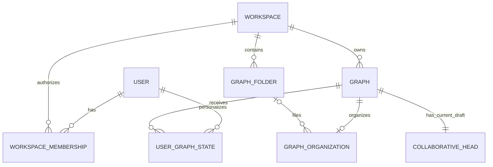

# Graph browser organization and authorized listing

- **Status:** Implemented foundation
- **Date:** 2026-08-11
- **Audience:** Engineers changing graph discovery, organization, tenancy, or
  collaboration
- **Related:** [Authentication and workspace tenancy](authentication-and-workspace-tenancy.md),
  [realtime collaboration](workbench-realtime-collaboration.md),
  [authenticated workspace ADR](../adr/0003-authenticate-users-and-scope-collaboration-to-workspaces.md),
  and [server-authoritative collaboration ADR](../adr/0002-server-authoritative-workbench-collaboration.md)

## Decision

Graph is the primary user object and post-login destination. Workspace remains
its durable tenant, security, and sharing owner, but the graph browser may
present a personal Workspace as **My graphs** and a shared Workspace as a Team
save/share location.

Organization is deliberately small:

- `GraphFolder` is one-level organization inside one Workspace. A null folder
  is the stable **Unfiled** state; folders cannot contain folders.
- `GraphOrganization` stores the graph's optional folder and archive lifecycle
  state. This shared metadata is not part of the graph document or a checkpoint.
- `UserGraphState` stores one user's `starred` and `last_opened_at` values for
  one workspace-owned graph. It is not shared state and grants no authority.

Composite foreign keys bind folder assignment, organization, and user state to
the graph's owning Workspace. A folder UUID from another Workspace therefore
cannot be attached even if an application check is accidentally bypassed.

## Current draft and immutable revisions

The browser row describes the current collaborative draft, not only the latest
checkpoint. Its name, updated time, node count, and edge count come from the
server-authoritative collaborative head. The row also exposes the head sequence,
checkpoint sequence, and checkpoint revision so a client does not mistake draft
metadata for an immutable revision.

Graph rename continues through the semantic `rename_graph` command at
`POST /v1/workspaces/{workspace_id}/graphs/{graph_id}/commands`. Folder and
archive changes do not modify the collaborative document, increment its
sequence, or create a checkpoint.

## Authorization and disclosure boundary

`GET /v1/me/graphs` performs one repository query for the authenticated user. The
query joins only active memberships and includes only the `viewer`, `editor`,
and `owner` roles. Workspace and graph predicates are applied before rows are
materialized; a UUID or browser filter never widens access.

The response contains only browser-safe metadata:

- graph UUID and current draft name;
- owning location UUID, display name, and `personal`/`shared` kind;
- optional folder, archive state, and activity update time;
- the current user's star and last-opened state;
- current draft node and edge counts plus head/checkpoint versions; and
- creator UUID and display name when the existing graph attribution can supply
  them. Email, membership rows, workspace slug, credentials, and other users'
  graph state are not returned.

No separate per-workspace fetch is required, preventing browser N+1 fan-out.
Revoked memberships and disabled users fail closed.

## Operations and capabilities

| Operation | Route | Required capability | Behavior |
| --- | --- | --- | --- |
| Authorized aggregate list | `GET /v1/me/graphs` | authenticated active membership per row | Returns only authorized rows. |
| List folders | `GET /v1/workspaces/{workspace_id}/graph-folders` | `view_graph` | Lists one Workspace's folders. |
| Create folder | `POST /v1/workspaces/{workspace_id}/graph-folders` | `edit_graph` | Rejects a duplicate name with `409`. |
| Rename folder | `PATCH /v1/workspaces/{workspace_id}/graph-folders/{folder_id}` | `edit_graph` | Keeps folder identity stable. |
| Delete folder | `DELETE /v1/workspaces/{workspace_id}/graph-folders/{folder_id}` | `edit_graph` | Unfiles contained graphs, then deletes the folder. |
| File/unfile graph | `PUT /v1/workspaces/{workspace_id}/graphs/{graph_id}/folder` | `edit_graph` | A null `folder_id` means Unfiled. |
| Archive/restore | `PUT` / `DELETE .../{graph_id}/archive` | `edit_graph` | Idempotently changes shared graph lifecycle state. |
| Star/unstar | `PUT` / `DELETE .../{graph_id}/star` | `view_graph` | Changes only the current user's state. |
| Record open | `POST .../{graph_id}/opened` | `view_graph` | Advances only the current user's last-opened time. |

Missing or foreign Workspace, Graph, and Folder identities use contextual
not-found responses rather than revealing whether a foreign object exists.
Shared organization mutations are metadata-only security-audited operations.

## Explicit limits

This foundation does not add tags, nested folders, generic organization
interfaces, per-graph ACLs, public links, or graph moves between Workspaces.
Templates and Modules keep their separate contracts: a Template creates an
independent graph from one exact revision, while a Module is a callable graph
with immutable pinned releases.
