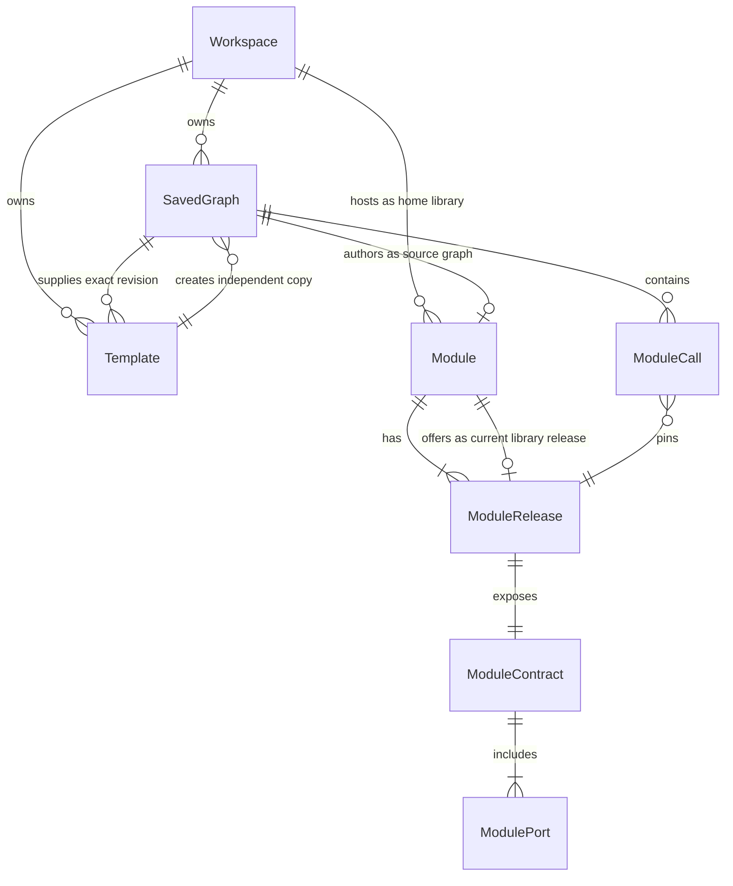
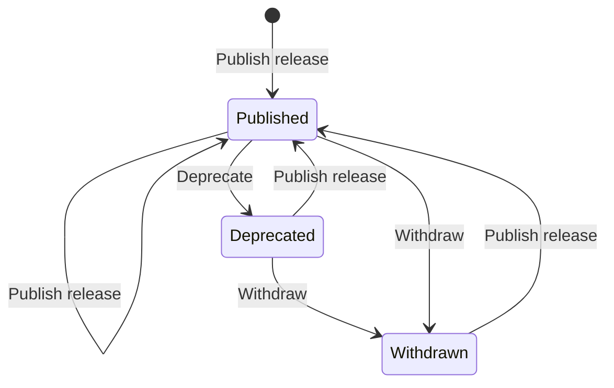
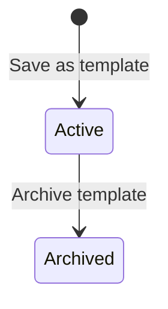
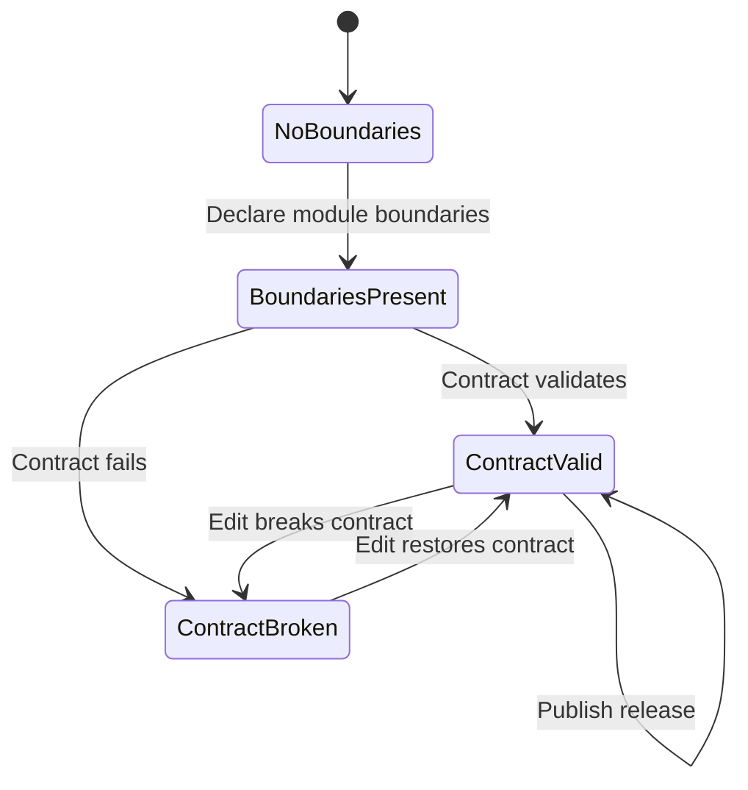

# Templates and Modules conceptual model

- **Status:** Draft hypothesis; belief-based (domain map without user research)
- **Date:** 2026-08-11
- **Audience:** Designers and engineers changing template copy, module publish,
  library scope, catalog browse, or nested module execution
- **Document type:** Explanation — Layers of Product Design conceptual model
- **Related:** [modules domain map](modules-domain.md),
  [modules interaction structure](modules-interaction-flow.md),
  [modules surface](modules-surface.md),
  [authentication and workspace tenancy](authentication-and-workspace-tenancy.md),
  [product vocabulary](../../CONTEXT.md)

## Summary

This note decides how Grafy models two deliberately different forms of
**graph reuse**: Templates create independent graph copies, while Modules are
callable pinned releases. It resolves the domain harvest into objects,
relationships, states, and ubiquitous language. It is not a database schema,
wireframe, or browse-UI spec.

**Hypothesis flag:** Built from the belief-based [domain map](modules-domain.md).
Revisit once observed behaviour or research challenges these decisions.

### Core job

Save an exact graph revision as a reusable copy source, or publish a validated
workflow building block that other graphs can call through an immutable pinned
release. Both forms of reuse preserve the Workspace tenancy boundary without
creating live cross-tenant references.

### Material

- [Modules domain map](modules-domain.md)
- Existing product: a module is any in-workspace saved-graph revision that
  validates with Module Input/Output boundaries; tip revisions are
  catalog-visible automatically; discovery is workspace-scoped
- Tenancy: Workspace is the only share boundary; graph copy clears
  cross-workspace module references

### Implicit model being replaced

Today, “having valid boundaries” silently means “appears in the node catalog.”
This model replaces that with an explicit **Module** that enters a workspace
**library** only when someone **publishes a release**.

## Object definitions

### Workspace

**What it is:** The sole collaboration and tenancy boundary; it also hosts that
workspace’s module library.

**Attributes users care about:** name/slug, kind (`personal` or `shared`).

**Relationships:**

- hosts zero or many Modules (as home library)
- owns zero or many Saved graphs

**Actions:** (existing membership and graph actions; no new library aggregate)

**Decision:** “Personal toolkit” and “team library” are roles of a Workspace,
not separate objects. A personal workspace library is private to its owner; a
shared workspace library is visible to members according to existing
capabilities. Product surfaces translate those backend locations into **My
graphs** and named **Team** save/share locations. There is no instance-public
or org-wide library in this model.

---

### Saved graph

**What it is:** The durable authoring document (workflow graph + canvas layout).

**Attributes users care about:** name, revision (tip), whether it declares
module boundaries.

**Relationships:**

- belongs to one Workspace
- may be the source graph of zero or one Module
- may be the source graph of zero or many Templates
- contains zero or many Module calls

**Actions:** Edit, Checkpoint, Declare module boundaries (add Module Input /
Module Output), Open, Copy into workspace (existing share-by-copy).

**Decision:** A Saved graph with boundaries is only a *candidate* until a Module
is published from it. Boundaries alone do not list it in the library.

---

### Template

**What it is:** An immutable, sanitized snapshot of one exact Saved graph
revision that can create new independent Saved graphs.

**Attributes users care about:** name, description, source graph and revision,
creator, source location, node/connection summary, and lifecycle state
(`active` or `archived`). Name and description may be edited; the captured
graph document and source revision may not.

**Relationships:**

- belongs to one Workspace (its source/save location)
- derives from exactly one Saved graph revision
- creates zero or many independent Saved graphs

**Actions:**

- **Save as template** — capture a chosen exact revision after removing runtime
  and security state
- **Use template** — choose a destination save location, graph name, and
  optional one-level Folder, then create and open a new independent graph
- **Edit template details** — change only descriptive metadata
- **Archive template** — withdraw it from new use without changing graphs that
  were already created from it

**Decision:** Template is a copy source, not a callable unit and not a synonym
for Module. Using it copies graph structure and safe configuration by value. It
does not copy secrets, execution history, materialized artifacts, uploads,
caches, or invalid runtime capabilities. Source edits, Template metadata or
lifecycle changes, and later copies never mutate graphs already created from
the Template. There is no Template release/version series, inheritance,
marketplace, category, or tag model.

**Authorization decision:** Template reads and use are authorized through the
source Workspace; graph creation is authorized independently at the chosen
destination Workspace. A user who can read the source and create in the
destination may use a Template across those locations through this explicit
copy operation. The resulting graph belongs only to the destination Workspace.

---

### Module

**What it is:** A reusable workflow building block belonging to one workspace
library, authored from one source graph.

**Attributes users care about:** name, description, publication state
(`published`, `deprecated`, `withdrawn`).

**Relationships:**

- belongs to one Workspace (as home library)
- authored from one Saved graph (as source graph)
- has one or many Module releases
- offers zero or one current library release (the release shown for Insert)

**Actions:**

- **Publish release** — create a Module release from a chosen source-graph
  revision (usually the tip) after the contract validates; first publish
  creates the Module
- **Deprecate** — keep callable pinned releases; discourage new inserts
- **Withdraw** — remove from the library browse/insert surface; existing
  Module calls keep resolving their pinned releases
- **Open source graph** — open the authoring Saved graph
- **Import into workspace** — copy a chosen Module release into another
  workspace (see action vocabulary)

**Decision:** Module is a first-class object, not “a graph that happens to
validate.” Name and description are module-facing; they may start from the
source graph name but are not required to track tip renames automatically
(implementation may; UX must not surprise callers mid-compose).

---

### Module release

**What it is:** An immutable, callable version of a Module with a fixed
contract, pinned to one source-graph revision.

**Attributes users care about:** release number (the pinned graph revision),
when it was published (if shown), whether it is the current library release.

**Relationships:**

- belongs to one Module
- pins exactly one Saved graph revision of the source graph
- exposes exactly one Module contract

**Actions:** Inspect contract; choose as target when **Upgrading** a Module
call. Users do not edit a release in place — they publish a new release.

**Decision:** Call sites always pin a Module release. “Track latest” is not a
stored mode in this model; staying current means **Upgrade module call**.

---

### Module contract

**What it is:** The callable surface of one Module release: named input and
output module ports with artifact types and requiredness.

**Attributes users care about:** port name, direction (input/output), artifact
type, requiredness, optional description.

**Relationships:**

- belongs to exactly one Module release
- composed of one or many module ports (at least one output)

**Actions:** Inspect (no independent edit — change the source graph and
publish a new release).

**Decision:** Contract is user-meaningful (composers depend on it) so it is
named as an object, even if storage derives it from boundary nodes at publish
time. Port **name** replaces product language “public name” to avoid
visibility polysemy. Boundary operators remain the authoring mechanism.

---

### Module call

**What it is:** A node in a Saved graph that invokes one Module release.

**Attributes users care about:** which Module, which pinned release, wiring to
module ports.

**Relationships:**

- belongs to one Saved graph (as containing graph)
- pins exactly one Module release
- must not target the Module whose source graph is the containing graph
  (no self-call while editing that module’s source)

**Actions:** Insert module call, Upgrade module call, Open source graph (when
the Module’s home workspace is the active workspace), Remove.

---

### Set aside (not objects in this model)

| Noun from harvest | Treatment |
| --- | --- |
| project | Rejected as product term → Workspace + Saved graph |
| library / personal toolkit / shared library | Role of Workspace, not a separate aggregate |
| catalog | Insert/browse *surface* (interaction layer), not an object |
| subgraph | Authoring structure inside a Saved graph, not a durable object |
| building block | Synonym → Module |
| draft | State of source work / unpublished candidate, not an object |
| fork | Outcome of Import or Use template, not a persistent type |
| dependency | Relationship via Module call → Module release |
| practitioner | User (existing) |

## Object map

Cardinality: `||` exactly one, `o|` zero or one, `|{` one or many, `o{` zero
or many. Labels read left entity → right entity as declared.

## State transitions

### Module publication state

| State | Library browse / Insert | Existing Module calls |
| --- | --- | --- |
| Published | Listed; current library release offered | Resolve pinned releases |
| Deprecated | Listed as deprecated; new inserts discouraged | Resolve pinned releases |
| Withdrawn | Hidden from library | Resolve pinned releases |

A Module does not exist until the first successful **Publish release**. A Saved
graph may declare boundaries and still have no Module.

### Template availability state

| State | New graph / Library | Existing graph copies |
| --- | --- | --- |
| Active | Listed and usable | Independent and unchanged |
| Archived | Hidden and unavailable for new use | Independent and unchanged |

Archiving is withdrawal, not deletion. The immutable snapshot remains so its
provenance and audit history are not rewritten; restoring archived Templates is
outside the current contract.

### Source graph readiness (authoring, not Module state)

**Publish release** is enabled only from `ContractValid` on the chosen
revision. Broken tips never become library releases; prior releases stay
callable.

### Temporal decisions

| Topic | Decision |
| --- | --- |
| History | Module releases are immutable; callers keep pins |
| Template history | One Template captures one exact revision; saving another snapshot creates another Template, not a version |
| Relationship temporality | “Current library release” means the release offered for new inserts *now*; existing calls do not move |
| Deletion | No hard delete in v1: Withdraw (and Deprecate) only. Existing Module calls keep resolving pinned releases; do not destroy releases out from under pins |
| Cross-workspace | **Import** copies a release into the destination workspace as a new source graph + Module; no live cross-workspace Module reference |
| Read model lag | UX requirement: after Publish/Withdraw, the active workspace library reflects the change before the user inserts again — how fresh is an open engineering question |

## Ubiquitous language

### Nouns

| Term | Rejected alternatives | Decision |
| --- | --- | --- |
| Template | starter, blueprint, reusable graph | Immutable exact-revision copy source; Use template creates an independent graph |
| Module | building block, component, package | Product name for the reusable callable unit; never use Template as its synonym |
| Module release | tip-as-catalog-entry, version (alone), checkpoint | Immutable callable pin; number aligns with source graph revision |
| Module contract | API, signature, interface | Callable ports of one release |
| Module port / port name | public name, public port | Avoid “public” = visibility |
| Module call | nest, embed, reference (alone), invoke (UI) | Node that pins a Module release |
| Workspace library | catalog, registry, toolkit (as object) | Published modules hosted by a Workspace |
| Source graph | project, upstream module graph | The Saved graph a Module is authored from |
| Saved graph | project, pipeline, notebook | Keep existing CONTEXT.md term |
| Workspace | project (as tenant) | Keep existing tenancy term |
| Folder | nested folder, directory tree | Optional one-level organization inside a Workspace; not a tenancy boundary |

**Visibility language:** Prefer **published / deprecated / withdrawn** and
**personal vs shared workspace**. Do not use **public/private module** for
library scope — “private” already collides with personal workspace and
“public” collides with port names and internet sharing.

### Verbs

| Verb | Applies to | Rejected alternatives | Decision |
| --- | --- | --- | --- |
| Save as template | Saved graph revision | Publish template, make module | Capture a sanitized immutable copy source from that exact revision |
| Use template | Template → destination Workspace | Insert template, call template, track template | Create a new independent Saved graph with an explicit name and optional Folder |
| Archive template | Template | Delete template | Withdraw from new use; existing copies are unaffected |
| Publish release | Module (creates Module on first success) | Share, expose, make public, sync tip | Deliberate offer of a validated revision to the workspace library |
| Deprecate | Module | Soft-delete, hide | Still visible as legacy; discourage new inserts |
| Withdraw | Module | Unpublish, remove, delete | Hide from library; keep pins resolving |
| Import into workspace | Module release → destination Workspace | Install, link, share across, reference | Copy-by-value into a new source graph + Module; no live link |
| Insert module call | Saved graph + Module release | Add node (when meaning module), nest, embed | Places a Module call pinned to a release |
| Upgrade module call | Module call | Update, sync, track latest | Repin to a newer Module release |
| Declare module boundaries | Saved graph | Make module (premature), expose ports | Authoring step; does not publish |
| Open source graph | Module or Module call | Edit module, drill in | Navigate to authoring document |

**Share** remains the existing workspace/graph meaning (membership or
copy-graph-into-workspace). It must not mean “publish module.”

**Edit** on a Module is rejected as a CTA — users **Open source graph**, edit
the Saved graph, then **Publish release**.

## Resolved decisions (binding)

1. **No hard delete (v1):** Retirement is **Deprecate** and **Withdraw from
   library**. Owners do not destroy Modules or releases out from under pins.
   Deprecated/withdrawn Modules’ existing Module calls remain executable as long
   as the underlying node/operator code can execute the pinned release.
2. **Who may Publish / Deprecate / Withdraw:**
   - **Publish release** — Editor + Owner (`publish_module`)
   - **Deprecate** and **Withdraw** — Owner only (`manage_module_library`);
     soft stewardship matches Owner-only withdraw, not Editor
3. **Insert release choice:** Composers may pick an older Module release at
   insert time (not only the current library release). Upgrade still repins to a
   chosen release (typically a newer one).
4. **Library entry points:** Templates appear in **New graph / Library**;
   Modules appear in **Add node / Library**. Template use creates and directly
   opens a graph; Module insertion creates a pinned call node.
5. **v1 scope:** Full breadboard (C) — Publish + Add node library listing +
   Workspace library manage (deprecate/withdraw) + Import into workspace. No
   instance-public modules.
6. **Template v1 scope:** Exact-revision Save as template + browse/search/read +
   descriptive metadata update + archive + explicit destination copy. No
   version tracking, marketplace behavior, tags/categories, or inheritance.

## Remaining open questions

1. **Rename propagation:** When the source graph is renamed, does the Module
   name follow, stay independent, or prompt on next publish?
2. **Imported Module lineage:** Does the destination Module record that it was
   imported from another workspace’s release, or is lineage discarded like
   graph copy today? (v1 UI does not promise lineage.)
3. **Nested optional-input rules** and execution semantics stay as today’s
   runtime contracts; this model does not reopen them.

## Next step

Interaction breadboards are in [modules-interaction-flow.md](modules-interaction-flow.md).
Next: `/layers-surface` or implementation against a stable model.

This model was built without domain research — it is a hypothesis. Plan to
revisit it once you have evidence.
