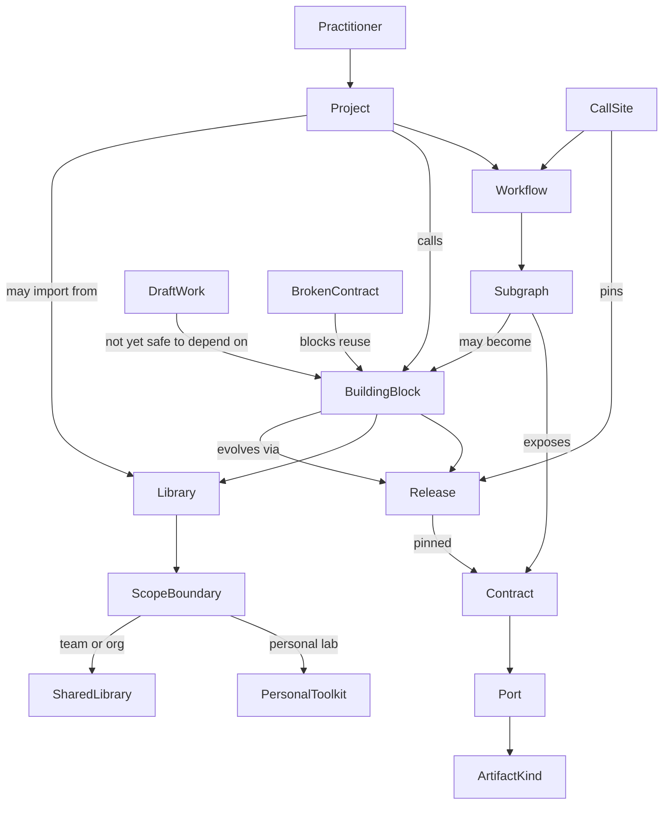

# Modules domain map

- **Status:** Draft; belief-based domain capture (not product decisions)
- **Date:** 2026-08-08
- **Audience:** Designers and engineers shaping module visibility, libraries,
  and browse UX
- **Document type:** Explanation — Layers of Product Design domain layer
- **Related:** [modules conceptual model](modules-conceptual-model.md),
  [product vocabulary](../../CONTEXT.md),
  [authentication and workspace tenancy](authentication-and-workspace-tenancy.md)

## Summary

This note maps the real-world domain of **reusing subgraphs and building
libraries across projects**. It is raw material for a later conceptual model.
It does not choose Grafy vocabulary, publish mechanics, cross-workspace
sharing rules, or browse UI.

**Source of truth:** team beliefs and product-adjacent understanding, not user
research. Treat every claim as the team's current model of the domain unless
later research confirms it.

## Frame

### Domain

Reusable workflow composition: people extract a subgraph with a clear contract,
package it into a library, and call it from other projects.

This is not a map of the Grafy Node catalog, saved-graph persistence, or
workspace tenancy APIs. Those are product solutions that sit above this layer.

### People (believed)

- Solo practitioner building a personal toolkit
- Teammate reusing another person's subgraph
- Library curator packaging stable building blocks for a group
- Project owner who cares what dependencies a project may call

### Jobs before any product

- Avoid rebuilding the same transform or pipeline
- Trust a known contract (inputs and outputs) when composing
- Share a useful piece without handing over the whole project
- Keep experimental work out of what others depend on
- Reuse the same piece across multiple projects without forking forever, or
  knowingly fork when that is the intent

## Concept map

### Informal relationships (beliefs)

- A **project** is where work happens; a **library** is where reusable pieces
  live. People often blur these.
- A **subgraph** is just structure until it has a **contract** others can
  depend on.
- **Reuse across projects** carries a constant tension: pin forever, track
  latest, or copy-and-own.

## Terminology audit

Do not pick winners here. Conflicts are data for the conceptual model.

| Concept | Names used | Context / conflict |
| --- | --- | --- |
| Reusable piece | module, subgraph, component, operator, node, block, template, package | Polysemy: “module” may mean code package, callable subgraph, or UI catalog entry |
| Host of work | project, workspace, graph, pipeline, notebook, job | Synonyms across communities; “project” is not always “workspace” |
| Collection of pieces | library, catalog, registry, toolkit, package index | Catalog often means “browse list”; library means “owned curated set” |
| Callable surface | interface, contract, ports, API, signature | “Public” often means port name, not internet visibility |
| Visibility | private, public, shared, internal, published, draft | Polysemy: private-to-me vs private-to-team; public-to-org vs public-to-world |
| Version | revision, release, pin, tip, latest, checkpoint | Tip vs pinned release is a major seam |
| Using a piece | call, invoke, import, install, nest, embed, reference | Copy-by-value vs live reference often collapsed into one verb |
| Authoring unit | graph, workflow, canvas, DAG, pipeline | Same artefact, different tribal names |

## Bounded contexts

Communities that share vocabulary internally but diverge across groups:

1. **Authoring** — editing the subgraph, boundaries, drafts, broken tips.
2. **Composition** — finding a block, matching ports and types, inserting a
   call site, pinning a release.
3. **Library stewardship** — what is published, naming, deprecation, what the
   team may depend on.
4. **Tenancy / trust** — who may see or call a piece; personal lab vs team
   library vs cross-project import.
5. **Execution / ops** — nested runs, caching, provenance of which release
   actually ran.

Same words (“module”, “public”, “share”) mean different things across these
contexts. Leave that unresolved until the conceptual model chooses product
vocabulary.

## Domain events

Significant things that happen, named in the past tense:

- Subgraph was extracted / boundaries were declared
- Contract was validated (or failed validation)
- Building block was published into a library
- Release was pinned
- Project imported or referenced a library block
- Call site was added to a workflow
- Release was upgraded at a call site
- Block was deprecated or unpublished
- Draft was kept out of the library
- Copy was taken into another project (fork) vs live dependency retained
- Dependency broke because the contract changed or the source became unavailable

## Noun harvest

### Potential objects

practitioner, project, workflow, subgraph, building block, contract, port,
artifact kind, library, release, call site, personal toolkit, shared library,
draft, import, fork, dependency

### Potential attributes

visibility, scope, name, description, requiredness (of a port), pinned
revision, tip, broken/valid, deprecated

### Unclear

- **catalog** — place vs listing
- **module** — which sense
- **public** — port vs audience
- **share** — copy vs membership vs publish
- **project** — vs workspace vs graph

## Explicit non-resolutions

This note does **not** decide product vocabulary or surface chrome. Those are
resolved in the conceptual model and interaction/surface docs.

## Binding product decisions (see conceptual model)

v1 uses an explicit Module + Publish release into a workspace library (not tip
auto-catalog), Owner-only Deprecate/Withdraw with no hard delete, insert-time
older-release pick, and library entry from Workbench and workspace overview.
Import is copy-by-value. See [modules-conceptual-model.md](modules-conceptual-model.md).

## Next step

Conceptual model captured in [modules-conceptual-model.md](modules-conceptual-model.md).
Interaction structure is next: `/layers-interaction-flow`.
