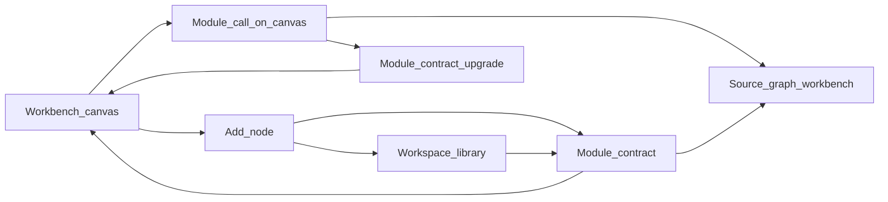
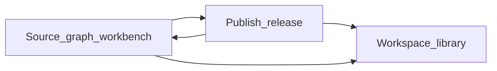
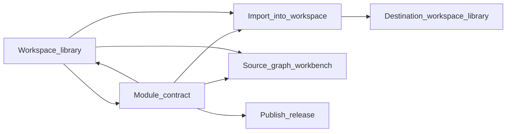

# Modules interaction structure

- **Status:** Draft; breadboards on the conceptual-model hypothesis
- **Date:** 2026-08-08
- **Audience:** Designers and engineers shaping Workbench add/insert, module
  publish, and workspace library management
- **Document type:** Explanation — Layers of Product Design interaction layer
- **Related:** [modules conceptual model](modules-conceptual-model.md),
  [modules surface](modules-surface.md),
  [modules domain map](modules-domain.md),
  [product vocabulary](../../CONTEXT.md)

## Summary

Breadboards for how people **publish**, **browse/insert**, **upgrade**, and
**import** modules. Interaction logic only — not visual design.

**Foundation:** [modules-conceptual-model.md](modules-conceptual-model.md).
Flows use that ubiquitous language. If the model changes, revisit these
breadboards.

**Redesign of:** today’s single Node catalog dialog where any tip with valid
boundaries appears under a Modules plugin origin.

## Job stories

Three journeys share places; each is a complete job.

1. **Compose — insert a module call**  
   When I am editing a graph and need a reusable building block, I want to find
   a published Module in this workspace library and insert a call pinned to its
   current library release, so I can wire its contract without rebuilding it.

2. **Author — publish a release**  
   When my source graph’s contract is valid, I want to publish a Module release
   into this workspace library, so teammates (or my future self) can insert it.

3. **Steward — import or withdraw**  
   When a Module should move across workspaces or leave the insert surface, I
   want to import a release into another workspace or withdraw/deprecate in the
   home library, without breaking existing pinned calls.

Success criteria:

1. Containing graph has a Module call pinned to a release; canvas focus returns.
2. Workspace library lists the Module (published); Insert offers that release.
3. Destination workspace has a new source graph + Module, or home library no
   longer offers the Module for insert while pins still resolve.

---

## Places (shared map)

| Place | Role |
| --- | --- |
| Workbench canvas | Editing one Saved graph in one Workspace |
| Add node | Fast search/insert for operators **and** published Modules |
| Module contract | Inspect one Module release before insert or upgrade |
| Workspace library | Manage published / deprecated Modules in this Workspace |
| Publish release | Confirm publishing a validated revision from the source graph |
| Import into workspace | Choose destination Workspace and confirm copy-by-value |
| Source graph workbench | Same Workbench canvas on the Module’s source graph |
| Module call on canvas | Selected Module call node (inline affordances) |

**Collapsed deliberately:** no separate “module settings” place — stewardship
lives in Workspace library; authoring lives on the source graph; composition
uses Add node + Module contract.

---

## Journey A — Insert a module call

### Current flow (rough)

Workbench → Node catalog → filter Modules origin → pick tip revision → inspect
ports → Add. Self-graph hidden; invalid tips listed as “unavailable.”

### Breadboard

```
Workbench canvas
- open Add node → Add node
- open Workspace library → Workspace library
- select Module call → Module call on canvas
[ active graph; selection; whether library has published modules ]

Add node
- search / filter → stays Add node (filtered)
- choose built-in or external operator → insert on Workbench canvas
- choose published Module → Module contract (intent: insert)
- choose deprecated Module → Module contract (intent: insert; warn)
- open Workspace library → Workspace library
- cancel / dismiss → Workbench canvas
[ search field; groups: Built-in, External, Workspace library modules;
  module rows show name, release number, published|deprecated;
  empty: "No published modules in this workspace" + affordance
  "Open workspace library"; loading; error retry ]

Module contract (insert)
- insert module call → Workbench canvas (new Module call selected)
- open source graph → Source graph workbench
- back → Add node
- cancel → Workbench canvas
[ module name, description, state; release number (current library release);
  module ports in/out with types and requiredness; deprecated warning if any;
  disabled Insert when module is source of active graph (self-call) ]

Module call on canvas
- upgrade module call → Module contract (intent: upgrade)
- open source graph → Source graph workbench
- remove → Workbench canvas
[ pinned release; whether a newer library release exists; port wiring ]

Workspace library (from compose)
- select Module → Module contract (intent: inspect / insert)
- publish guidance when empty → Source graph workbench or graphs list
  (see open decisions)
- back → Workbench canvas or Add node (return to opener)
[ see Journey C content ]
```

### Flow diagram (insert)



### Edge cases — insert

| Case | Behaviour |
| --- | --- |
| Empty library | Add node Modules group empty; CTA to Workspace library explaining Publish release |
| Loading library | Inline loading in Add node module group; Insert disabled until loaded |
| Self-call | Module whose source is the active graph omitted or Insert disabled with reason |
| Deprecated | Visible with badge; Insert allowed after explicit confirm on Module contract |
| Withdrawn | Not listed in Add node or library; existing calls remain on canvas |
| Insert failure | Stay on Module contract; error + retry; no partial node |
| Post-insert | Return to canvas with new Module call selected; pin = current library release at confirm time |
| Newer release exists | Module call shows upgrade affordance → Module contract (upgrade) |
| Upgrade cancel | Stay on Module call; pin unchanged |
| Concurrent withdraw during inspect | Insert fails with “no longer in library”; return to Add node refreshed |

**Optimistic vs pessimistic:** Pessimistic insert/upgrade — wait for server
accept before placing or repinning. Open engineering question if collaboration
command batching needs optimistic placeholder.

---

## Journey B — Publish a release

### Breadboard

```
Source graph workbench
- declare module boundaries → stays (nodes added)
- open Publish release → Publish release
  (only if chosen revision contract validates; else blocked with reason)
- open Workspace library → Workspace library
[ graph canvas; boundary nodes; readiness: no boundaries | broken | valid;
  if Module exists: current library release number ]

Publish release
- confirm publish → Source graph workbench (success) 
  and workspace library now lists Module / new release
- cancel → Source graph workbench
[ source graph name; revision to publish (tip by default);
  derived module contract preview; name/description fields for Module
  on first publish; note that callers pin this release and do not auto-track;
  validation errors if contract broken — Confirm disabled ]

Workspace library
- shows new/updated Module as published with that release as current
```

### Flow diagram (publish)



### Edge cases — publish

| Case | Behaviour |
| --- | --- |
| No boundaries | Publish affordance absent or explains Declare module boundaries |
| Contract broken | Publish opens in blocked state or stays on canvas with diagnostics; Confirm disabled |
| First publish | Creates Module; requires name (default from graph name); enters Published |
| Later publish | New Module release; becomes current library release; old releases remain for pins |
| Concurrent edit / revision mismatch | Failure on Publish release; stay with refresh tip + retry |
| Permission denied | Affordance hidden or error on confirm (capability open question) |
| Post-publish | Toast/inline success on source graph; library and Add node reflect new release before next insert (freshness requirement from conceptual model) |

---

## Journey C — Steward: library, deprecate, withdraw, import

### Breadboard

```
Workspace library
- filter / search → stays
- select Module → Module contract (intent: manage)
- deprecate → stays (state deprecated) or confirm sheet → stays
- withdraw → confirm withdraw → stays (module removed from list)
- import into workspace → Import into workspace
- open source graph → Source graph workbench
- back → Workbench canvas (or workspace graphs entry — see open decisions)
[ modules: published and deprecated; name, current release, state;
  empty state: how to Declare boundaries + Publish release;
  loading; error ]

Module contract (manage)
- insert module call → Workbench canvas
  (only if a graph is active in this workspace; else disabled)
- deprecate / withdraw → Workspace library
- publish release → Publish release
  (if user can open source and contract valid — or deep-link source)
- import into workspace → Import into workspace
- open source graph → Source graph workbench
- back → Workspace library
[ full contract; release history list for inspect; state ]

Import into workspace
- choose destination workspace → stays
- confirm import → destination Workspace library
  (or destination source graph workbench)
- cancel → Module contract or Workspace library
[ source module name + release; destination workspace picker
  (workspaces where user can create graphs); copy-by-value explanation;
  no live link warning ]

Confirm withdraw (nested in library or contract)
- confirm → Workspace library (module gone from browse)
- cancel → previous place
[ pins keep working; not a hard delete ]
```

### Flow diagram (steward)



### Edge cases — steward

| Case | Behaviour |
| --- | --- |
| Withdraw with active pins | Allowed; confirm copy states pins keep resolving |
| Deprecate then insert | Allowed with warning on Module contract |
| Import permission | Destinations limited to workspaces with create_graph |
| Import failure | Stay on Import; error + retry; no partial Module |
| Post-import | New Saved graph + Published Module in destination; user lands on destination library or new source graph |
| Lineage | Unresolved in conceptual model — UI does not promise lineage until decided |

---

## Challenge notes

- **Add node vs Workspace library:** Add node is for composition speed; library
  is for stewardship and empty-state education. Both list the same published
  Modules — not two divergent catalogs.
- **Vocabulary check:** Uses Publish release, Insert module call, Upgrade
  module call, Import into workspace, Withdraw, Deprecate, Open source graph.
  Avoids Share/Public/Private for these actions.
- **Broken objects:** Module attributes (state, current release, contract) and
  actions (publish, deprecate, withdraw, import, open source) meet on Module
  contract and Workspace library with cross-links.
- **Isolated relationships:** Module → source graph and Module call → release
  are navigable via Open source graph and Upgrade.
- **Simpler alternative rejected:** Publishing automatically on every valid tip
  checkpoint — rejected by conceptual model (silent library pollution).

## Open decisions

1. **Workspace library entry points** — from Workbench only, also from
   workspace graphs overview, or both?
2. **Release picker on insert** — always current library release, or allow
   picking an older release at insert time?
3. **Upgrade UX** — one-click to current library release vs always through
   Module contract?
4. **Import landing** — destination library vs new source graph workbench?
5. **Empty library education** — link to a specific graph, graphs list, or
   short inline steps only?
6. **Viewer role** — can Viewers open Module contract read-only from Add node
   without Insert?
7. Unresolved conceptual-model items (hard delete, rename, publish capability,
   import lineage) still constrain copy and affordance visibility.

## Risks

- Conceptual model is a **hypothesis** without research; browse places may be
  wrong if “library” is not how users think.
- Who may Publish/Withdraw is unsettled — breadboards assume an Editor-or-Owner
  can see stewardship affordances; may need Owner-only variants.
- Collaboration freshness after Publish (multiplayer Add node open during
  publish) needs an engineering rule so Insert does not offer a stale release.
- Surface work must not collapse Module back into “another plugin row” without
  state (published/deprecated) and Open source graph.

## Next step

Surface audit and decision inventory:
[modules-surface.md](modules-surface.md). Keep the conceptual model stable
before large UI rewrites.
