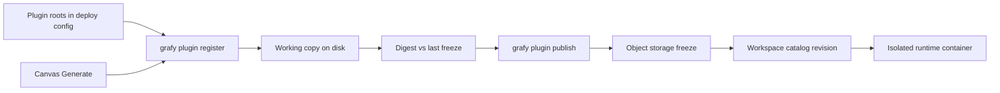

# Plugin unification (isolated, register and publish)

- **Status:** Direction — not implemented. Current host plugins still load
  through `grafy.plugins` entry points into the API process.
- **Date:** 2026-08-18
- **Audience:** Engineers changing plugin discovery, catalog identity, CLI,
  agent authoring, or isolated execution
- **Document type:** Explanation — intended architecture and boundaries
- **Related:** [plugin development](plugin-development.md) (current in-process
  host adapter), [modules conceptual model](modules-conceptual-model.md),
  [backend architecture](backend-architecture.md),
  [product vocabulary](../../CONTEXT.md)

## Summary

A **Plugin** is a uv-managed project on disk (`pyproject.toml`, `uv.lock`,
typed nodes, tests, owned artifact types). Grafy does not import that tree.
An admin or the coding agent **registers** the directory; **publish** freezes
exact bytes into object storage and inserts a Workspace **Plugin release**.
The catalog lists that release. Graphs pin `notes.table.summarize@1`. Graph
run starts a fresh container from the freeze.

That replaces `grafy.plugins` entry points as the way Team-authored (and,
eventually, first-party) operators reach the catalog. Entry-point loading
remains the host adapter for monorepo plugins (GIS, SQL, OCR, LLM) until each
moves onto the same freeze path.

A **Module** stays a published subgraph. It is not a Plugin.



## What closed this

The missing piece was not “how the agent writes Python.” It was **how a
directory becomes a revisioned catalog entry without loading it into FastAPI**.

Register and publish are that seam. Humans and the coding agent use the same
two verbs. Diffs only answer “is the working copy different from revision N?”
They never invent revision N+1 or retarget graph pins.

## Working copy vs freeze

The **working copy** is the directory you open in Cursor. It is not
authoritative for execution.

The **freeze** is the immutable artifact Grafy stores (source archive + locked
runtime image, keyed by digest). Graph runs trust the freeze.

A checkout from Grafy and a git clone of the same project are both working
copies. Publish always hashes exact bytes.

## Plugin roots (deploy config)

A deployment config allowlists **roots** — directories where Plugins may live.
It is not the catalog.

```toml
[[plugin_roots]]
path = "./examples"
path = "./plugins"
```

Paths are relative to the data root / workspace the process already uses, not
arbitrary host paths. The coding agent inside Docker does not read this file
to discover work; it is assigned a project directory. Roots exist so register
cannot point at `/` or a secrets volume.

Catalog membership is Workspace-scoped in the database. A root on the API
host must not make a Plugin visible to every Workspace.

## Register

`grafy plugin register <dir>` (and Generate doing the same write) records:

- Plugin slug (`notes`)
- Workspace
- runtime profile (`python-uv`, later a pinned `python-uv-gdal` digest)
- working-copy location under an allowed root

Register does **not** import Python, freeze, bump a revision, or change
graphs. It only makes Grafy aware of the project.

## Publish

`grafy plugin publish notes` (or publish of the assigned tree) is the
generated-node verification pipeline applied to a Plugin:

1. Confirm the tree is under a registered Plugin in this Workspace.
2. Lock-check, locked sync, required tests.
3. Freeze source + runtime image; store in the object bucket (S3 or local).
4. Insert append-only **revision N** (monotonic). Same digest as revision N
   → no new row.
5. Human review / capability approval remains required for the first
   executable revision (and for capability changes). The agent has no side
   door.

After publish, `GET /v1/workspaces/{id}/nodes` lists Plugin `notes` and its
nodes (`notes.table.summarize@1`, …) from that release row, not from
`PluginRegistry` entry points. The compiler resolves those operator ids from
the Workspace release and executes the freeze offline.

`runnable` is false until the freeze can actually materialize the declared
ports (today’s generated runner is JSON scalars; `table.data` needs
ref-in / persist-out inside the sandbox).

## Diffs

Compare the working copy to the last freeze (file digests / review diff).
That is status: dirty vs published.

Do **not** watch the folder and auto-publish. That is “track latest”: dirty
agent sessions, leftover files, and silent pin movement. Graphs stay on `@1`
until someone upgrades the pin to `@2`.

## Typing, types, and dependencies

Nodes use the same `function_node` surface as host plugins: Pydantic models,
`InPort` / `OutPort`. Catalog **NodeSpec** is derived from those contracts in
the freeze, without importing the package into FastAPI.

Dependencies on Table or GIS are **artifact type ids** (`table.data@1`,
`geo.map_layer@1`), not `grafy-plugin-gis` in `pyproject.toml`.

Python wheels live in the Plugin’s `uv.lock` and are installed only at freeze.
Native tools (GDAL) are **named profiles**: ops-pinned image digests, never
`apt` in the sandbox, never a user Dockerfile. Graph run stays
`--network none`. `uv` talks only to the deployment’s package index.

A Plugin may declare new artifact types. A Pillow `Image` (or any
host-unknown Python object) is not a catalog type until the Plugin ships a
writer and resolver. Those adapters run in the isolated runtime, not in
FastAPI. Inline JSON models can use the existing inline writer shape.

Every generated node lands in a Plugin, even if the family has one node. One
uv project is simpler than `generated.node.<uuid>` plus a wrapper.

## Catalog overlays (target)

| Overlay | Identity | Revision |
| --- | --- | --- |
| Builtin host plugins (until migrated) | `table.file.import@1` | node `operator_version` |
| Workspace Plugin releases | `notes.table.summarize@1` | Plugin release N |
| Workspace Module releases | `graph.module.{id}@{revision}` | Module release |

The synthetic catalog plugin `generated.agent` is a prototype stand-in. It
should not remain once Plugin releases exist.

Cross-Workspace reuse is later and copy-by-value (like Module import): freeze
bytes into the destination Workspace as its own release, no live link.

## Execution

Graph execution stays the API process's own in-process scheduler. That is
where in-process GIS still runs. Team Plugin `src/` does not.

Publish freeze → fresh `--network none` container per invocation →
`.venv/bin/python -I` → destroy. No `uv` at graph run.

## What not to do

- `[project.entry-points."grafy.plugins"]` for new Plugins.
- Import the working copy into `build_plugin_registry`.
- Auto-create revisions from filesystem watchers.
- Put teammate writer/resolver code on the API `sys.path`.
- Treat `docker-trusted-development` as a production isolation boundary.
  Profiles and register/publish do not replace a later hardened runtime.

## Migration

```text
now:    grafy.plugins entry points → in-process PluginRegistry
        + generated.node uv projects (isolated, not a Plugin family)

target: register directory → publish freeze → Workspace Plugin release
        host entry points only until GIS/SQL/OCR/LLM freeze on a profile
```

The coding agent’s `propose_release` becomes publish of the assigned Plugin
tree. CLI register/publish is the human path for the same rows.
