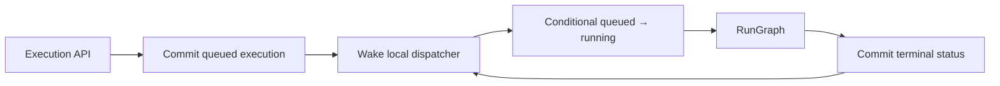

# Slice 6: Local execution queue and capacity

- **Status:** Complete
- **Updated:** 2026-08-24
- **Depends on:** Existing managed execution lifecycle; Slice 4 is required for
  final Plugin invocation and sandbox capacity integration
- **Outcome:** Accepted saved-graph executions wait in a bounded durable FIFO
  owned by the single API process, while graph, Plugin invocation, and sandbox
  concurrency remain within VPS limits

## Why this slice exists

The current manager records `queued` and then immediately attempts a fail-fast
admission lease. That is admission control, not a queue. Users submitting work
while the two active slots are occupied receive a capacity error instead of a
durable waiting execution.

For one VPS, the appropriate pattern is a database-backed execution state
machine with one local dispatcher and an in-process wake signal. An outbox is
for reliably publishing a committed change to another system; Grafy has no
broker or separate queue consumer in this deployment.

## Scope

- Bounded FIFO for managed saved-graph executions.
- Execution row as durable queue item and lifecycle record.
- One manager-owned local dispatcher.
- Queue cancellation, position, capacity response, and restart recovery.
- Existing one-active-or-queued execution invariant per saved graph.
- Exact API retry idempotency across process restart.
- Shared active graph, Plugin invocation, and live sandbox limits.
- Draft/diagnostic run admission that cannot bypass global capacity.

## Non-goals

- Outbox, Redis, RabbitMQ, Kafka, or another broker.
- Multiple dispatchers, competing consumers, leases, or fencing tokens.
- Automatic retry of an execution that may have started.
- Priority classes, fair-share scheduling, or per-user quotas.
- Distributed progress, cancellation routing, or replay storage.
- Schedule definitions, occurrence records, polling, and coalescing. Grafy has
  no scheduler domain; that work belongs to the package that introduces one.

## Fixed decisions



The database execution row is authoritative. An `asyncio.Event` or condition
only wakes the dispatcher; losing the wake signal cannot lose the queued work.
The dispatcher selects the oldest queued record when capacity exists.

Delivery semantics are deliberate:

- a queued execution that never started may be dispatched after restart;
- a running or cancelling execution found during restart becomes interrupted;
- interrupted work is not automatically retried.

The durable idempotency key is intentionally caller-defined. A future scheduler
can use `(schedule_id, scheduled_for)` without changing queue semantics, but
this slice does not invent schedule ownership or occurrence state.

## Expected ownership

- Queue orchestration in the existing `RunExecutionManager`
- Durable state and active graph invariant in existing execution application
  services/repositories
- Manager-owned wake signal, dispatcher task, and capacity counters
- Global Plugin invocation limit at the Plugin execution caller
- API/SSE/web models for queued state, position, and capacity outcomes

Do not create a generic queue service used by one manager.

## Suggested deployment settings

Initial values are configuration, not domain constants:

```text
max_active_executions = 2
max_pending_graphs = 20
max_active_plugin_invocations = 4
max_live_plugin_sandboxes = 4
max_distinct_plugin_releases_per_graph = bounded
```

Tune them using representative VPS CPU, memory, disk, and artifact workloads.

## Implementation checklist

### Durable enqueue

- [x] Reuse the execution lifecycle row as the queue item unless a proven
      persistence constraint requires another owned model.
- [x] Capture the exact graph revision, requested scope, idempotency key, and
      submitted Plugin release pins before committing `queued`.
- [x] Assign deterministic FIFO order using committed enqueue time plus a
      stable tie-breaker.
- [x] Enforce `max_pending_graphs` before accepting another record.
- [x] Return a clear capacity result when the bounded pending queue is full.
- [x] Preserve the durable one queued/running/cancelling execution invariant
      for `(workspace_id, graph_id)`.
- [x] Signal the dispatcher only after the enqueue transaction commits.

### Single dispatcher

- [x] Start exactly one dispatcher with the single execution-owning API
      process.
- [x] Wake it on enqueue, cancellation, terminal completion, and startup.
- [x] Select the oldest eligible queued execution while graph capacity exists.
- [x] Transition `queued → running` with a conditional update so queued
      cancellation wins cleanly.
- [x] Reserve in-process graph capacity before starting the task and release it
      on every terminal path.
- [x] Avoid `SKIP LOCKED`, leases, or broker acknowledgements while one owner is
      an enforced deployment invariant.
- [x] Ensure dispatcher failure cannot silently stop future dispatch; fail the
      application or restart the owned task visibly.

### Cancellation, status, and restart

- [x] Cancel a queued execution without starting `RunGraph`.
- [x] Expose waiting state and a stable queue-position estimate to the API and
      web client.
- [x] Revalidate Workspace access, graph revision, and release availability
      before dispatching recovered queued work.
- [x] Reload eligible queued records during startup.
- [x] Mark previously running or cancelling records interrupted on startup.
- [x] Do not automatically rerun interrupted work.
- [x] Keep live SSE events best-effort and separate from durable queue truth.

### Duplicate submissions

- [x] Make exact API submission retries return the original execution.
- [x] Reject reuse of one idempotency key with a different graph revision,
      scope, or requested closure.
- [x] Persist the idempotency key and exact submitted request so an API retry
      after process restart resolves the original execution.
- [x] Check exact idempotent retry before queue-capacity rejection.

### Resource capacity

- [x] Keep top-level active graph capacity separate from pending queue capacity.
- [x] Add one process-wide semaphore for scalar Workspace Plugin invocations.
- [x] Bound concurrently live Plugin sandboxes independently from child
      processes.
- [x] Ensure nested MAP and Module invocations use the same global Plugin
      invocation budget.
- [x] Reject or fail compilation for an excessive number of distinct Plugin
      releases in one graph.
- [x] Ensure synchronous draft/diagnostic runs acquire the same global graph
      capacity or fail fast without exceeding it.
- [x] Publish metrics or diagnostics for pending, active, invocations, live
      sandboxes, wait time, and queue-full outcomes.

## Verification checklist

- [x] With two graph slots occupied, the next accepted execution remains queued
      and starts when one slot is released.
- [x] FIFO ordering is deterministic for equal-time submissions.
- [x] A queued execution can be cancelled without invoking graph code.
- [x] Queue-full behavior does not create a phantom active/history record unless
      the product deliberately records rejected attempts.
- [x] An exact idempotent retry never creates a second execution.
- [x] An exact API retry after manager restart resolves the durable original
      execution rather than creating another row.
- [x] Startup reloads queued work and interrupts possibly-started work.
- [x] Multiple configured API workers fail startup or leave execution disabled.
- [x] Nested MAP/Module activity never exceeds the global Plugin invocation
      limit.
- [x] Draft diagnostic execution cannot bypass global graph capacity.
- [x] Queue and cancellation behavioral tests are deterministic without sleeps.

## Exit criteria

- [x] Saved-graph executions wait durably instead of failing merely because all
      active slots are occupied.
- [x] The pending queue and every execution resource dimension are bounded.
- [x] One process owns dispatch, progress, cancellation, and recovery.
- [x] No outbox, broker, lease, or speculative distributed abstraction exists.
- [x] Restart and duplicate-submission semantics are explicit and tested.

## Agent handoff

- **Owner:** Codex
- **Branch or PR:** —
- **Implementation evidence:** Migration `0018_local_execution_queue` adds the
  immutable submitted request, submitter, and idempotency key to the existing
  execution lifecycle row. `RunExecutionManager` owns one wake-driven FIFO
  dispatcher, conditional durable claims, restart recovery, queue cancellation,
  and queue-position snapshots. API/web contracts expose queue position and
  typed queue-full/idempotency outcomes. Deployment settings independently
  bound active graphs, pending graphs, Plugin invocations, live sandboxes, and
  distinct releases per execution. Typed `capacity_diagnostics()` snapshots
  cover active admissions, pending FIFO depth, cumulative queue-full outcomes,
  dispatch wait, Plugin invocations, and live/waiting sandboxes; startup,
  dispatch, and queue-full events are logged without Workspace payloads.
- **Verification evidence:** 123 focused Python tests pass across queue manager,
  persistence, migrations, Plugin capacity, settings, single-owner startup,
  routes, and OpenAPI. Ruff lint/format, focused basedpyright, and diff checks
  pass. The focused web execution hook has 21 passing tests; TypeScript
  typecheck, ESLint, generated-client drift, and API contract checks pass.
- **VPS capacity evidence:** The Docker resource dimensions were exercised on a
  4-vCPU, 8.30 GB Linux/arm64 Colima VM with the deployment runtime profile.
  Queue limits remain deployment settings and should be tuned again on the
  production host with representative graph/artifact workloads.
- **Open decisions or blockers:** None for this slice. Schedule occurrence
  identity, polling, and coalescing are deferred to the future scheduler domain.
