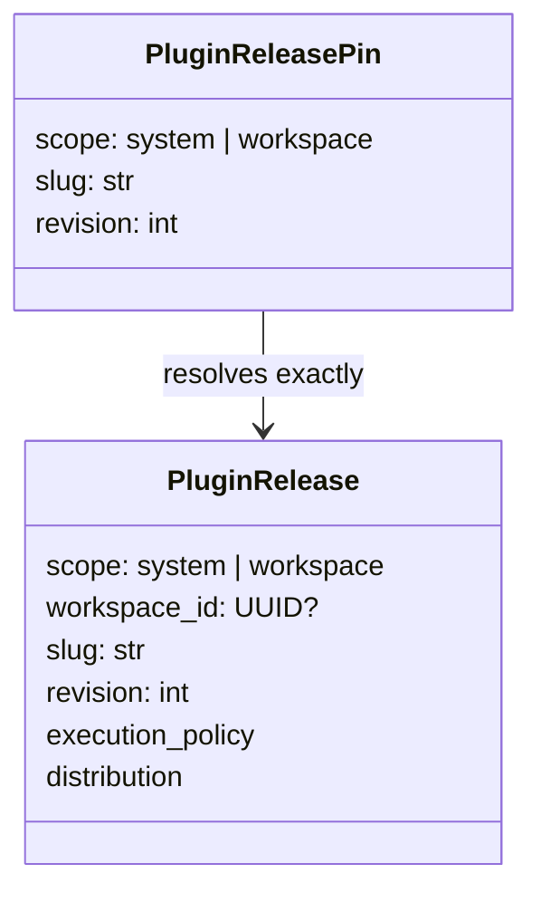

# Slice 8: Scoped release identity and migration

- **Status:** Complete
- **Updated:** 2026-08-24
- **Depends on:** [Slice 7](07-agent-authoring-unification.md)
- **Outcome:** One immutable Plugin release identity supports globally visible
  System releases and Workspace-owned releases without using a hidden
  Workspace; every new Plugin graph pin names its scope explicitly

## Fixed model

`scope=system` requires no Workspace owner. `scope=workspace` requires exactly
one `workspace_id`. Scope controls visibility and authorization only. Execution
policy is deployment-owned metadata and is not inferred from scope.

Existing `plugin_releases` rows become `workspace` releases. Existing saved
pins containing only `slug` and `revision` are interpreted and rewritten as
`workspace` pins. This compatibility rule is one-way: all newly serialized pins
include scope.

## Implementation checklist

### Domain and persistence

- [x] Add narrow release-scope, execution-policy, and System distribution values
      to the immutable release model. Keep current/deprecated/withdrawn/revoked
      selection out of immutable release facts.
- [x] Use an internal UUID primary key without exposing it in graph pins; enforce
      partial System and Workspace uniqueness for revisions and descriptors.
- [x] Enforce `system => workspace_id is null` and
      `workspace => workspace_id is present` in both domain and database.
- [x] Make repository lookup, revision allocation, idempotency, and current
      listing scope-aware.
- [x] Preserve append-only exact release identities and digest validation.
- [x] Add a migration that maps every existing release row to Workspace scope
      without changing slug, revision, descriptor, publisher, or artifact.

### Pins and compatibility

- [x] Add scope to the core saved-graph pin, API pin, execution request, web
      authored graph, collaboration command, and generated API contract.
- [x] Upgrade a node pin through a semantic collaboration command with an exact
      expected-pin comparison; never replace the full document for a one-node
      release upgrade.
- [x] Read legacy two-field pins as Workspace pins and always write the new
      three-field form.
- [x] Include release scope in execution/cache/provenance fingerprints.
- [x] Propagate scope through protocol identity, sandbox keys, runtime-artifact
      lookup, materialized compatibility, execution diagnostics, and stable
      errors.
- [x] Reject Module nodes carrying Plugin release pins.

### Stored representation migration

- [x] Rewrite legacy two-field pins in `saved_graphs.document`,
      `saved_graph_revisions.document`, `collaborative_graph_heads.document`,
      `templates.snapshot_document`, and recoverable
      `graph_executions.submitted_request` payloads.
- [x] Treat the graph-document rewrite as representation migration: preserve
      graph revisions, topology, config, layout, and timestamps.
- [x] Normalize or explicitly support legacy release provenance in artifact
      metadata and execution diagnostics.

## Verification checklist

- [x] Domain tests reject invalid scope/owner combinations.
- [x] Repository tests prove System and Workspace releases with the same slug
      have independent revision sequences and exact lookup.
- [x] Migration tests preserve old Workspace release data on SQLite and
      PostgreSQL-compatible metadata.
- [x] Saved-graph tests prove legacy pins read as Workspace pins and round-trip
      with explicit scope.
- [x] Generated web types and graph command tests carry scope without moving
      unrelated nodes.

## Exit criteria

- [x] No Plugin release lookup relies on an implicit owning Workspace.
- [x] Every newly serialized Plugin pin has an explicit scope.
- [x] Existing Workspace releases and pins retain their meaning.

## Agent handoff

- **Owner:** Codex
- **Branch or PR:** `feat/workspace-plugin-releases` / PR #8
- **Implementation evidence:** Scoped domain values and UUID-backed persistence
  are in `plugin_identity.py`, `plugin_releases.py`, `schema.py`, repository
  adapters, and migrations `0019`/`0020`. Exact pins now cross saved documents,
  API models, generated web contracts, the semantic collaboration CAS, compiler,
  OCI namespace, sandbox identity, and provenance.
- **Verification evidence:** Core release/pin/collaboration suites, 71 persistence
  tests, 19 migration tests, 26 collaboration integration tests, and the full
  web suite (82 files / 563 tests) pass; web lint, typecheck, and API contract
  generation are clean.
- **Open decisions or blockers:** None.
