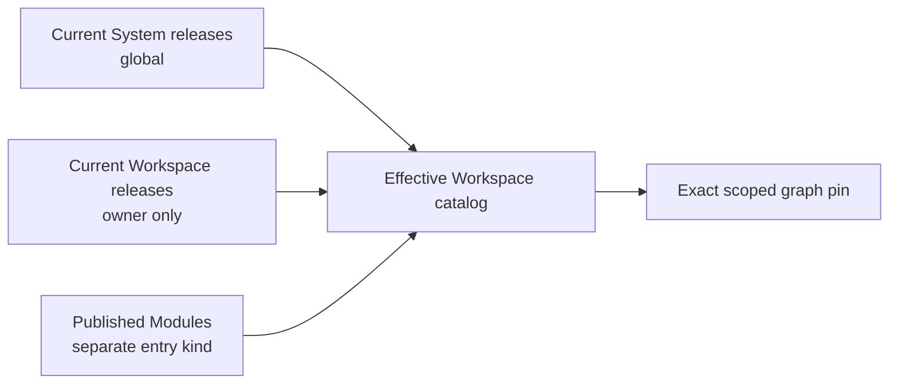

# Slice 9: System catalog and execution policy

- **Status:** In progress
- **Updated:** 2026-08-24
- **Depends on:** [Slice 8](08-scoped-release-identity.md)
- **Decision:** [ADR 0004 — Unify System and Workspace Plugin releases](../../adr/0004-unify-system-and-workspace-plugin-releases.md)
- **Outcome:** Every Workspace sees current System releases plus its own current
  releases; compilation resolves one exact pin and selects in-process or
  isolated execution from deployment policy and byte identity

## Effective catalog

Module is not a Plugin scope. The public catalog uses an entry kind rather than
the old origin enum. `bundled` means shipped and normally enabled by the
deployment; it does not imply in-process execution.

## Runtime selection

1. Resolve the exact scoped release and operator contract.
2. Reject revoked releases and scope/Workspace mismatches.
3. Use the host implementation only when the release is System,
   `host-eligible`, current, deployment-allowlisted, and the loaded release
   identity matches the exact pin.
4. Otherwise require the retained OCI artifact and invoke it through the
   provider-neutral isolated runtime.

Routing is selected once from an immutable selection-generation snapshot at
the start of a top-level run. A concurrent promotion or ordinary revocation
changes later runs, not nodes already compiled in that snapshot. Emergency
revocation additionally cancels affected active runs or is performed during a
drain.

`current` is an explicit exact selection, never `max(revision)`. Publication
appends immutable facts. A separate mutable selection/admission aggregate owns
the selected revision and lifecycle policy: deprecated or withdrawn releases
cannot be inserted into new graphs but retained pins may run; revoked releases
retain identity and artifacts but cannot execute. Promotion and rollback move
the exact pointer without mutating a release.

## Implementation checklist

- [x] Add a platform-authorized System publication/bootstrap boundary that
      reuses immutable inspection, digest, object-store, and OCI contracts.
- [x] Retain a verified OCI artifact for every System release, including a
      current host-eligible release.
- [x] Run candidate fetch, tests, and inspection through a platform publisher
      sandbox; sanitized host subprocesses are not an isolation boundary.
- [x] Ship publication as a one-shot service or CI job without online API
      credentials; do not grant the long-lived API Docker build authority.
- [x] Record explicit platform audit attribution for System publication; a null
      Workspace publisher is not platform authorization.
- [x] Prevent Workspace publishers and coding agents from choosing System scope
      or execution policy.
- [x] List current System releases globally and current Workspace releases only
      for the requested Workspace.
- [x] Reject Workspace slug/operator/artifact collisions with System releases.
- [ ] Replace Builtin/External/Module/Workspace origin with explicit Plugin
      release scope plus separate Module catalog entry kind.
- [x] Expose entry kind, Plugin scope, System distribution, selected revision,
      and derived disabled reason as separate catalog facts.
- [x] Add the mutable exact release selection/admission aggregate and lifecycle
      transitions; never derive current from maximum revision.
- [x] Pin newly inserted System and Workspace nodes exactly.
- [x] Implement the exact current host fast path and retained OCI fallback.
- [x] Require the fast path to match exact scope, descriptor, loaded build bytes,
      catalog digest, deployment allowlist, and selected revision.
- [ ] Descriptor-cover the loader target and immutable build-input identity;
      bind both the retained OCI labels and baked host manifest to that build
      identity before promotion.
- [x] Use one caller-owned `ReleaseExecutionAdmission` from catalog, compiler,
      and defensive runtime checks so crafted pins cannot bypass policy.
- [x] Keep unsupported, deprecated, and revoked releases fail-closed with stable
      catalog and compilation reasons.
- [ ] Snapshot one selection generation per top-level run and define explicit
      cancellation for emergency revocation.
- [ ] Keep source and OCI artifacts reachable for every lifecycle state,
      including revoked releases; orphan cleanup uses a grace period and exact
      reference checks.

## Verification checklist

- [ ] Two Workspaces see the same System release and only their own Workspace
      releases.
- [ ] An agent with `publish_plugin` cannot publish System scope.
- [x] A System/Workspace identity collision fails before catalog assembly.
- [x] A matching current host-eligible pin runs in-process.
- [x] A historical System pin does not silently retarget and runs its retained
      OCI artifact.
- [x] An isolated-only System release never enters the host path.
- [x] A revoked release remains identifiable but cannot execute.
- [ ] Catalog and compiler produce the same admission decision for every
      lifecycle, profile, protocol, capability, artifact-format, and adapter
      combination.

## Exit criteria

- [ ] Scope, distribution, and runtime policy are independent in code and API.
- [ ] Every Plugin-backed compiler branch begins with exact release resolution.
- [ ] Module catalog behavior no longer depends on Plugin origin vocabulary.

## Agent handoff

- **Owner:** Codex
- **Branch or PR:** `feat/workspace-plugin-releases` / PR #8
- **Implementation evidence:** Explicit selection and revocation persistence,
  scoped System staging/promotion, platform actor attribution, Docker-isolated
  one-shot publication, exact host bindings, retained OCI fallback, centralized
  release admission, and scoped effective catalog loading are implemented.
- **Verification evidence:** Selection/repository/migration,
  stage/promote/rollback, publisher CLI, catalog readiness, host-binding,
  historical fallback, isolated-only routing, compiler snapshot, defensive
  Docker admission, and exact revocation tests pass. Cross-Workspace catalog
  acceptance, full admission-matrix parity, emergency active-run cancellation,
  and reachability/garbage-collection verification remain open.
- **Open decisions or blockers:** None.
