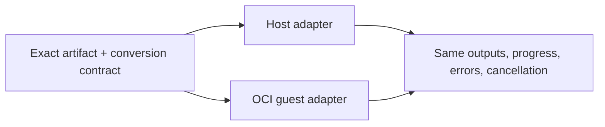

# Slice 10: Artifact contracts and runtime parity

- **Status:** In progress
- **Updated:** 2026-08-24
- **Depends on:** [Slice 9](09-system-catalog-and-runtime.md)
- **Outcome:** Serialized release contracts are sufficient to catalog and
  execute every first-party System release identically through host and OCI
  adapters

## Why this is a separate slice

The current release manifest omits artifact materialization shape and
conversions, readiness recognizes a hard-coded artifact-type whitelist, and the
isolated guest cannot report node progress. Moving packages before these
contracts are portable would produce System baselines that can be cataloged but
cannot reproduce historical execution.

## Implementation checklist

### Contract inventory and serialization

- [ ] Inventory every first-party port, owned and referenced artifact type,
      projection, export, conversion, runtime Python shape, persisted layout,
      secret, egress, native dependency, and query capability.
- [x] Define one canonical artifact contract carrying key/version, JSON schema,
      `materialized_json_type`, projections, exports, and an explicit portable
      `bundle_format@version` when values are not canonical inline JSON.
- [ ] Replace the hard-coded type-id readiness whitelist with format-level host
      adapters selected from exact serialized contracts.
- [ ] Represent referenced foreign artifact contracts as exact dependencies and
      reject the same key/version with a different contract digest.
- [x] Make each executable conversion key/version a deployment-owned immutable
      canonical implementation. Release manifests may reference only an exact
      canonical contract; graph execution never resolves conversions from
      mutable host Plugin registry state.

### First-party runtime capabilities

- [ ] Implement portable bundles and stable host/guest resolver-writer behavior
      for every first-party type needed by GIS, SQL, OCR, and LLM.
- [ ] Add the scoped secret, egress, native-profile, and SQL isolation policies
      required by first-party releases; unsupported capabilities remain
      fail-closed and cannot become current.
- [x] Send bounded guest-to-host progress events (`message`, `current`, `total`)
      through the same validation, best-effort reporting, and live execution
      event path as in-process `NodeExecutionContext.progress`.
- [ ] Preserve typed terminal status and failure codes across adapters.

## Verification checklist

- [ ] Run the same exact eligible release through host and OCI adapters and
      compare outputs, progress, cancellation, errors, cache identity, and
      provenance.
- [x] Artifact contracts round-trip without importing a Plugin implementation.
- [x] Same-key/different-contract canonical conversion references fail closed at
      publication and catalog assembly.
- [ ] Unsupported bundle formats, capabilities, profiles, and transports produce
      the same readiness and compiler admission result.
- [ ] No current-to-historical selection is allowed while the release lacks a
      runnable OCI policy.

## Exit criteria

- [ ] Every first-party release contract is self-sufficient for catalog and both
      runtime adapters.
- [ ] Artifact and conversion execution no longer depends on mutable ambient host
      registry state.
- [ ] Host and OCI execution have behavioral parity at the public execution
      boundary.

## Agent handoff

- **Owner:** Codex
- **Branch or PR:** `feat/workspace-plugin-releases` / PR #8
- **Implementation evidence:** Release manifests now bind materialized JSON
  shape, portable bundle format/version, and exact conversion declarations;
  protocol v3 carries bounded isolated progress to the host execution reporter.
- **Verification evidence:** Full core suite (342 tests), 49 focused protocol
  tests, four guest integration tests, Ruff, and focused type checking pass.
- **Open decisions or blockers:** None.
