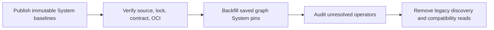

# Slice 12: Compatibility cutover and cleanup

- **Status:** Not started
- **Updated:** 2026-08-24
- **Depends on:** [Slice 9](09-system-catalog-and-runtime.md),
  [Slice 10](10-artifact-contract-and-runtime-parity.md), and
  [Slice 11](11-first-party-package-convergence.md)
- **Outcome:** The deployment has immutable System baselines and all persisted
  Plugin nodes are exact-pinned before the legacy host discovery/origin model is
  removed

## Mandatory cutover order

Code that disappeared before a baseline was frozen cannot be reconstructed from
an operator ID. The cutover therefore fails closed when any installed Plugin
family lacks a retained baseline or any known graph node cannot be mapped.

## Implementation checklist

- [ ] Add a deployment/admin command that publishes or verifies the exact
      baseline release for every enabled System Plugin.
- [ ] Stage source plus OCI first, build the API image from the frozen System
      wheel and exact host-binding manifest, verify the deployed bytes against
      the staged row, and only then promote the explicit current selection.
- [x] Produce an exact operator/artifact-to-release map from verified installed
      bytes, retained OCI artifacts, and explicit current selections before
      rewriting any graph. Verify conversions separately against the immutable
      deployment-owned canonical map; never assign them to a System release.
- [ ] Add an idempotent graph-data migration/backfill from unpinned installed
      operators to exact System release pins.
- [ ] Report unknown, ambiguous, or conflicting operators without rewriting
      their saved bytes.
- [ ] Rewrite `saved_graphs.document`, `saved_graph_revisions.document`,
      `collaborative_graph_heads.document`, `templates.snapshot_document`, and
      queued `graph_executions.submitted_request`; exclude Module boundary and
      `graph.module.*` operators.
- [ ] Drain or cancel active executions and stop graph authoring during a
      maintenance window. Back up and verify the database, release object
      namespace, local artifacts, and migration manifest as one rollback unit.
- [ ] Invalidate pre-cutover materialized bindings and invocation-cache entries
      for backfilled System nodes; bump the fingerprint version.
- [ ] Preserve historical execution rows and artifacts but mark old System
      provenance `legacy_unpinned` instead of inventing a release identity.
- [ ] Block legacy removal while any enabled System Plugin lacks a verified
      runtime artifact or any known graph node remains unpinned.
- [x] Remove generic Python package discovery, its shared group constant, and
      the Builtin/External origin branches.
- [ ] Remove compatibility reads for legacy two-field pins only after persisted
      data and supported import/export fixtures are upgraded.
- [ ] Reconcile `CONTEXT.md`, architecture docs, examples, and API fixtures with
      the delivered structure.

## Verification checklist

- [ ] Baseline publication is idempotent and refuses mismatched installed bytes.
- [ ] Backfill changes only known Plugin nodes and preserves graph topology,
      config, layout, and revision history policy.
- [ ] A graph created before cutover is pinned to the verified cutover baseline;
      old reusable outputs are not trusted, and every later execution is exact.
- [ ] Removing a current System implementation leaves retained historical pins
      executable through OCI.
- [ ] Repository search finds no generic host Plugin package-discovery or
      External origin path.
- [ ] Full Python and web suites, migration upgrade tests, formatting, and API
      contract checks pass.

## Exit criteria

- [ ] Every persisted Plugin node is exact-pinned or explicitly inert/unknown.
- [ ] No executable Plugin code is reachable only through mutable host
      installation state.
- [ ] All twelve slices and the package plan are `Complete` with verification
      evidence.

## Agent handoff

- **Owner:** Unassigned
- **Branch or PR:** —
- **Implementation evidence:** —
- **Verification evidence:** —
- **Open decisions or blockers:** None.
