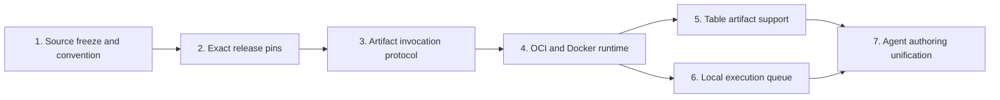

# Workspace Plugins implementation plan

- **Status:** Complete
- **Date:** 2026-08-24
- **Audience:** Coding agents and maintainers changing Plugin publication,
  catalog identity, graph compilation, artifact persistence, execution, or agent
  authoring
- **Document type:** Implementation plan and progress reference
- **Scope:** Workspace Plugin releases on one VPS with one API owner and a local
  Docker runtime adapter
- **Related:** [Plugin unification](../../design/plugin-unification.md),
  [current host Plugin development](../../design/plugin-development.md),
  [backend architecture](../../design/backend-architecture.md),
  [server-authoritative collaboration ADR](../../adr/0002-server-authoritative-workbench-collaboration.md),
  [identity and Workspace ADR](../../adr/0003-authenticate-users-and-scope-collaboration-to-workspaces.md),
  and [product vocabulary](../../../CONTEXT.md)

## Outcome

A human or the coding agent authors a uv project under an allowlisted Plugin
root and publishes an immutable Workspace Plugin release. The API catalogs and
compiles the serialized release contract without importing the working copy.
Saved graphs pin both the operator version and an exact Plugin release. During
execution, built-in nodes remain on the host path while Workspace Plugin nodes
run offline through a provider-neutral invocation port backed by local Docker.

The target deployment is one VPS for a research team. The plan deliberately
does not introduce a broker, outbox, distributed leases, a worker fleet,
Kubernetes, or cross-run container pools.

## Progress protocol

The slice-local checklist is authoritative.

1. Before starting a slice, set its **Status** to `In progress`, add the agent
   or branch under **Agent handoff**, and update the status table below.
2. Check a task only after its implementation and focused verification are
   complete. Do not use a checked box to mean “started.”
3. Record concrete evidence under **Agent handoff**: changed files, test
   commands, migrations, and any accepted deviation from this plan.
4. If blocked, set **Status** to `Blocked` and describe the exact unmet
   dependency. Leave incomplete tasks unchecked.
5. Set a slice to `Complete` only when every exit criterion is checked and the
   status table below has been updated.
6. An agent taking over a slice reads this index, that complete slice file, and
   every linked prerequisite slice before editing.

Allowed status values are `Not started`, `In progress`, `Blocked`, and
`Complete`.

## Current foundation

These capabilities already exist and are treated as the starting point:

- [x] Deployment configuration allowlists Plugin roots.
- [x] Publication creates digest-addressed Workspace Plugin release rows.
- [x] Publishing identical freeze bytes is idempotent.
- [x] The Workspace node catalog overlays the current Plugin release.
- [x] Workspace Plugin catalog readiness is derived and fail-closed with a
      stable disabled reason.
- [x] `examples/plugin-notes` exercises publication and catalog inspection.
- [x] Existing vocabulary and design documents are reconciled with the
      decisions in this implementation plan.

The original foundation was not an executable release path. All seven slices
now provide immutable source/runtime artifacts, exact graph pins, the
provider-neutral protocol, local Docker, portable Table transport, a durable
local queue, and one fenced human/coding-agent authoring path.

## Slice status

| Slice | Status | Depends on | Plan |
| --- | --- | --- | --- |
| 1. Source freeze and project convention | Complete | Current catalog foundation | [Slice 1](01-source-freeze-and-convention.md) |
| 2. Exact release pins and compiler proxy | Complete | Slice 1 | [Slice 2](02-exact-release-pins.md) |
| 3. Artifact invocation protocol | Complete | Slice 2 | [Slice 3](03-artifact-invocation-protocol.md) |
| 4. OCI image and Docker runtime | Complete | Slices 1 and 3 | [Slice 4](04-oci-and-docker-runtime.md) |
| 5. Table artifact support | Complete | Slices 3 and 4 | [Slice 5](05-table-artifact-support.md) |
| 6. Local execution queue | Complete | Slice 4 for final capacity integration | [Slice 6](06-local-execution-queue.md) |
| 7. Agent authoring unification | Complete | Slices 1, 2, 5, and 6 | [Slice 7](07-agent-authoring-unification.md) |

Slices should normally land in this order. Queue-domain work may be developed
alongside artifact work, but its global Plugin invocation limit cannot be
completed until the runtime adapter exists.

## Source-of-truth boundaries

| Concern | Authority |
| --- | --- |
| Product terms such as Plugin, Plugin root, and Plugin release | `CONTEXT.md` after its Slice 1 reconciliation |
| Intended architecture and anti-patterns | `docs/design/plugin-unification.md` after its Slice 1 reconciliation |
| Ordered implementation work and completion state | This directory |
| Current behavior | Production code, migrations, and behavioral tests |
| Legacy in-process entry-point authoring | `docs/design/plugin-development.md` |

This completed plan is authoritative where an older explanation differs on:

- implicit first-publish identity versus a mandatory public Register step;
- operator version versus exact Plugin release revision;
- source archive metadata versus generated release metadata;
- container-per-invocation versus a sandbox scoped to one top-level execution
  and exact release;
- bounded local queue versus fail-fast admission.

## Fixed implementation decisions

- The working copy is authoring input only. Runtime trusts an immutable release.
- New Workspace Plugins do not use `grafy.plugins` entry points.
- Every project exports `PLUGIN` from the fixed `grafy_plugin` package.
- First publish establishes `(workspace, slug)` identity; public registration is
  deferred until a real pre-publish working-copy workflow needs it.
- Operator version and Plugin release revision are independent pins.
- FastAPI reads serialized contracts and never imports a working copy.
- Workspace Plugin caching stays `NEVER` until release identity participates in
  the cache fingerprint and an executable release explicitly earns another
  policy.
- The host authorizes inputs, stages artifact bundles, validates outputs,
  persists them, and mints authoritative `ArtifactRef` values.
- The Plugin invocation contract contains domain values only. Docker image,
  mount, process, and container details stay in an outer adapter.
- A sandbox is scoped to `(PluginSandboxScopeId, exact Plugin release)` and uses
  a fresh Python child and scratch directory for each scalar invocation.
- Graph execution has one owner. A database-backed execution state machine and
  local dispatcher provide the queue; no outbox or external broker is used.
- Coding-agent authoring uses fixed scaffold/reserve/review/publish CLI
  boundaries. It does not create catalog rows, graph pins, or runtime images
  through a separate agent path.
- The first executable runtime has no Plugin secrets, no egress, no arbitrary
  Dockerfile, and no ambient database or object-store credentials.

## Package definition of done

- [x] Every slice is `Complete` with all exit criteria checked.
- [x] Existing Plugin vocabulary and architecture documents describe the
      implemented lifecycle without contradictions.
- [x] A graph pinned to Plugin release N remains reproducible after release
      N+1 is published.
- [x] A mixed graph executes host and Workspace Plugin nodes while preserving
      Workspace authorization and artifact provenance.
- [x] Docker is absent from core graph, release, and artifact contracts.
- [x] Queue, cancellation, restart, and resource-limit behavior are covered by
      deterministic behavioral tests.
- [x] Deferred capabilities remain fail-closed and documented.

## Final verification

- `uv run pytest -q --disable-warnings -o log_cli=false` — 1,010 passed.
- `npm run lint`, `npm run typecheck`, and `npm run check:api` in `apps/web`
  — passed.
- `npm test` in `apps/web` — 82 files and 552 tests passed.
- `uv run ruff check .`, `uv run ruff format --check .`, and
  `git diff --check` — passed.
- `uv run grafy plugin --help` — the human and coding-agent command boundary
  constructs with publish, scaffold, reservation, review, reviewed-publication,
  and reservation-release commands.
- `uv run pytest -q -o log_cli=false
  tests/integration/executions/test_workspace_plugin_docker.py` — the live
  Docker isolation, resource, cancellation, cache-restore, release separation,
  Table, and cleanup path passed on the local Linux/arm64 Colima engine.

## Deferred work

- Plugin secrets and a scoped secret-broker policy.
- Outbound network capabilities and origin-scoped egress.
- Cross-Plugin custom artifact codecs and conversions.
- Additional native runtime profiles beyond a deployment-owned default.
- Cross-Workspace Plugin copying.
- Multiple API owners or remote execution workers.
- Global warm pools, prewarming, or cross-execution container reuse.
- Parallel logical DAG scheduling.
- Migration of GIS, SQL, OCR, and LLM host Plugins onto the release path.
- Canvas islands and multi-graph authoring.
- Scheduler definitions, durable occurrence records, polling, and coalescing.
- A Canvas coding-agent experience and retained-release history chooser above
  the completed authoring/publication and exact-pin command boundaries.
