# Plugin releases implementation plan

- **Status:** In progress
- **Date:** 2026-08-24
- **Audience:** Coding agents and maintainers changing Plugin publication,
  catalog identity, graph compilation, artifact persistence, execution, or agent
  authoring
- **Document type:** Implementation plan and progress reference
- **Scope:** Immutable System and Workspace Plugin releases on one VPS with one
  API owner, an exact in-process System fast path, and a local Docker runtime
  adapter
- **Related:** [Plugin unification](../../design/plugin-unification.md),
  [current host Plugin development](../../design/plugin-development.md),
  [backend architecture](../../design/backend-architecture.md),
  [unified Plugin releases ADR](../../adr/0004-unify-system-and-workspace-plugin-releases.md),
  [server-authoritative collaboration ADR](../../adr/0002-server-authoritative-workbench-collaboration.md),
  [identity and Workspace ADR](../../adr/0003-authenticate-users-and-scope-collaboration-to-workspaces.md),
  and [product vocabulary](../../../CONTEXT.md)

## Outcome

A human or the coding agent authors a uv project under an allowlisted Plugin
root and publishes an immutable Workspace Plugin release. Deployment CI or an
authorized platform administrator publishes globally visible System Plugin
releases. Both scopes use the same serialized release contract and exact graph
pin. Workspace releases are isolated; a current System release may use the
in-process fast path only when deployment policy allows it and the loaded bytes
match the exact pin. Retained historical System releases use the same offline
Docker invocation path as Workspace releases.

The target deployment is one VPS for a research team. The plan deliberately
does not introduce a broker, outbox, distributed leases, a worker fleet,
Kubernetes, or cross-run container pools.

```mermaid
flowchart LR
    Source["1. Source freeze and convention"]
    Pins["2. Exact release pins"]
    Protocol["3. Artifact invocation protocol"]
    Runtime["4. OCI and Docker runtime"]
    Tables["5. Table artifact support"]
    Queue["6. Local execution queue"]
    Agent["7. Agent authoring unification"]
    Scope["8. Scoped release identity"]
    Catalog["9. System catalog and runtime"]
    Contracts["10. Artifact and runtime parity"]
    Packages["11. First-party package convergence"]
    Cutover["12. Compatibility cutover"]

    Source --> Pins
    Pins --> Protocol
    Protocol --> Runtime
    Runtime --> Tables
    Runtime --> Queue
    Tables --> Agent
    Queue --> Agent
    Agent --> Scope
    Scope --> Catalog
    Catalog --> Contracts
    Contracts --> Packages
    Packages --> Cutover
```

## Progress protocol

The slice-local checklist is authoritative.

1. Before starting a slice, set its **Status** to `In progress`, add the agent
   or branch under **Agent handoff**, and update the status table below.
2. Check a task only after its implementation and focused verification are
   complete. Do not use a checked box to mean “started.”
3. Record concrete evidence under **Agent handoff**: changed files, test
   commands, migrations, and any accepted deviation from this plan.
4. If blocked, set **Status** to `Blocked` and describe the exact unmet
   dependency. Leave incomplete tasks unchecked.
5. Set a slice to `Complete` only when every exit criterion is checked and the
   status table below has been updated.
6. An agent taking over a slice reads this index, that complete slice file, and
   every linked prerequisite slice before editing.

Allowed status values are `Not started`, `In progress`, `Blocked`, and
`Complete`.

## Current foundation

These capabilities already exist and are treated as the starting point:

- [x] Deployment configuration allowlists Plugin roots.
- [x] Publication creates digest-addressed Workspace Plugin release rows.
- [x] Publishing identical freeze bytes is idempotent.
- [x] The Workspace node catalog overlays the current Plugin release.
- [x] Workspace Plugin catalog readiness is derived and fail-closed with a
      stable disabled reason.
- [x] `examples/plugin-notes` exercises publication and catalog inspection.
- [x] Existing vocabulary and design documents are reconciled with the
      decisions in this implementation plan.

The original foundation was not an executable release path. The first seven
slices provide immutable Workspace source/runtime artifacts, exact graph pins,
the provider-neutral protocol, local Docker, portable Table transport, a
durable local queue, and one fenced human/coding-agent authoring path. Slices
8–12 remove the remaining host-only Plugin lifecycle and make every Plugin node
release-addressed.

## Slice status

| Slice | Status | Depends on | Plan |
| --- | --- | --- | --- |
| 1. Source freeze and project convention | Complete | Current catalog foundation | [Slice 1](01-source-freeze-and-convention.md) |
| 2. Exact release pins and compiler proxy | Complete | Slice 1 | [Slice 2](02-exact-release-pins.md) |
| 3. Artifact invocation protocol | Complete | Slice 2 | [Slice 3](03-artifact-invocation-protocol.md) |
| 4. OCI image and Docker runtime | Complete | Slices 1 and 3 | [Slice 4](04-oci-and-docker-runtime.md) |
| 5. Table artifact support | Complete | Slices 3 and 4 | [Slice 5](05-table-artifact-support.md) |
| 6. Local execution queue | Complete | Slice 4 for final capacity integration | [Slice 6](06-local-execution-queue.md) |
| 7. Agent authoring unification | Complete | Slices 1, 2, 5, and 6 | [Slice 7](07-agent-authoring-unification.md) |
| 8. Scoped release identity and migration | Complete | Slice 7 | [Slice 8](08-scoped-release-identity.md) |
| 9. System catalog and execution policy | In progress | Slice 8 | [Slice 9](09-system-catalog-and-runtime.md) |
| 10. Artifact contracts and runtime parity | In progress | Slice 9 | [Slice 10](10-artifact-contract-and-runtime-parity.md) |
| 11. First-party package convergence | In progress | Slice 10 | [Slice 11](11-first-party-package-convergence.md) |
| 12. Compatibility cutover and cleanup | Not started | Slices 9–11 | [Slice 12](12-compatibility-cutover.md) |

Slices should normally land in this order. In particular, do not remove a host
implementation or entry-point adapter until its immutable System baseline is
published and existing graph nodes have exact System pins.

## Source-of-truth boundaries

| Concern | Authority |
| --- | --- |
| Product terms such as Plugin, Plugin root, and Plugin release | `CONTEXT.md` after its Slice 12 reconciliation |
| Intended architecture and anti-patterns | `docs/design/plugin-unification.md` after its Slice 12 reconciliation |
| Ordered implementation work and completion state | This directory |
| Current behavior | Production code, migrations, and behavioral tests |
| First-party System Plugin authoring | `docs/design/plugin-development.md` after Slice 11 |

Slices 1–7 are the completed baseline. This plan is authoritative where an
older explanation differs on:

- implicit first-publish identity versus a mandatory public Register step;
- operator version versus exact Plugin release revision;
- source archive metadata versus generated release metadata;
- container-per-invocation versus a sandbox scoped to one top-level execution
  and exact release;
- bounded local queue versus fail-fast admission.

## Fixed implementation decisions

- The working copy is authoring input only. Runtime trusts an immutable release.
- Workspace Plugins never use ambient Python package discovery.
- Every project exports exactly one Plugin declaration. Workspace projects use
  the fixed `src/grafy_plugin` package and `grafy_plugin:PLUGIN` loader target;
  System distributions use a family-specific package and exact loader target
  named by platform-owned inventory. The Python import package is not catalog
  identity.
- First publish establishes `(workspace, slug)` identity; public registration is
  deferred until a real pre-publish working-copy workflow needs it.
- Operator version and Plugin release revision are independent pins.
- FastAPI reads serialized contracts and never imports a working copy.
- Plugin caching is fail-closed at `NEVER`; an exact serialized node declaration
  may opt into `EXACT` only when release identity and all deterministic inputs
  participate in the cache fingerprint.
- The host authorizes inputs, stages artifact bundles, validates outputs,
  persists them, and mints authoritative `ArtifactRef` values.
- The Plugin invocation contract contains domain values only. Docker image,
  mount, process, and container details stay in an outer adapter.
- A sandbox is scoped to `(PluginSandboxScopeId, exact Plugin release)` and uses
  a fresh Python child and scratch directory for each scalar invocation.
- Graph execution has one owner. A database-backed execution state machine and
  local dispatcher provide the queue; no outbox or external broker is used.
- Coding-agent authoring uses fixed scaffold/reserve/review/publish CLI
  boundaries. It does not create catalog rows, graph pins, or runtime images
  through a separate agent path.
- The default Workspace runtime policy has no Plugin secrets, no egress, no
  arbitrary Dockerfile, and no ambient database or object-store credentials.
- Plugin release scope is exactly `system` or `workspace`; Module catalog
  entries are not Plugins.
- System visibility is global. Workspace visibility is limited to the owning
  Workspace. Visibility never selects a runtime.
- Distribution (`bundled`, `optional`, or `published`) and execution policy
  (`host-eligible` or `isolated-only`) are deployment-owned release metadata.
- Every System release retains a verified OCI artifact, including releases that
  are eligible for the current deployment's in-process fast path.
- A loaded System implementation may run in-process only when it is
  host-eligible and matches the exact current release pin. Historical System
  releases and every Workspace release run from retained OCI artifacts.
- A Workspace publisher, including a coding agent, cannot select System scope
  or weaken execution policy. System publication has a separate platform
  authority boundary.
- One immutable release-selection generation is captured for each top-level
  run. Promotions and ordinary revocations affect later runs; emergency
  revocation explicitly cancels affected active runs.
- Workspace releases cannot shadow System Plugin slugs, operator identities, or
  canonical artifact contracts.
- Bundled is distribution metadata, not a Plugin origin or execution branch.
  The generic `external` origin and entry-point discovery are removed after the
  first-party packages migrate.

## Phase-one definition of done (Slices 1–7)

- [x] Every slice is `Complete` with all exit criteria checked.
- [x] Existing Plugin vocabulary and architecture documents describe the
      implemented lifecycle without contradictions.
- [x] A graph pinned to Plugin release N remains reproducible after release
      N+1 is published.
- [x] A mixed graph executes host and Workspace Plugin nodes while preserving
      Workspace authorization and artifact provenance.
- [x] Docker is absent from core graph, release, and artifact contracts.
- [x] Queue, cancellation, restart, and resource-limit behavior are covered by
      deterministic behavioral tests.
- [x] Deferred capabilities remain fail-closed and documented.

## Unified lifecycle definition of done (Slices 8–12)

- [x] Existing Workspace release rows and graph pins migrate without changing
      their release identity.
- [x] Immutable release facts are separate from mutable selection, deprecation,
      withdrawal, and revocation policy.
- [x] Every newly inserted Plugin-backed node carries a System or Workspace
      release scope, slug, and exact revision.
- [x] The effective Workspace catalog is current System releases, current
      releases owned by that Workspace, and published Modules as a separate
      entry kind.
- [x] Current exact host-eligible System releases run in-process; historical
      System releases and Workspace releases use retained OCI artifacts.
- [ ] Every retained release state, including revoked releases, keeps its
      source and OCI artifacts reachable by runtime garbage collection.
- [ ] Every first-party artifact type, bundle, projection, export, and conversion
      has a portable exact contract sufficient for both runtime adapters.
- [ ] In-process and isolated execution preserve the same outputs, bounded
      progress, typed failures, cancellation, cache identity, and provenance.
- [x] Catalog readiness, compilation, and the defensive runtime boundary use one
      release-admission decision.
- [ ] Current first-party Plugin families use one `plugins/<slug>/` project
      convention and own their declaration, nodes, artifacts, and persistence
      registrations.
- [x] The legacy Builtin/External origin split and generic Python package
      discovery path are deleted.
- [ ] System baseline publication and saved-graph backfill are verified before
      any legacy implementation becomes removable.

## Phase-one verification baseline

- `uv run pytest -q --disable-warnings -o log_cli=false` — 1,010 passed.
- `npm run lint`, `npm run typecheck`, and `npm run check:api` in `apps/web`
  — passed.
- `npm test` in `apps/web` — 82 files and 552 tests passed.
- `uv run ruff check .`, `uv run ruff format --check .`, and
  `git diff --check` — passed.
- `uv run grafy plugin --help` — the human and coding-agent command boundary
  constructs with publish, scaffold, reservation, review, reviewed-publication,
  and reservation-release commands.
- `uv run pytest -q -o log_cli=false
  tests/integration/executions/test_workspace_plugin_docker.py` — the live
  Docker isolation, resource, cancellation, cache-restore, release separation,
  Table, and cleanup path passed on the local Linux/arm64 Colima engine.

## Unified lifecycle final verification

This section remains empty until Slices 8–12 are complete. Phase-one counts are
historical evidence, not verification of the unified lifecycle.

## Deferred work

- Arbitrary third-party secret, egress, native-profile, and custom-codec
  policies beyond the first-party capabilities required by Slice 10.
- Cross-Workspace Plugin copying.
- Multiple API owners or remote execution workers.
- Global warm pools, prewarming, or cross-execution container reuse.
- Parallel logical DAG scheduling.
- Third-party trusted host extension loading. It must not be reintroduced
  without a concrete deployment use case and an explicit trust/update model.
- Canvas islands and multi-graph authoring.
- Scheduler definitions, durable occurrence records, polling, and coalescing.
- A Canvas coding-agent experience and retained-release history chooser above
  the completed authoring/publication and exact-pin command boundaries.
