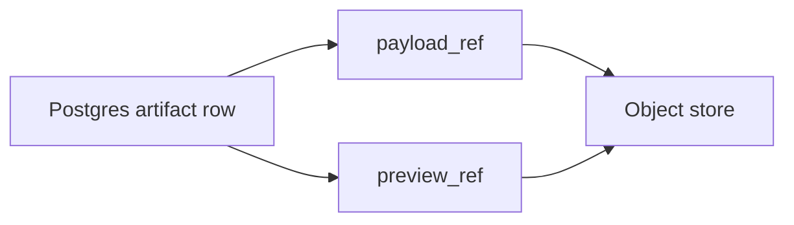

# Artifact Graph

The artifact graph is the source of truth for reproducibility, auditability, and comparison.

## Core Rule

Every meaningful input, intermediate result, and final output should be representable as an artifact.

Artifacts are not just files. An artifact is a typed evidence object with payload, metadata, lineage, and an inspectable contract.

## Artifact Fields

Recommended minimum fields:

```text
artifact_id
artifact_type
schema_version
workflow_run_id
producer_node_run_id
producer_operator_id
producer_operator_version
input_artifact_ids
content_hash
created_at
metadata
payload_ref
preview_ref
```

Optional but useful fields:

```text
sequence_id
sequence_index
source_artifact_id
parent_artifact_id
validation_status
quality_metrics
provider_metadata
```

## Artifact Types

Artifact types should be stable strings with schema versions. They describe payload contracts, not Python classes.

Initial type families:

```text
source.document
source.page_image
source.page_sequence
ocr.page_result
ocr.document_result
layout.page_blocks
vision.detections
vision.segmentation_mask
vision.embedding
text.markdown
text.normalized
prompt.template
model.input
model.response
model.invocation_trace
input.policy
context.bundle
context.trace
extraction.schema
extraction.record_result
extraction.document_result
evaluation.metrics
export.dataset
```

LLM-specific payloads can exist, but they should not define the core platform:

```text
llm.rendered_prompt
llm.response
llm.tool_call_trace
```

## Artifact Sequence

Sequential sources need an explicit sequence object:

```text
ArtifactSequence[T]
  sequence_id
  artifact_type
  ordered: true
  index_key: page_number
  item_refs: ArtifactRef[T][]
  metadata
```

This lets the system pass ordered page images, OCR results, layout results, or extraction results without losing index identity.

## Example: OCR Page Result

An OCR page result may contain:

```json
{
  "page_number": 12,
  "engine": "mistral-ocr",
  "text": "...",
  "blocks": [],
  "tokens": [],
  "confidence": 0.83,
  "image_artifact_id": "artifact_123",
  "runtime": {
    "duration_ms": 1842,
    "provider_request_id": "..."
  }
}
```

## Example: Detection Result

A layout or vision detection artifact may contain:

```json
{
  "image_artifact_id": "artifact_123",
  "model": "layout-detector-v1",
  "detections": [
    {
      "label": "table",
      "confidence": 0.91,
      "bbox": [100, 220, 340, 248]
    }
  ]
}
```

## Example: Structured Extraction Result

An extraction result should preserve field-level evidence where possible:

```json
{
  "records": [
    {
      "name": {
        "value": "Jan Kowalski",
        "evidence": [
          {
            "artifact_id": "artifact_ocr_page_12",
            "page_number": 12,
            "span": [345, 357],
            "bbox": [100, 220, 340, 248]
          }
        ],
        "confidence": 0.74
      }
    }
  ]
}
```

## Payload Storage

The database should store artifact metadata, lineage, refs, and status. Large payloads should live in object storage.



This keeps API queries cheap while preserving full payloads for inspection and export.

## Provenance

Each artifact should know:

- which node run produced it
- which operator spec and version produced it
- which input artifacts were used
- which workflow run owns it
- which content hash identifies the payload

This makes comparisons and reruns defensible.
