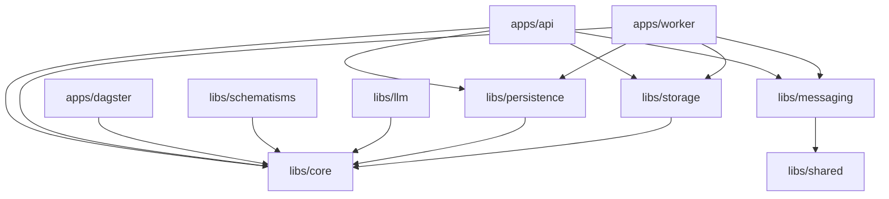
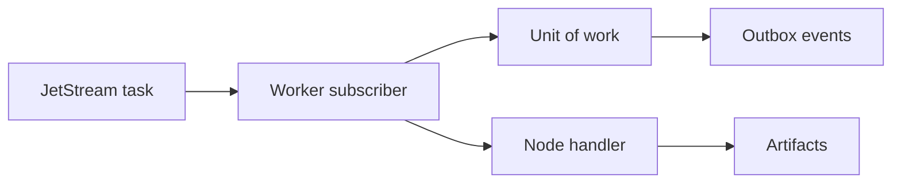

# Backend Architecture

The target backend is a modular monorepo with a generic platform core, concrete adapters, and product apps.

## Target Layout

```text
apps/
  api/
    src/notarius_api/
  worker/
    src/notarius_worker/
  dagster/
    src/notarius_dagster/
libs/
  core/
    src/notarius_core/
  storage/
    src/notarius_storage/
  persistence/
    src/notarius_persistence/
  messaging/
    src/notarius_messaging/
  shared/
    src/notarius_shared/
  llm/
    src/notarius_llm/
  schematisms/
    src/notarius_schematisms/
```

## Dependency Direction



`libs/core` owns domain models, ports, and pure application behavior. It must not import FastAPI, SQLAlchemy, NATS, Dagster, concrete LLM providers, or schematism-specific models.

## Core Library

`notarius_core` should own:

- artifact model
- workflow model
- node run model
- operator spec contracts
- execution mode enum
- compiler interfaces
- repository ports
- storage ports
- model invocation ports
- generic extraction and sequence-processing services

It should not own:

- HTTP routes
- SQLAlchemy mappings
- NATS subjects
- object-store SDKs
- provider-specific clients
- schematism-specific prompts or models

## API App

The FastAPI app should expose:

- health checks
- source upload
- workflow templates
- workflow definitions
- workflow versions
- workflow runs
- node runs
- artifacts
- artifact previews
- run events
- exports

The API should enqueue work through an outbox and messaging adapter rather than directly executing long jobs.

Current implementation:

- `GET /v1/workflow-templates` lists backend-owned workflow templates.
- `POST /v1/workflow-templates/{template_id}/materialize` expands a template
  into a persisted `WorkflowDefinition` and version `1` without launching a run.
  Experiment scripts use this when they need a reusable workflow version for a
  parameter grid.
- `POST /v1/workflow-templates/{template_id}/launch` expands a template into a
  persisted `WorkflowDefinition`, creates version `1`, launches a
  `WorkflowRun`, binds supplied artifact or artifact-sequence inputs, and
  writes queued lifecycle events plus executable root node-run messages through
  the outbox path.
- Implemented template ids:
  - `ocr-pages`
  - `contextual-extraction`
  - `ocr-compare-contextual-extraction`
- Python scripts now use template launch/materialization for OCR, OCR
  experiments, and contextual extraction instead of constructing the whole DAG
  client-side.
- `GET /v1/workflow-runs/{workflow_run_id}/events` returns a normalized
  run-scoped event timeline from existing outbox event rows, including
  workflow-run events, node-run events, artifact events, DLQ entries, and
  malformed retained outbox payloads that could not be normalized.
- `GET /v1/artifacts/{artifact_id}/inspect` returns artifact metadata with
  optional decoded JSON/text payload and optional lineage graph, giving
  script/notebook clients one structured inspection response instead of
  multiple raw calls.
- `scripts/platform/watch_workflow_run_events.py` reads or polls the same
  timeline for script users.
- `scripts/platform/manage_artifact.py` reads artifact metadata, structured
  artifact inspections, and artifact lineage graphs through the HTTP API.
- `scripts/platform/manage_outbox.py` lists outbox messages by status,
  summarizes DLQ groups, requeues terminal failed messages, and previews or
  executes terminal-message cleanup through the HTTP API. Cleanup can write a
  JSON archive of the matched messages before destructive deletion.
- `scripts/platform/manage_experiment.py` reads experiments and comparison
  tables, cancels experiments or individual variants, reruns one eligible
  variant, and reruns all failed variants through the HTTP API. Comparison
  tables can be printed as JSON or written as CSV for notebook/spreadsheet
  analysis. Experiment output bundles can be fetched with artifact-type,
  payload, text-payload, and trace filters. The same script can also aggregate
  the current workflow-run event timeline for every experiment variant.
- Template configs reject literal sensitive keys such as `api_key`, `token`,
  `password`, and `secret`; provider credentials should be referenced through
  `credential_ref` or environment-variable parameter names.
- Outbox operations are inspectable through:
  - `GET /v1/outbox-messages?status=pending|published|failed&subject_prefix=events.&limit=100&offset=0`
  - `GET /v1/outbox-messages/dlq-summary` grouped by consumer name, error
    code, and original subject
  - `GET /v1/outbox-messages/{outbox_message_id}`
  - `POST /v1/outbox-messages/{outbox_message_id}/requeue` for terminal
    failed messages
  - `POST /v1/outbox-messages/cleanup` to dry-run or delete old terminal
    `published` and `failed` messages by status, creation timestamp, subject
    prefix, and message type
- `scripts/platform/manage_outbox.py cleanup --older-than 2026-01-01T00:00:00+00:00`
  previews matching terminal messages by default. Add `--execute` to delete
  the matches. Add `--archive-path outbox-cleanup.json` with `--execute` to
  write a dry-run archive before deletion. `pending` messages are intentionally
  rejected by cleanup.

## Worker App

The worker should consume concrete node-run jobs:



The worker should:

- load `NodeRun`
- load input artifacts
- execute the registered handler
- persist output artifacts
- update node-run status
- write lifecycle and artifact events through outbox
- retry or dead-letter failures based on error type

Current implementation:

- Workflow launches write `events.workflow_run.queued`,
  `events.node_run.queued`, and `jobs.node_run.execute.requested` outbox
  messages in the same transaction as the run and root node runs.
- Worker execution writes `running`, `succeeded`, `failed_retryable`,
  `failed_permanent`, and `cancelled` lifecycle events as node and workflow
  state changes are persisted.
- Output artifact persistence writes `events.artifact.created` messages with
  artifact, workflow-run, and producer node-run identifiers.
- Node-run retry writes fresh queued lifecycle events and a new executable
  node-run request.
- The local node-run outbox drainer dead-letters invalid
  `NodeRunExecuteRequested` payloads to `dlq.node_run.execute` instead of
  retrying malformed commands indefinitely.
- Permanent node-run execution failures are also dead-lettered by the local
  drainer; retryable node-run failures keep the executable command pending so
  the same node run can retry until its attempt limit is exhausted.
- Worker startup ensures the `TASKS`, `EVENTS`, `LIVE_DELTAS`, and `DLQ`
  JetStream stream definitions exist before the outbox drain loop starts.
- The NATS outbox publisher sends known task, event, live-delta, and DLQ
  subjects with an explicit target stream so publishes use JetStream
  acknowledgement semantics instead of plain core NATS fire-and-forget.
- Generic outbox publish failures remain pending for transient retry, then move
  to terminal `failed` status after the configured publish-attempt cap. Node-run
  command failures still use `dlq.node_run.execute` when the worker can attach
  workflow/node context.

## NATS JetStream

JetStream should be the durable execution and event backbone. It should not be the artifact store or workflow definition store.

Recommended streams:

```text
TASKS
EVENTS
LIVE_DELTAS
DLQ
```

Recommended subjects:

```text
jobs.workflow.compile.requested
jobs.workflow.run.requested
jobs.node_run.execute.requested
events.workflow_run.*
events.node_run.*
events.artifact.*
dlq.>
```

Use core NATS or short-lived JetStream streams for live UI deltas. Use durable JetStream streams for tasks, audit events, and DLQ messages.

Current implementation:

- `jobs.node_run.execute.requested` is registered as a durable JetStream
  consumer on the `TASKS` stream with the `consumer-node-run-execute` durable
  name, five maximum deliveries, and long OCR/extraction-oriented backoff.
- Stream definitions are reconciled on worker startup.
- Outbox publishing maps `jobs.*` subjects to `TASKS`, `events.*` subjects to
  `EVENTS`, `live.*` subjects to `LIVE_DELTAS`, and `dlq.*` subjects to `DLQ`.

## Persistence

Postgres should store:

- workflow definitions
- workflow versions
- workflow runs
- node runs
- artifacts
- artifact sequences
- outbox messages
- processed message ids
- experiment definitions when introduced

Large payloads should live in object storage.

## Storage

Object storage should store:

- source PDFs
- page images
- OCR payloads
- raw provider responses
- rendered model requests
- parsed results
- previews
- exports

Storage adapters should support local development and S3/MinIO.

## Dagster

Dagster should become an adapter app, not the core execution model.

Recommended role:

- scheduled research pipelines
- administrative batch jobs
- legacy pipeline compatibility
- offline experiments

Dagster should depend on Notarius libraries. Notarius core should not depend on Dagster.

## Boundary Tests

Add architecture tests early.

Required checks:

```text
notarius_core must not import fastapi
notarius_core must not import sqlalchemy
notarius_core must not import nats or faststream
notarius_core must not import notarius_api
notarius_core must not import notarius_worker
notarius_core must not import notarius_dagster
notarius_core must not import notarius_schematisms
notarius_messaging.jetstream should stay message-contract agnostic where possible
```

These tests should be part of the first backend refactor PR.
