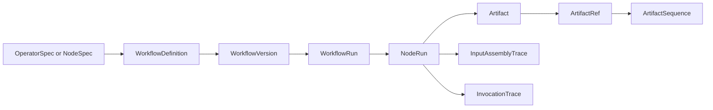

# Conceptual Model

This document defines the main platform objects. The model is intentionally generic so the platform can support OCR, layout detection, vision models, LLM extraction, classical ML, evaluation, and export.

## Object Relationship



## WorkflowDefinition

The editable workflow graph.

It contains nodes, edges, node configuration, UI layout, labels, declared inputs, and draft changes.

Justification: users need to save and edit workflows without mutating historical runs. A workflow definition is the mutable authoring object.

## WorkflowVersion

An immutable snapshot of a workflow definition.

Justification: scientific reproducibility depends on pinning exactly what was run. A workflow run should point to an immutable graph snapshot, not to a mutable definition that may change later.

## WorkflowRun

One execution of a workflow version against a set of input artifacts or a corpus.

It owns run status, timestamps, input refs, output refs, costs, failures, metrics, and summary metadata.

Justification: researchers compare runs. The platform needs to answer which workflow version ran against which inputs with which parameters and which outputs.

## OperatorSpec Or NodeSpec

The registered contract for a node type.

The UI can call it a node. The backend should treat it as an operator contract.

It should declare:

- id
- version
- input ports
- output ports
- config schema
- execution mode
- display metadata
- runtime handler binding

Justification: the compiler and UI both need to know what an operator accepts, what it produces, and how it executes before a workflow can be validated or run.

Implementation note: if the codebase already uses `NodeSpec`, keep the name if that reduces churn. Document its semantics as a generic operator spec, not an LLM-specific node.

## NodeRun

One concrete execution of one operator inside one workflow run.

It stores the concrete input artifact refs, output artifact refs, status, attempt count, logs, error details, runtime metadata, and trace refs.

Justification: workflow runs are too coarse for retries, partial failures, progress, and provenance. Node runs are the audit and retry unit.

## Artifact

A typed, versioned, evidence-bearing object.

Examples:

- source page image
- OCR page result
- layout blocks
- model detections
- rendered model input
- model response
- extraction result
- evaluation metrics
- export file

Justification: artifacts are the platform's core value. They make intermediate results inspectable, comparable, reproducible, and reusable.

## ArtifactSequence

An ordered collection of artifact refs.

Examples:

- page image sequence
- OCR page result sequence
- layout result sequence
- extraction page result sequence
- frame sequence

Justification: Notarius frequently works with ordered sources. Page order and index identity are meaningful and should not be represented as an arbitrary list.

## ArtifactRef

A lightweight pointer to an artifact.

It should include at least the artifact id, artifact type, schema version, and optional content hash.

Justification: graph edges, node inputs, trace payloads, and API responses should reference artifacts without embedding full payloads everywhere.

## InputAssemblyTrace

The record of how a node's concrete inputs were resolved before execution.

Examples:

- selected prior page artifacts
- selected OCR stream
- selected context bundle
- pruned images
- sliding window state
- retrieved examples
- normalized input payload

Justification: many AI/ML operators are sensitive to input assembly. The platform must make input selection auditable without assuming the input is an LLM prompt.

## InvocationTrace

The record of a local or remote model/tool invocation.

Examples:

- OCR provider request and response metadata
- local model version and runtime settings
- LLM request, prompt, attached images, and token usage
- layout detector thresholds
- classifier probabilities
- retry attempts

Justification: model behavior cannot be reproduced or audited from output artifacts alone. Invocation traces preserve the execution details that produced the output.

## ExecutionMode

A finite enum that describes scheduler semantics.

Initial modes:

```text
single
map
reduce
stateful_sequence
```

Justification: the compiler needs to know whether to run once, fan out over a sequence, collect many inputs, or preserve ordered state. This belongs in the operator contract, not hidden in arbitrary handler code.

## Experiment

An experiment is not required for the first backend slice, but it should be planned as a first-class product object.

An experiment combines:

- workflow version or template
- input corpus
- parameter grid
- evaluation criteria
- resulting workflow runs

Justification: researchers usually compare variants, not single runs. OCR provider, prompt, model, schema, history policy, and preprocessing settings are all natural experiment dimensions.

