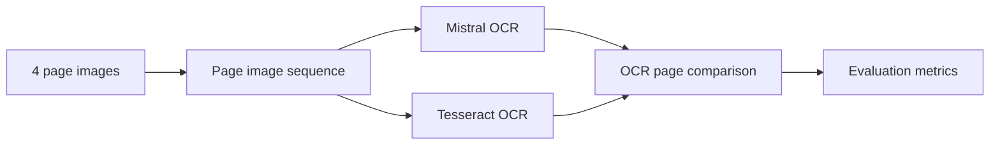
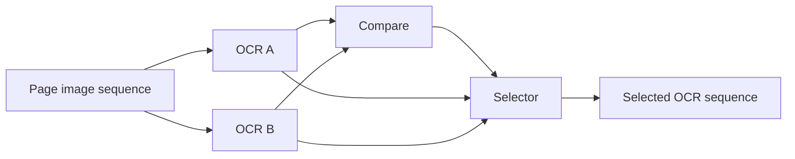
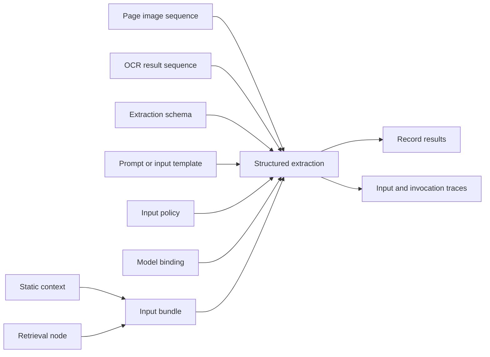
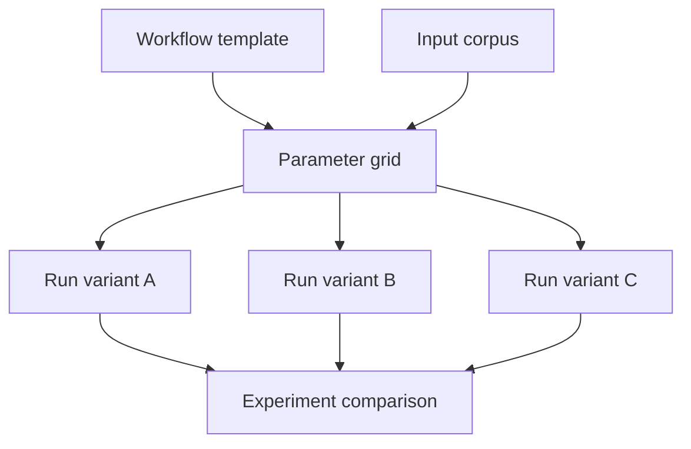
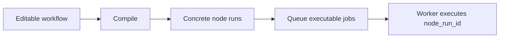
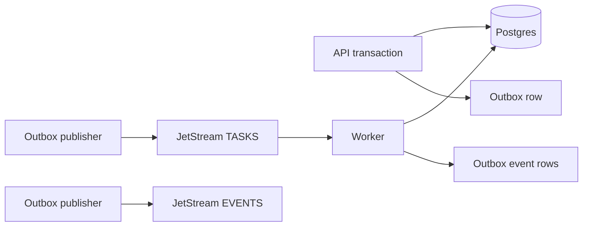

# Example Workflows

This document describes canonical workflows the platform should support. These examples are implementation anchors for API, worker, and UI development.

## Four-Page OCR Comparison

Goal: run multiple OCR methods over four page images and compare their outputs.



Expected artifacts:

```text
source.page_image x 4
source.page_sequence x 1
ocr.page_result x 8
ocr.document_result x 2
evaluation.metrics x 1
```

The page sequence preserves order:

```text
page 1 -> page 2 -> page 3 -> page 4
```

The OCR operators run in `map` mode over the sequence. The comparison operator runs in `reduce` mode over both OCR result sequences and emits page-level and aggregate metrics.

The user should be able to inspect, for each page:

- source image
- Mistral OCR text and metadata
- Tesseract OCR text and metadata
- similarity score
- confidence and runtime hints where available

## OCR Selection Before Extraction

Goal: compare OCR streams, select one, and pass the selected text into a downstream model.



Selection can be manual or policy-driven:

- always choose provider A
- choose highest confidence
- choose highest similarity to reference
- choose per-page manual override
- keep multiple streams for later comparison

The selector should emit a new artifact sequence rather than mutating the original OCR outputs.

## Contextual Structured Extraction

Goal: extract records from ordered pages while carrying controlled state across the sequence.



The important design point is that context providers, prompt/input templates, schemas, model bindings, and policies should be graph-visible inputs. Some are material artifacts. Some may later be compiler-resolved spec nodes.

The extraction operator runs in `stateful_sequence` mode. It consumes an ordered sequence and emits page-level records, a document-level result, input assembly traces, and invocation traces.

This workflow should preserve:

- rendered model input
- attached artifacts
- previous state used for each page
- pruned images or text
- raw model/tool response
- parsed output
- validation result
- retry attempts

## Experiment Matrix

Goal: compare several workflow variants over the same source corpus.



Example dimensions:

```text
ocr.provider:
  - tesseract
  - mistral

layout.model:
  - layoutlmv3
  - provider-layout-api

model.binding:
  - local-model
  - remote-provider

input.policy:
  - previous-page-only
  - sliding-window-3
  - summary-memory

schema:
  - strict
  - relaxed
```

The comparison view should derive:

- run status
- node-run status counts
- artifact counts
- validation errors
- evaluation metrics
- duration
- cost
- selected output artifacts

## DAG Resolution

The API should accept workflow definitions, but the compiler should resolve the DAG before work is queued.



The worker should execute persisted `node_run_id` jobs. It should not re-derive the graph from scratch.

The compiler should reject:

- cycles
- missing required inputs
- incompatible artifact types
- unresolved configuration nodes
- unsupported execution modes
- missing runtime handlers

## JetStream Execution Flow

Goal: use NATS JetStream for durable work and event delivery without making it the source of truth.



Postgres stores workflow, run, node-run, artifact, and outbox state. Object storage stores large payloads. JetStream carries tasks and events.

Recommended task subjects:

```text
jobs.workflow.compile.requested
jobs.workflow.run.requested
jobs.node_run.execute.requested
```

Recommended event subjects:

```text
events.workflow_run.*
events.node_run.*
events.artifact.*
```

Implemented lifecycle subjects use the concrete suffixes:

```text
queued
running
succeeded
failed_retryable
failed_permanent
cancelled
created
```

Use dead-letter subjects for permanent failures and retry exhaustion.
