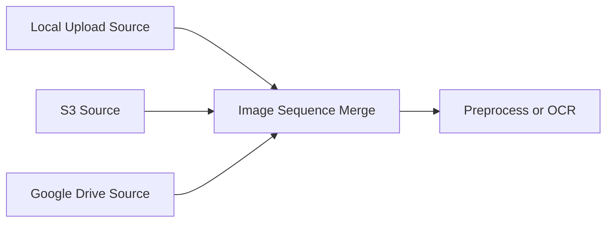

# MVP Source Ingestion Slice

This slice defines the first practical source-to-OCR workflow shape. It keeps
connector-specific behavior at source nodes and gives downstream operators a
single ordered artifact sequence to consume.

## Canonical Graph

The MVP graph has separate source nodes for each connector and one merge node
that creates the ordered image collection.



Example user intent:

```text
5 local PNG files
5 S3 PNG files
5 Google Drive PNG files
-> one ArtifactSequence[source.page_image@1]
-> preprocessing, OCR, or another image-consuming operator
```

The canvas may group these sources visually later, but the canonical runtime
model is separate source operators feeding one merge operator.

## Design-Time And Runtime Split

Connector browsing is a design-time activity. It supports workflow
configuration and previews, but it does not create the run's source-of-truth
artifacts by itself.

Design time:

- browse local staged uploads, S3 objects, or Google Drive files
- fetch names, sizes, content types, modified timestamps, thumbnails, and
  connector version tokens when available
- persist a source node selection in the workflow definition or workflow
  version

Runtime:

- fetch the selected objects
- hash the bytes
- copy or import them into Notarius artifact storage
- create `source.page_image@1` artifacts
- emit `ArtifactSequence[source.page_image@1]`

The default policy for external connectors is snapshot-on-run. S3 and Google
Drive bytes are copied into Notarius storage during execution so later runs can
be audited without relying on mutable external files or live credentials. Local
drag-and-drop files are staged before execution, then imported by the local
source node through the same artifact path.

## Source Node Contract

A source node has no artifact inputs. Its inputs are connector configuration and
a pinned source selection.

```text
LocalUploadImageSource
  config:
    connector_id: local_upload
    selection: SourceSelectionItem[]
  output:
    pages: ArtifactSequence[source.page_image@1]

S3ImageSource
  config:
    connector_id: s3:<account-or-project-binding>
    selection: SourceSelectionItem[]
  output:
    pages: ArtifactSequence[source.page_image@1]

GoogleDriveImageSource
  config:
    connector_id: google_drive:<account-or-project-binding>
    selection: SourceSelectionItem[]
  output:
    pages: ArtifactSequence[source.page_image@1]
```

Source selection metadata should be serializable and connector-neutral enough
for the graph and run records:

```text
SourceSelectionItem
  connector_id
  external_uri
  display_name
  size_bytes
  content_type
  version_token
  order_index
```

`version_token` is connector-specific. For S3 it can be an object version id or
ETag. For Google Drive it can be a file revision or equivalent version marker.
If the connector cannot provide a stable version token, the runtime import still
records fetched time and content hash on the produced artifact.

Each produced source artifact should preserve source provenance in metadata:

```text
source_connector
source_uri
source_version_token
original_filename
fetched_at
content_hash
```

## Merge Node Contract

The merge node concatenates image artifact sequences. It does not copy image
bytes or re-materialize images.

```text
ImageSequenceMerge
  inputs:
    sequences: ArtifactSequence[source.page_image@1][]
  config:
    ordering: preserve_input_order
  output:
    pages: ArtifactSequence[source.page_image@1]
```

The output sequence keeps the merged item refs in order. Its metadata should
record the segment boundaries so the UI can explain where each image came from:

```text
segments:
  - source_node_id: local_upload_1
    start_index: 0
    count: 5
  - source_node_id: s3_1
    start_index: 5
    count: 5
  - source_node_id: google_drive_1
    start_index: 10
    count: 5
```

## Downstream Consumption

Preprocessors, OCR operators, and other image consumers should only depend on
the artifact contract:

```text
ArtifactTypeKey("source.page_image", 1)
```

If an operator needs an in-memory image, its input port should request a runtime
representation:

```text
RepresentationKey("pil.image")
```

The executor validates the artifact ref against the input port, then asks the
resolver registry for the conversion:

```text
(ArtifactTypeKey("source.page_image", 1), RepresentationKey("pil.image"))
  -> PilImageResolver
```

This keeps connector concerns out of preprocessing and OCR. Downstream nodes do
not know whether an image came from local upload, S3, Google Drive, a future
IIIF connector, or another source operator. They only consume typed artifact
refs and materialized runtime values selected by the resolver registry.
