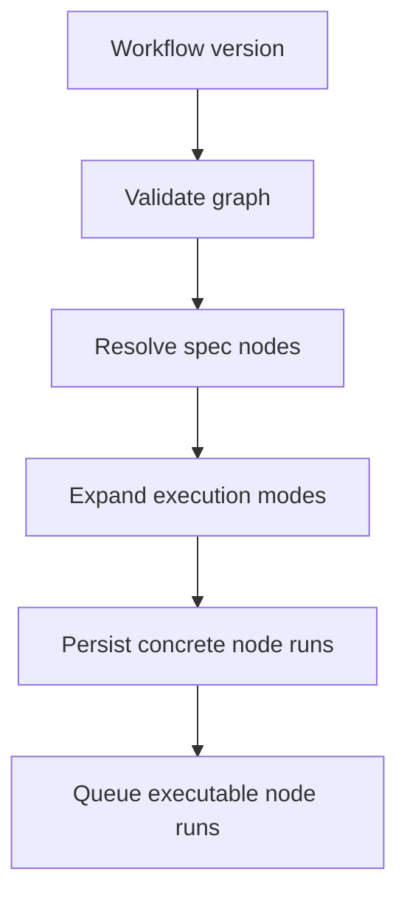
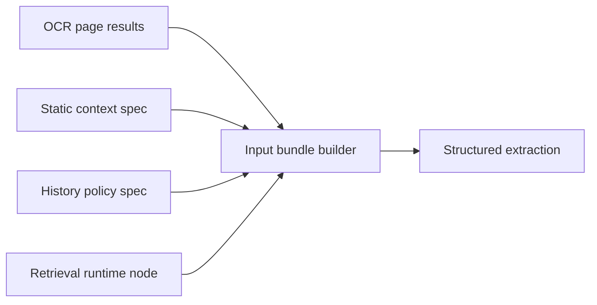

# Node And Execution Model

The UI may call graph blocks "nodes." The backend should treat each executable block as an operator with declared artifact contracts.

## Operator Spec

An operator spec describes a node type before it runs:

```python
class OperatorSpec:
    id: str
    version: str
    inputs: list[PortSpec]
    outputs: list[PortSpec]
    config_schema: dict
    execution_mode: ExecutionMode
```

Example OCR operator:

```text
MistralOCR
  input:
    pages: ArtifactSequence[source.page_image]
  output:
    ocr_pages: ArtifactSequence[ocr.page_result]
    ocr_document: ocr.document_result
  mode:
    map
```

Example structured extraction operator:

```text
ContextualStructuredExtractor
  input:
    pages: ArtifactSequence[source.page_image]
    text: ArtifactSequence[ocr.page_result] | ArtifactSequence[text.markdown]
    schema: extraction.schema
    input_policy: input.policy
    model_binding: model.binding
  output:
    page_results: ArtifactSequence[extraction.record_result]
    document_result: extraction.document_result
    traces: ArtifactSequence[model.invocation_trace]
  mode:
    stateful_sequence
```

## Spec Nodes And Runtime Nodes

Not every graph node should become a queued job.

Spec/config nodes contribute configuration:

```text
Prompt Template
Schema
Model Binding
History Policy
Input Policy
Evaluation Criteria
Static Context Provider
```

In the first implementation pass, these are executable `*.define` operators
that materialize typed artifacts. This fits the current compiler, which creates
node runs for every graph node. Later compiler-resolved spec nodes can preserve
the same artifact contracts.

Runtime nodes produce material artifacts:

```text
OCR
Layout Detection
Embedding
Classification
Markdown Conversion
Context Retrieval
Structured Extraction
Evaluation
Export
```

The compiler should resolve spec nodes into runtime node configurations before queueing work.

## Execution Modes

Initial modes:

```text
single
map
reduce
stateful_sequence
```

### single

Run once against its resolved inputs.

Examples:

- export dataset
- create one summary artifact
- validate one schema artifact

### map

Run independently over each item in an artifact sequence.

Examples:

- OCR each page image
- classify each page
- detect layout blocks per page

Backend status:

- The default compatibility path still creates one node run per workflow node,
  which preserves existing OCR and contextual extraction templates whose
  handlers process ordered sequences internally.
- Workflows can opt into first-stage concrete map planning by setting
  `WorkflowDefinition.metadata.execution_planning` to `concrete_map`.
- In that mode, a root `map` node with one bound sequence input expands into
  one concrete node run per sequence item. Each concrete node run records
  `concrete_execution_kind=map_item`, `map_item_index`, `map_item_count`,
  `map_source_port`, and, when applicable, `map_source_sequence_id`.
- A downstream blocked node that depends on all concrete map items receives a
  collected `ArtifactSequence` assembled in `map_item_index` order.
- This is an enabling backend slice. Built-in OCR still needs a follow-up split
  into per-page OCR execution plus document/sequence aggregation before the
  templates should enable concrete map planning by default.

### reduce

Collect many artifacts into one artifact.

Examples:

- merge page-level records into a document result
- compute aggregate evaluation metrics
- build an export dataset

### stateful_sequence

Run over an ordered artifact sequence while carrying state between items.

Examples:

- contextual extraction across book pages
- sliding-window correction
- entity continuation across pages

This mode is essential for sequential historical sources.

## Workflow Compilation

The workflow compiler turns an editable workflow version into concrete node runs.



The worker should execute concrete `node_run_id` jobs. It should not reason from scratch about abstract graph definitions.

## DAG Resolution

The compiler should reject:

- missing inputs
- incompatible artifact types
- cycles
- unresolved spec nodes
- unsupported execution modes
- runtime nodes with no registered handler

The compiler should persist:

- logical graph snapshot
- concrete execution plan
- node run dependencies
- expected output artifact contracts

## Input Assembly Trace

Input assembly should be explicit and inspectable.

Examples:

- selected OCR stream
- selected previous page outputs
- selected image refs
- retrieval results
- history window
- pruned inputs
- normalization steps

This replaces LLM-specific "context trace" as the generic core concept.

## Invocation Trace

Every model or provider call should be traceable.

For OCR:

```text
provider
model
input image refs
request metadata
raw response ref
confidence summary
runtime metadata
```

For LLMs:

```text
provider
model
rendered request
attached artifact refs
raw response ref
parsed response ref
token usage
retry attempts
validation result
```

For local ML:

```text
model name
model version
weights hash
runtime config
device
input artifact refs
output artifact refs
metrics
```

## Context Providers As Nodes

Context providers should be graph-visible, but not all should be queued runtime jobs.

Use this split:

- Cheap/static providers produce specs resolved by the compiler.
- Expensive providers produce material artifacts and run as runtime nodes.

Example:



This keeps the graph composable without forcing every configuration object into the job queue.
