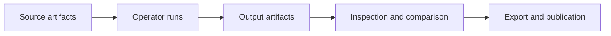

# Product Direction

## Positioning

Notarius Studio is a reproducible artifact-graph workbench for assembling, running, comparing, and auditing AI/ML pipelines over sequential research sources.

It is intended for researchers who need to experiment with different extraction methods, compare model behavior, inspect intermediate evidence, and preserve enough provenance to make results defensible.

## Primary Users

The first target users are researchers and research engineers working with historical or archival material:

- scanned books
- schematisms
- directories
- parish records
- registers
- long tables
- OCR-heavy image collections
- sequential corpora where page order matters

The system should also support more general AI/ML experimentation over ordered source material.

## Core Product Claim

Notarius Studio is not a chatbot, not only an OCR runner, and not only an LLM extraction tool.

The defensible product primitive is the artifact graph:

Each output should be inspectable as an artifact with type, schema version, lineage, payload, metadata, preview, and run context.

## What Makes It Different

Generic visual workflow tools usually focus on connecting blocks. Notarius Studio should focus on evidence-bearing artifacts and reproducible experiments.

OCR tools usually produce text. Notarius Studio should preserve the source image, OCR result, bounding boxes, confidence, provider response, downstream transformations, and comparison results.

LLM extraction tools usually hide prompt and context details. Notarius Studio should preserve the rendered request, selected context, attached artifacts, raw response, parsed result, validation state, and retry history.

Annotation platforms usually focus on human labels. Notarius Studio should support model pipelines, experiment matrices, and artifact provenance first.

## First Vertical Slice

The first product slice should avoid a blank generic graph editor. Start with a guided workflow template and expose the graph underneath.

Initial slice:

1. Upload a scanned PDF or four page images.
2. Split or register page images as ordered source artifacts.
3. Run two OCR operators, such as Tesseract and Mistral OCR.
4. Compare OCR outputs page by page.
5. Select one OCR stream or keep both as competing inputs.
6. Attach an extraction schema, prompt, model binding, and context/history policy.
7. Run contextual structured extraction over the ordered pages.
8. Inspect each page: source image, OCR, assembled input, model invocation, raw output, parsed result, validation errors, and evidence.
9. Export JSON or CSV.

This validates the core thesis without requiring a fully generic node marketplace.

## Long-Term Product Shape

The platform should support:

- guided workflow templates
- editable artifact graphs
- model and provider comparison
- experiment matrices
- artifact inspection
- page timelines
- invocation traces
- provenance graphs
- evaluation dashboards
- export datasets
- optional human correction loops

The visual node interface is one interface over the artifact graph. It should not become the architecture.

