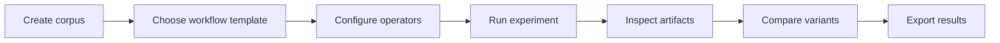
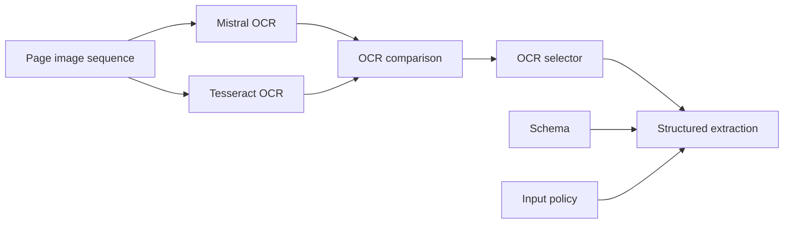

# User Experience

Notarius Studio should feel like a scientific workbench, not a chatbot and not a blank automation canvas.

The user should be able to start from a concrete research task, inspect every intermediate artifact, compare alternatives, and only then drop into the graph when they need more control.

## Primary User Journey



The first screen should help a researcher do real work immediately:

- create or open a project
- upload or select a source corpus
- choose a workflow template
- configure model/provider choices
- launch a run or experiment
- inspect artifacts and evidence

The graph editor is important, but it should be entered from a useful workflow, not from an empty page.

## Main Views

### Project And Corpus View

The project view shows source material and past work:

- uploaded PDFs and image sets
- derived page image sequences
- workflow definitions
- workflow runs
- experiments
- exports

For sequential sources, the corpus view should make order visible. Page number, sequence index, source filename, and processing state should be easy to scan.

### Guided Workflow Templates

Templates should provide starting points for common research tasks:

- compare OCR engines
- run OCR plus structured extraction
- test prompt or schema variants
- test input/history policies
- run layout detection and compare outputs
- evaluate extraction against a gold dataset

Each template should open as an editable graph after creation.

### Workflow Canvas

The canvas should show typed artifact flow:



Node labels should communicate operator behavior and artifact contracts. The canvas should make incompatible connections impossible or visibly invalid.

### Run View

The run view is the operational center for one workflow run:

- workflow version
- input artifacts
- node-run status
- queued/running/succeeded/failed counts
- emitted artifacts
- logs and errors
- cost and latency hints where available

The run view should not require the user to understand the whole graph before finding the failing node or inspecting a result.

### Artifact Inspector

Every artifact should be inspectable.

The inspector should show:

- artifact type and schema version
- payload preview
- metadata
- producer node run
- input artifacts
- content hash
- sequence membership
- validation state
- related traces

Artifacts are the user's evidence objects. They should be first-class clickable entities throughout the UI.

### Page Timeline

For sources such as books, schematisms, and registers, page order is part of the data.

The page timeline should let the user inspect a single page across pipeline stages:

```text
source image
OCR result A
OCR result B
OCR comparison
selected text
input assembly
model invocation
parsed output
validation state
field evidence
```

This view is often more useful than the graph because it answers what happened to this page.

### Comparison View

The comparison view should support scientific experimentation:

- compare OCR providers
- compare model bindings
- compare prompts
- compare schemas
- compare preprocessing settings
- compare input/history policies

The comparison table should show:

- variant parameters
- run status
- validation failures
- evaluation metrics
- latency
- cost
- artifact counts
- manual correction status when introduced

### Trace Inspectors

Input assembly and model invocation should be inspectable without assuming the operator is an LLM.

Input assembly examples:

- selected page artifacts
- selected OCR stream
- retrieval results
- prior state
- image pruning
- normalization steps

Invocation examples:

- OCR provider request metadata
- local model version and weights hash
- layout detector thresholds
- classifier probabilities
- LLM rendered request and token usage

## UX Principles

Use templates before blank graphs.

Make artifact inspection as important as node editing.

Treat graph edges as typed artifact contracts, not arbitrary wires.

Make page-level inspection excellent before building broad workflow marketplace features.

Show provenance close to the output. A result without evidence is not a scientific artifact.

Keep LLM-specific concepts inside LLM operator views. The surrounding workbench should use generic terms: model input, invocation trace, output artifact, input assembly, evidence, validation, and metrics.
