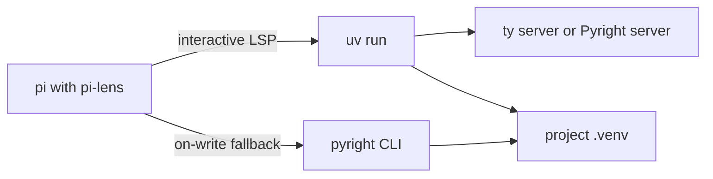

# Configure pi-lens with uv, ty, and Pyright

Checked: 2026-08-27

## Recommendation

GrafY now uses Pyright 1.1.411 from the uv development group. [`pyproject.toml`](../../pyproject.toml) stores the strict settings under `[tool.pyright]`. [`.pi-lens/lsp.json`](../../.pi-lens/lsp.json) launches `uv run --all-extras pyright-langserver --stdio` and disables the two built-in Python servers.

To use ty instead, add ty to the uv development group and register `uv run ty server` as a custom pi-lens server. pi-lens checks for every `pyright-langserver` candidate, then every `basedpyright-langserver` candidate, before it checks for ty. pi-lens documents that order in the [4.1.2 Python server source](https://github.com/apmantza/pi-lens/blob/v4.1.2/clients/lsp/server.ts#L1935-L2032).

Local checks on 2026-08-27 found this effective state:

| Component | Observed version or command |
| --- | --- |
| pi-lens | 4.1.2 |
| Pyright | `.venv/bin/pyright-langserver`, version 1.1.411 |
| BasedPyright | Not installed in `.venv` |
| ty | Not installed in `.venv` |

The applied custom server always invokes the uv-managed Pyright command. These are workspace observations, not guarantees made by pi-lens or uv.

The BasedPyright and ty examples below are alternatives. Use only one custom primary Python server.



The last path matters. Selecting ty changes the interactive language server, but it does not replace pi-lens's standalone Pyright runner.

## What the released code supports

pi-lens 4.1.2 uses this Python LSP order:

1. A `pyright-langserver` command found through the project or `PATH`.
2. A `basedpyright-langserver` command found through the project or `PATH`.
3. A bare `ty server` command found on `PATH`.
4. A pi-lens-managed Pyright installation.
5. Jedi as the alternate Python server if the primary server cannot start.

The first four steps are visible in [`PythonServer.spawn`](https://github.com/apmantza/pi-lens/blob/v4.1.2/clients/lsp/server.ts#L1935-L2032). ty is opt-in and PATH-only. pi-lens does not install it. Pyright remains an auto-installed, flow-gated dependency according to the [pi-lens dependency table](https://github.com/apmantza/pi-lens/blob/v4.1.2/docs/dependencies.md#L1-L25).

Separately, the enabled-by-default [`pyright` dispatch runner](https://github.com/apmantza/pi-lens/blob/v4.1.2/clients/dispatch/runners/pyright.ts#L26-L83) runs `pyright --outputjson <file>` even when an LSP is active. Its command resolver checks `.venv/bin/pyright` or `.venv/Scripts/pyright.exe` before managed and global commands. See the [venv-aware resolver](https://github.com/apmantza/pi-lens/blob/v4.1.2/clients/dispatch/runners/utils/runner-helpers.ts#L333-L375).

uv keeps the project environment in `.venv` and isolates it from the shell. `uv run` makes commands from that environment available and updates the environment before the command starts. The command may also be an executable outside the environment, which is why `uv run pi` works when pi itself came from Homebrew or npm. See uv's [running commands guide](https://docs.astral.sh/uv/concepts/projects/run/).

## Switch back to BasedPyright through uv

Add BasedPyright to the development group and restore `[tool.basedpyright]` before using this configuration:

```console
uv add --dev basedpyright
```

```json
{
	"servers": {
		"basedpyright-uv": {
			"name": "BasedPyright via uv",
			"extensions": [".py", ".pyi"],
			"command": "uv",
			"args": ["run", "--all-extras", "basedpyright-langserver", "--stdio"],
			"rootMarkers": [".git"]
		}
	},
	"disabledServers": ["python", "python-jedi"]
}
```

This configuration forces the project-local BasedPyright server. Disabling only `python` is insufficient because `python-jedi` is also registered before custom servers. The built-in order is visible in the [server registry](https://github.com/apmantza/pi-lens/blob/v4.1.2/clients/lsp/server.ts#L3662-L3670). The [custom-server registry](https://github.com/apmantza/pi-lens/blob/v4.1.2/clients/lsp/config.ts#L269-L352) appends custom servers after the built-ins.

## Applied Pyright configuration

The repository uses this dependency and server command:

```console
uv add --dev pyright
uv run --all-extras pyright-langserver --stdio
```

uv installs the `dev` dependency group by default during `uv run` and `uv sync`. See [uv development dependencies](https://docs.astral.sh/uv/concepts/projects/dependencies/#development-dependencies). The custom server invokes the environment's `pyright-langserver`. The standalone runner finds `.venv/bin/pyright`.

Microsoft's Pyright documentation calls the PyPI `pyright` package community-maintained; Microsoft's first-party distribution is the npm package. The command above therefore uses a uv-managed community wrapper, not a Microsoft-published Python package. pi-lens lists `pip install pyright` as a supported way to provide its standalone runner and separately searches for `pyright-langserver`. Verify both commands after syncing. See the official [Pyright installation guide](https://github.com/microsoft/pyright/blob/main/docs/installation.md#python-package), the [pi-lens runner source](https://github.com/apmantza/pi-lens/blob/v4.1.2/clients/dispatch/runners/pyright.ts#L1-L28), and the [pi-lens LSP source](https://github.com/apmantza/pi-lens/blob/v4.1.2/clients/lsp/server.ts#L1935-L2032).

Pyright reads `[tool.pyright]` from `pyproject.toml`:

```toml
[tool.pyright]
pythonVersion = "3.14"
typeCheckingMode = "strict"

# The repository keeps its include, exclude, and executionEnvironments values here.
```

Pyright officially supports `[tool.pyright]`, and `pyrightconfig.json` takes precedence if both exist. See the [Pyright configuration reference](https://github.com/microsoft/pyright/blob/main/docs/configuration.md#pyright-configuration).

Do not add an absolute interpreter path to the shared file. `uv run` sets `VIRTUAL_ENV` for the custom language server. Pyright also reads `venvPath = "."` and `venv = ".venv"` from the repository configuration. See the [Pyright import-resolution guide](https://github.com/microsoft/pyright/blob/main/docs/import-resolution.md#configuring-your-python-environment).

## Use ty from the uv environment

Add ty to the development group, then replace `.pi-lens/lsp.json` with this content:

```console
uv add --dev ty
```

```json
{
	"servers": {
		"ty-uv": {
			"name": "ty via uv",
			"extensions": [".py", ".pyi"],
			"command": "uv",
			"args": ["run", "--all-extras", "ty", "server"],
			"rootMarkers": [".git"]
		}
	},
	"disabledServers": ["python", "python-jedi"]
}
```

Using `.git` as the root marker is specific to this repository. Several excluded plugin projects have their own `pyproject.toml` and `uv.lock`. A `pyproject.toml` marker would start separate servers from those directories, where `ty` is not declared. The `.git` marker keeps one server at the GrafY workspace root. `--all-extras` installs the optional plugin dependencies that the root configuration can inspect.

pi-lens supports custom `command`, `args`, `extensions`, and `rootMarkers` fields in [`.pi-lens/lsp.json`](https://github.com/apmantza/pi-lens/blob/v4.1.2/clients/lsp/config.ts#L1-L108). It starts the command with the detected root as its working directory. `disabledServers` removes the built-in server IDs before matching a file. See the [custom-server factory and registry](https://github.com/apmantza/pi-lens/blob/v4.1.2/clients/lsp/config.ts#L204-L228) and [server filtering](https://github.com/apmantza/pi-lens/blob/v4.1.2/clients/lsp/config.ts#L269-L352).

ty's official LSP command is `ty server`. Astral recommends adding ty to the project and invoking it with `uv run`. ty then uses `VIRTUAL_ENV` or a project-root `.venv` to find installed packages. See the [ty installation guide](https://docs.astral.sh/ty/installation/), [editor integration](https://docs.astral.sh/ty/editors/#other-editors), and [`environment.python` reference](https://docs.astral.sh/ty/reference/configuration/#python).

ty does not read `[tool.basedpyright]`. Add ty's own first-party roots so imports across this repository's source-layout packages resolve consistently:

```toml
[tool.ty.environment]
root = [
	".",
	"libs/core/src",
	"libs/persistence/src",
	"libs/storage/src",
	"plugins/arithmetic/src",
	"plugins/image/src",
	"plugins/prompt/src",
	"plugins/schema/src",
	"plugins/text/src",
	"plugins/sequence/src",
	"plugins/table/src",
	"plugins/llm/src",
	"plugins/ocr/src",
	"plugins/gis/src",
	"plugins/sql/src",
	"apps/api/src",
]

[tool.ty.src]
include = ["libs", "plugins", "apps/api", "tests"]
exclude = ["apps/web", ".grafy-artifacts", ".playwright-cli"]
```

Do not set `tool.ty.environment.python` for the normal `.venv` layout. ty states that `uv run` sets `VIRTUAL_ENV`, and ty also checks for `.venv` at the project root. The `root`, `include`, and `exclude` fields are documented in the [ty configuration reference](https://docs.astral.sh/ty/reference/configuration/#root) and [source selection reference](https://docs.astral.sh/ty/reference/configuration/#src).

## Use pi-lens's native ty fallback

For a project without Pyright or BasedPyright on `PATH`, the native shortcut is:

```console
uv tool install ty@latest
uv tool update-shell
pi
```

`uv tool install` exposes the tool in uv's executable directory, and `uv tool update-shell` adds that directory to `PATH`. See [uv's tools guide](https://docs.astral.sh/uv/guides/tools/#installing-tools). This shortcut is not deterministic when any `pyright-langserver` or `basedpyright-langserver` command is also visible because both take precedence over ty.

Do not use `uvx ty` for this integration. `uvx` creates an environment isolated from the project. uv recommends `uv run` when a tool must use the project environment. See [uv's distinction between `uvx` and `uv run`](https://docs.astral.sh/uv/guides/tools/#running-tools).

## Unsupported combinations and limits

- pi-lens 4.1.2 has no `python.typeChecker = "ty"` selector. Native ty selection depends on command discovery and precedence.
- `serverOverrides.python.initializationOptions` can change initialization options, but it cannot change the built-in server command.
- `disabledServers` disables LSP servers only. It does not disable the standalone Pyright dispatch runner.
- There is no released pi-lens setting that replaces the standalone `pyright --outputjson` runner with `ty check`.
- The `uv` custom-server snippets are a composition of documented pi-lens custom-server behavior and documented `uv run` behavior. Neither project publishes this exact integration recipe.

## Verify the result

Run the selected checker directly first:

```console
uv run --all-extras ty check
# or
uv run --all-extras pyright
```

Then start pi and request `lsp_diagnostics` for a Python file. If the server is unavailable or times out, run `/lens-health`. pi-lens documents both surfaces in its [agent guide](https://github.com/apmantza/pi-lens/blob/v4.1.2/docs/agent-guide.md#agent-facing-tools-and-commands).

## Primary sources

- [pi-lens 4.1.2 Python LSP selection](https://github.com/apmantza/pi-lens/blob/v4.1.2/clients/lsp/server.ts#L1935-L2032)
- [pi-lens 4.1.2 standalone Pyright runner](https://github.com/apmantza/pi-lens/blob/v4.1.2/clients/dispatch/runners/pyright.ts#L26-L83)
- [pi-lens 4.1.2 custom LSP configuration](https://github.com/apmantza/pi-lens/blob/v4.1.2/clients/lsp/config.ts#L1-L108)
- [uv project command environments](https://docs.astral.sh/uv/concepts/projects/run/)
- [uv development dependencies](https://docs.astral.sh/uv/concepts/projects/dependencies/#development-dependencies)
- [ty installation](https://docs.astral.sh/ty/installation/)
- [ty editor integration](https://docs.astral.sh/ty/editors/)
- [ty configuration reference](https://docs.astral.sh/ty/reference/configuration/)
- [Pyright configuration](https://github.com/microsoft/pyright/blob/main/docs/configuration.md)
- [Pyright import resolution](https://github.com/microsoft/pyright/blob/main/docs/import-resolution.md)
