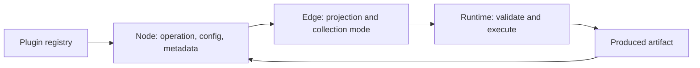

# Workbench interaction plan

## Purpose

This document records the interaction and runtime decisions for the first usable
Notarius workbench. It is an implementation plan for contributors, not a list of
possible features. A task belongs in the committed slice only when its acceptance
criteria appear below.

The visual thesis is a restrained graph canvas where **nodes own operations** and
**edges own transport semantics**. Configuration and produced artifacts stay on
the node. Projection, collection mapping, and removal stay on the edge. Run
controls act on either the complete canvas or the user's current selection.

## Status

- **Done** — implemented and retained.
- **In progress** — part of the current implementation slice.
- **Deferred** — deliberately excluded until the current contract is proven.

## Confirmed model

An artifact type and schema version are the nominal compatibility boundary. A
Python class is the runtime representation of that contract, not an alternative
graph-level compatibility system. A declared field projection lets an edge take
a nested value from a compound artifact without introducing a boilerplate
adapter node.

Collection behavior follows the same ownership rule. An operator declares the
value shape it handles for one call. An incoming edge decides whether to pass a
collection directly or invoke the target once for each item. The runtime may use
an internal invocation model, but invocation is not user-owned node state.

## Retained foundation

These capabilities already work and must remain intact during the interaction
rewrite:

| Capability | Status | Why it stays |
| --- | --- | --- |
| Node configuration generated from backend JSON Schema | Done | A plugin can add configuration without adding a hand-written web form. |
| Configuration rendered directly on each node | Done | The canvas remains the place where a workflow is understood and edited; no configuration sidebar is needed. |
| Produced-artifact appendix after execution | Done | Results remain associated with the operation that produced them and can expose their content links. |
| Nominal artifact types, schema versions, and declared projections | Done | Compatibility is deterministic and can be validated before execution. |
| Plugin discovery through `notarius.plugins` entry points | Done | External plugins can depend on their own optional packages without adding those dependencies to the Notarius host. |
| OCR as an external plugin package | Done | It proves the host/plugin dependency boundary while keeping Mistral optional. |
| Basic arithmetic, source, text, and table operators | Done | They provide a dependency-light vocabulary for exercising graph behavior. |

## Current implementation tasks

### T1. Make edge transport the public execution contract — Done

**Description.** Replace node-owned `once`/`map` request state with an edge
collection mode:

- `direct` forwards the value as produced and requires compatible effective
  source and target shapes;
- `map` accepts a sequence from the source and drives one target invocation per
  item on the connected item port;
- each edge independently stores its optional projection path;
- at most one mapped edge drives a target node in this first contract.

The runtime can continue to use `NodeInvocation` internally, but the API derives
it from incoming edges instead of accepting it on every node.

**Justification.** Projection and mapping describe how one produced value travels
through one connection. Keeping them on the source or target node prevents two
outgoing connections from making independent choices and makes the canvas lie
about what an existing connection will do.

**Acceptance criteria.**

- Run-node payloads contain operator identity, version, and configuration but no
  invocation selection.
- Run-edge payloads contain projection and `direct`/`map` collection mode.
- Invalid direct or mapped cardinalities fail during graph validation with edge
  and port context.
- The existing internal once/map execution tests remain behavioral contracts.

### T2. Put projection, mapping, editing, and deletion on the edge — Done

**Description.** Render a custom edge with a compact midpoint control. The
control displays the selected field path and whether items are mapped. It opens
an editor for those values and provides a visible remove action. Output ports no
longer store an "emit as" draft.

**Justification.** A setting must be edited where its effect is visible. This
also lets `result.addition` and `result.subtraction` leave the same output port on
two different edges without overwriting one another.

**Acceptance criteria.**

- An existing edge can change its field projection and immediately updates its
  label and run payload.
- An edge can switch between passing a whole compatible value and mapping its
  items when both choices are valid.
- Every edge has a visible delete affordance.
- Multiple outgoing edges retain independent settings.

### T3. Simplify node controls — Done

**Description.** Remove the Invocation row. Add a compact remove button in the
top-right of the node and a help button that reveals the node description. Keep
schema-driven configuration and produced artifacts in the node body.

**Justification.** Node chrome should explain and control the operation itself.
Always-visible prose and a transport-policy dropdown consume space while hiding
the controls that users actually need during graph editing.

**Acceptance criteria.**

- Removing a node also removes its incident edges.
- The node description is available from the help control and is not permanently
  rendered in the body.
- No Invocation control remains on the node.

### T4. Run the current selection — Done

**Description.** Add `Run selected` alongside `Run all`. Selected execution uses
the selected nodes, their internal edges, and incoming edges that cross from an
unselected upstream node. It does not silently add or execute upstream nodes.
For every crossing edge, the client pins the exact `ArtifactRef` or
`ArtifactRefSequence` from the upstream node's latest visible successful output.
The edge still owns and applies its projection and `direct`/`map` collection
mode. If a current upstream output is absent, `Run selected` refuses to submit;
the server never substitutes a fuzzy lookup for the latest artifact.

**Justification.** Building a workflow is iterative. Re-running unrelated OCR or
other expensive branches just to test a small arithmetic or text fragment makes
the workbench slow and unpredictable. Exact selection also keeps the action
faithful to what the user highlighted.

**Acceptance criteria.**

- Drag-selecting nodes and choosing `Run selected` submits only those nodes,
  their internal edges, and their incoming crossing edges; upstream source nodes
  remain unexecuted.
- Each incoming crossing edge carries the exact latest visible successful
  upstream `ArtifactRef` or `ArtifactRefSequence` as a run-scoped pin.
- Projection and `direct`/`map` semantics continue to be applied by the crossing
  edge after its source value is pinned.
- A selected fragment whose crossing edge has no current upstream output reports
  a useful error instead of executing additional nodes or asking the server to
  discover a "latest" artifact.
- Results and running state outside the selected fragment remain untouched.
- Run results and pins remain transient across page reload and API restart under
  the current architecture.
- `Run all` preserves the existing whole-graph behavior.

### T5. Derive useful metadata from node definitions — Done

**Description.** Keep plugin slug and title on `Plugin`, expose node title,
description, and plugin slug on decorated node classes and registrations, derive
the description from the class docstring, and expose port titles/descriptions
from `Annotated`/Pydantic metadata through the registry API.

**Justification.** A node definition should be the source of truth. Duplicating
display metadata in FastAPI or the web app makes external plugins incomplete and
causes descriptions to drift from implementation.

**Acceptance criteria.**

- The API does not hand-author node descriptions or port labels.
- Decorated classes expose the same identity and descriptive metadata as their
  registry entries.
- Port metadata reaches the node UI through the registry response.

### T6. Remove superseded state and update vocabulary — Done

**Description.** Delete dead output-treatment and node-invocation UI code, update
generated API types, and amend `CONTEXT.md` and the README so durable vocabulary
matches edge-owned mapping.

**Justification.** Leaving both models in the repository would make the old one
look supported and invite new code to depend on it. Dead abstractions should be
removed when their owner disappears. [R17: Delete Dead Abstractions]

**Acceptance criteria.**

- Searches find no user-facing node invocation or output-treatment ownership.
- Public documentation describes edge-owned collection mapping.
- Generated OpenAPI and TypeScript contracts match the server.

### T7. Verify the contract at its real boundaries — Done

**Description.** Add focused runtime/API tests for direct and mapped edges and
selected-fragment validation where practical, then run Python tests, lint, type
checks, generated-client verification, a production web build, and a live canvas
smoke test.

**Justification.** Registration and generated-client failures often appear at
framework construction rather than in isolated functions. Tests should assert
public graph behavior, while the live smoke test checks the actual controls the
user sees. [R20: Verify After Signature Changes] [R43: Tests Are Behavioral Contracts]

**Completed verification (2026-07-13).**

- `make check` passed 100 Python tests, Ruff, ESLint, basedpyright, TypeScript,
  generated OpenAPI client verification, and the production Next.js build.
- A browser smoke test changed an edge projection, connected a mapped node's
  effective `many` output to a collection input, removed an edge, and removed a
  node together with its incident edges and stale artifacts.
- The whole arithmetic example ran and displayed each produced artifact on its
  node.
- At that date, drag selection executed the then-current exact-fragment contract.
  Upstream output pinning was implemented later; no additional verification
  result is recorded here.

## Deliberately deferred

### Run to here / upstream closure — Deferred

This remains distinct from selected-subgraph execution with pinned upstream
outputs. It should compute and display the upstream closure before execution
rather than quietly expanding an ordinary selection.

### Zip, Cartesian, and multi-driver mapping — Deferred

The initial mapping contract has exactly one driver. Additional collection
algebra needs explicit ordering, length-mismatch, and output-shape semantics; it
must not emerge accidentally from multiple mapped edges.

### Filesystem workspaces and remote plugin runtimes — Deferred

Python package entry points solve the current plugin registration and dependency
boundary. Workspace discovery or isolated remote runtimes should be introduced
only when an actual deployment or development workflow requires them. This does
not include saved-graph persistence: graph documents are stored in the active
workbench's migrated SQLite database, while discovery of multiple filesystem
workspaces remains deferred. The web route
`/workspaces/local/graphs/{graph_uuid}` is only the canonical address for that
single active workbench; its `local` segment does not imply tenant isolation or
workspace-scoped authorization.
